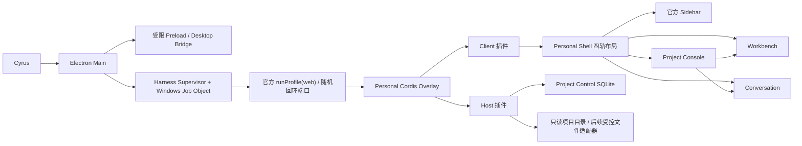
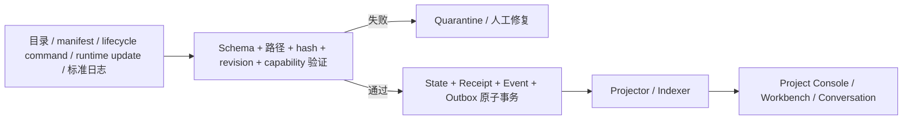

# DeepSeek Harness Personal 开发移交

状态：**正式移交给 DeepSeek Harness 自主维护**  
移交日期：2026-08-15  
项目根：`D:\Deepseek Harness Personal`  
只读上游：`D:\Deepseek Harness`  
当前上游基线：DeepSeek Harness `0.1.0-rc.5` / `47f943859bef60e4160492346772ded9b24f765a`

## 1. 接手结论

当前 Personal Desktop 已经不是简单启动壳，而是一套独立维护的 Electron 桌面层、Personal Shell、十三个 DSH runtime 插件和 Project Control 控制面。

当前最重要的事实：

- Gate 0、Gate 1、Gate 2A、Gate 2B、Gate 2C 已完成。
- Project Control 已能只读扫描、审阅和确认关联现有项目，但不会自动导入，也不会修改项目目录。
- SQLite 当前为 `schemaVersion=5`，具有迁移、备份、单写者锁、幂等、revision、Receipt/Event/Outbox 原子事务和 Unicode Windows 路径键。
- 下一项正式开发是 **Gate 2D：标准项目快速新建、模板原子写盘、legacy 安全升级和项目文档同步**。
- Workbench 已有稳定容器、页签、viewer registry 和候选详情，Files/Code/Outline/Diff/Browser/独立终端业务仍未实现。
- `D:\Deepseek Harness` 必须继续视为只读上游；Personal 功能都在本仓库实现，除非 Cyrus 明确批准修改上游。

## 2. 接手后先读什么

按以下顺序读取，不能只看本文就直接修改代码：

1. [`HANDOVER_TO_DEEPSEEK_HARNESS.md`](HANDOVER_TO_DEEPSEEK_HARNESS.md)：移交入口、当前状态、边界和下一步。
2. [`README.md`](../README.md)：运行、功能、限制、构建与数据位置。
3. [`PROGRESS.md`](PROGRESS.md)：当前完成状态的短摘要。
4. [`NEXT.md`](NEXT.md)：下一阶段执行清单与验收顺序。
5. [`PROJECT_CONTROL_SPEC.md`](PROJECT_CONTROL_SPEC.md)：Project Console 与 Workbench 产品架构。
6. [`PROJECT_INTAKE_SPEC.md`](PROJECT_INTAKE_SPEC.md)：项目导入、新建、升级和默认只读原则。
7. [`PROJECT_CONTROL_DATA_MODEL.md`](PROJECT_CONTROL_DATA_MODEL.md)：事实归属、SQLite、事务与迁移。
8. [`PROJECT_PROTOCOL.md`](PROJECT_PROTOCOL.md) 与 `protocol/project-control/v1alpha1/`：机器可验证输入输出合同。
9. [`DEVLOG.md`](DEVLOG.md)：历史决策、验证证据和已知边界。
10. [`compat.json`](compat.json)：当前可复现的版本与制品状态。

若文档与聊天记录冲突，以当前仓库中的规范和测试为准；产品边界冲突不得自行猜测，先把冲突写入 `BLOCKED.md` 并请求 Cyrus 决策。

## 3. 不可破坏的开发边界

### 3.1 上游和发布

- 不修改 `D:\Deepseek Harness`，除非 Cyrus 明确授权一次具体上游变更。
- 不执行 commit、push、发布 GitHub Release、安装 NSIS、覆盖 Portable 或更改系统配置，除非 Cyrus 明确授权。
- 不把 npm `rc.6` 包混装进当前 rc.5 monorepo。升级必须等待可追溯的官方源码基线，再整树验证。
- 普通 `dsh web` 不得自动加载 Personal 插件；Personal 插件仅由桌面 overlay 激活。

### 3.2 项目数据

- 扫描默认只读；扫描、预览、忽略和 `linked_legacy` 登记不得修改项目目录。
- Renderer 不能提交任意绝对路径。路径必须来自 Electron 系统目录选择器签发的短期、单次、绑定用途的 capability。
- Project Control 全局数据库只能由唯一 Host 写入；其他 Harness 实例调用协议/API，不得直接打开 SQLite。
- 全局数据库不存整份 PRD、架构、DEVLOG 或 Session 全文；它只存身份、索引、哈希、状态、引用和审计事实。
- Harness 原生 Session、消息、工具调用和会话日志继续由 Harness 自己管理，Project Control 只保存稳定引用。

### 3.3 安全与隐私

- 连接密钥、API Key、Webhook secret 不进入 Renderer、日志、项目文件或 Git。
- 更新、预检和构建子进程只继承最小环境，不能继承 SSH Agent、npm/git 用户配置或任意凭据。
- 本文第 12 节的项目路径是 Cyrus 本机私有交接信息，不得发布到公开仓库、Issue、日志或外部服务。
- UNC、extended UNC 和已知网络盘不用于 Project Control 数据库、项目根或更新 staging。

## 4. 总体架构



关键原则：

- Electron Main 只负责桌面生命周期、托盘、快捷方式、目录选择、更新、充值窗口和进程树。
- Harness Host 插件负责文件、SQLite、凭据、PTY 和安全边界。
- Client 插件只通过受限 Host API 工作，不直接使用 Node、SQLite 或系统路径。
- Personal Shell 替代 Personal 组合中的官方 layout root，但继续提供兼容的 `layout` 服务和官方 slots。
- Project Console 管“项目事实、决策、审核和运行引用”；Workbench 管“资源查看和操作”；Conversation 始终保留完整会话。

### 4.1 “所有功能插件化”的实际含义

Personal 不是把每个按钮做成 Electron hard-code。每项业务能力是独立 DSH runtime package：

- Host face 在 Harness Node 进程中提供文件、SQLite、凭据、HTTP route 或 PTY 能力。
- Client face 通过 `dsh.client` bundle 加入浏览器模块图，用 Cordis service/slot 注入 UI。
- `src/personal-plugins.js` 负责包解析和 profile junction；`plugins/cordis.patch.yml` 负责 Personal 桌面 overlay 的激活顺序。
- 跨插件交互使用稳定 service/typed intent，例如 `ctx.workbench.open()`，不使用 DOM 选择器互相操纵。
- 插件卸载或 HMR 必须通过 `ctx.effect`/disposer 清理 route、service、timer、PTY 或资源，不留隐藏全局状态。
- 设置和插件管理页能看到这些用户功能的一句话简介；两个内部基础包仍应在技术 inventory 可追踪，但不必伪装成独立产品功能。

这套结构的便利是：功能可以独立构建、测试、启停和替换；升级官方 Harness 时只需重新验证兼容 seam，不必复制上游整套客户端。代价是 slot scope、service inject、Host/Client DTO 和打包资产必须严格稳定，不能把插件化退化为全局 CSS/DOM patch。

## 5. 四轨界面与最终产品方向

宽屏目标布局从左到右固定为：

1. Harness 原生 Sidebar：项目、Session、Agent 列表；保持官方行为，不做拖拽改造。
2. Project Console：项目总览、单项目控制、审核、Agent Runs、活动与流水线状态；可拖拽宽度、独立收起。
3. Conversation：完整 Harness 会话，始终是主要工作区。
4. Workbench：Files、Code、Outline、Diff/Review、Browser、Terminal、Details；可拖拽宽度、独立收起。

当前 Personal Shell 已实现四轨网格、40px Project rail、44px Workbench rail、宽度持久化、窄窗让步、“专注会话”和“重置布局”。原生 Sidebar 不可拖拽。

Project Console 和 Conversation 必须可以同时显示。窄窗口按 Conversation-first 原则依次让出 Project Console 和 Workbench，不能把 Conversation 变成附属面板。

## 6. Project Control 的产品模型

### 6.1 总览页面

未来总览应包含：

- 所有项目和健康状态。
- 待我审核、阻塞项、进行中的 Agent Runs、最近活动。
- 项目来源、注册模式、最近 Session、待处理命令和同步状态。
- 快速筛选、固定项目、跟随当前 Session。

### 6.2 单项目页面

单项目页面应包含：

- Overview：目标、成功标准、当前阶段和关键指标的投影。
- Checklist / Work Items：决策、步骤、负责人、revision 和状态。
- Reviews：需要 Cyrus 通过、驳回、评论或要求重做的产出。
- Agent Runs：父 Agent、子 Agent、目标、状态、产物和关联 Session。
- Activity：规范化事件流，不直接把原始日志当业务状态。
- Documents：PRD、架构、ADR、DEVLOG、NEXT 等角色和当前 hash。
- Sessions：Harness 原生 Session 引用与可下达指令的目标。

### 6.3 审阅与 Workbench 的关系

Project Console 只保存审核对象和决策事实，不重复实现代码/文件查看器。点击产物时发送 typed open intent 给 Workbench：

- `file` / `preview`：文件和渲染预览。
- `outline`：结构树。
- `diff` / `artifact`：产出审核。
- `browser`：受限网页。
- `terminal`：复用现有 Session Terminal 的同一 terminal ID。
- `details`：统一 Details selection。

审核动作（通过、驳回、评论、暂停、执行）写入 Project Control 命令和事件；具体文件、Diff、网页或终端显示在 Workbench。不要建立第二套审核状态源。

### 6.4 Agent 并行与状态

Harness 可以让当前 Agent 创建多个子 Agent 并行工作，再由父 Agent汇总。Project Control 未来只做管理投影：

- 记录 Run/parent Run/Session/任务目标/状态/产物引用。
- 显示 queued/running/waiting/review_required/completed/failed/cancelled。
- 点击 Run 打开对应 Session 或 Workbench 产物。
- 指令必须发到明确的 Harness Session，不能让控制台在后台自行选择会话。
- “Agent 声明完成”不等于验证通过，也不等于 Cyrus 已批准。

## 7. 数据事实归属

| 事实 | 唯一来源 | 说明 |
|---|---|---|
| 项目稳定身份 | managed manifest；legacy 为全局 DB | 不从文件夹名反复推断 |
| 项目显示名 | managed manifest；legacy 为用户确认 DB 值 | PRD 标题只是候选/证据 |
| 目标和成功标准 | 绑定为 PRD 的项目文档 | DB 只存投影、hash 和定位 |
| 当前架构/ADR/日志正文 | 项目内可移植文档 | 不复制完整正文到全局库 |
| 本机绝对路径 | 全局 DB `workspace_locations` | manifest 禁止绝对路径 |
| WorkItem/Review/Run/Decision 状态 | 全局 DB | 命令 + revision + Event/Outbox |
| Session 消息和工具调用 | Harness 原生存储 | Project Control 只存引用 |
| UI 宽度、固定和筛选 | 本机用户偏好 | 不能冒充项目事实 |

标准 managed 项目的最小可移植内容由协议定义，建议形态：

```text
.dsh-project/
  project.yaml
docs/
  PRD.md
  ARCHITECTURE.md
  ADR/
  DEVLOG.md
  NEXT.md
```

目录名可由 manifest 映射，不强制所有项目完全同构。

## 8. 流水线和协议方向

目标不是“扫描几份 Markdown 后展示”，而是建立可由其他 Harness 应用使用的输入—验证—状态—输出流水线：



已冻结的外部 runtime update 只有 progress/blocker/completion。未知主版本、未知核心字段、路径逃逸、hash/revision 不一致或未协商 capability 必须拒绝或进入 Quarantine，不能“尽量写入”。

未来项目日志必须使用冻结 frontmatter/Schema；文本语气不能静默改变 WorkItem、Run 或 Review 状态。其他 Harness 应用通过同一协议提交，不能直接改 SQLite 或自创第二种日志格式。

## 9. 已完成 Gate

| Gate | 状态 | 交付 |
|---|---|---|
| Gate 0 | 完成 | Personal Shell 可替换官方 layout，原生 Sidebar/Conversation/Details/Theme 可继续工作 |
| Gate 1 | 完成 | 四轨 Shell、Project/Workbench slots、rails、拖拽、持久化、Details 路由、Workbench registry |
| Gate 2A | 完成 | Intake/Data Model/Protocol/lifecycle Schema 与 fixtures 冻结 |
| Gate 2B | 完成 | SQLite migration runner、单写者、Project 注册事务、Receipt/Event/Outbox、Host API、真实状态 UI |
| Gate 2C | 完成 | 系统目录授权、只读 scanner、候选/问题/映射、Workbench 详情、legacy/managed 登记、安全 rebind、schema 5 |
| Gate 2D | 下一项 | 模板快速新建、原子文件同步、legacy 升级、持续文档刷新 |
| Gate 2E | 后续 | 跨 Harness/Agent 强类型输入、标准输出、Quarantine、Outbox dispatcher、WorkItem/Run/Review |

## 10. Gate 2C 当前实现细节

### 10.1 目录和扫描

- Electron 系统选择器只接受 `source-root` 或 `project-root`。
- 选择结果用 HMAC-SHA256 签名，绑定 path/kind/expiry/nonce，单次使用。
- Scanner 零写入、限制深度/条目/文件大小/总读取量，跳过依赖和构建目录。
- 不跟随逃出授权根的 symlink/junction。
- 识别 README、PRD、DEVLOG、PROGRESS、NEXT、架构、ADR 和有效 manifest。
- 来源目录只发现直接子项目；项目内部默认扫描深度独立为 3。
- Managed manifest 绑定按相对路径直接读取和 hash，不受 heuristic 深度影响。
- Required 文件缺失会 blocking；optional 缺失保留 binding 和 null hash。

### 10.2 UI 和登记

- Project Console 列出最新候选并保留历史扫描审计。
- 候选卡只返回轻量摘要和 document/issue count；点击后才加载完整详情。
- Legacy 候选允许编辑名称和文档角色，也可忽略/恢复。
- Managed binding 由已验证 manifest 锁定，只读展示，允许同 role 多路径。
- 确认前重新扫描并核对 SHA-256。
- Candidate→Project/location/bindings/Receipt/Event/Outbox 在一个事务中提交。
- 相同 signed command 在响应丢失后返回 `replayed`；同 commandId 的篡改请求返回 `IDEMPOTENCY_CONFLICT`。
- Managed rebind 只在新位置身份一致且旧 active 位置不可访问时开放；两份都可访问时保持冲突。

### 10.3 SQLite schema 5

- `0001`：核心 Project/lifecycle/Receipt/Event/Outbox。
- `0002`：registration document bindings 与 managed manifest mirror。
- `0003`：source roots、import jobs、candidates、documents、issues、限时 refs。
- `0004`：source-level `import_job_issues` 与 ASCII `NOCASE` 防线。
- `0005`：版本化 `windows-unicode-v1` path key，Windows 分隔符规范化 + NFC +稳定 Unicode lower。

v4 升 v5 若检测到 Unicode 等价重复路径，迁移失败回滚并保留 pre-v5 backup，不合并或删除用户记录。

## 11. 十三个插件

| 插件 | 当前状态 |
|---|---|
| `personal-foundation` | 共用 Host 存储和 Personal API |
| `personal-shell` | 四轨 root layout 与布局服务 |
| `project-control` | Gate 2C 已完成；Gate 2D 待开发 |
| `workbench` | 容器/registry/Details/候选 viewer 完成，其余 viewer 业务待开发 |
| `personal-theme` | 全局和按 workspace 主题 |
| `desktop-integration` | 桌面设置状态与入口 |
| `skill-library` | Skill 搜索、分类、简介、添加、可恢复删除 |
| `plugin-organizer` | 插件分类和简介；安装卸载仍由 Harness 原生页负责 |
| `connection-center` | 飞书/企微/Webhook/MCP 配置管理；当前仅配置，不主动连接 |
| `session-terminal` | 每 Session 持久 PowerShell、多标签、重连、UTF-8 |
| `usage-balance` | 预计费用、官方余额、轻量充值入口 |
| `trajectory-island` | 顶部会话轨迹岛和快速定位 |
| `update-center` | Personal/Harness/插件更新状态与安全更新流程 |

这些是 DSH runtime packages，不是 Codex Marketplace 插件；不要新增 `.codex-plugin` 或 marketplace cachebuster。

## 12. Cyrus 当前四个项目（本机私有）

> 本节只用于本机移交。不得复制到公开仓库、外部 Issue、公开日志或第三方服务。

| 项目 | 本机目录 | 最终只读扫描 |
|---|---|---|
| 食溯 App | `F:\QClawData\workspace\meal_tracker` | `linked_legacy` / 51 份候选文档 |
| Amazon Store | `F:\documents\Kimi\Workspaces\Amazon Store` | `linked_legacy` / 6 份候选文档 |
| Cyrus 量化模拟 | `F:\documents\Kimi\Workspaces\Cyrus Quant Trading‌` | `linked_legacy` / 14 份候选文档 |
| Cyrus Music | `D:\CodexData\workspaces\Cyrus Music` | `linked_legacy` / 2 份候选文档 |

量化目录名末尾含不可见的 `U+200C`。不要手工拼接路径，使用系统目录选择器；scanner 的显示名会清理该不可见字符，但真实路径不应被擅自改名。

四个项目目前只完成验收扫描，**没有自动登记到正式项目总览**。由 Cyrus 在 UI 中逐项审阅并确认后才注册。

## 13. Workbench 后续实现顺序

交互参考可看 [DSH-better-sidebar 介绍](https://www.jamecling.com/archives/5292) 和 [omdsh-dev/DSH-better-sidebar](https://github.com/omdsh-dev/DSH-better-sidebar)，但**不要直接安装或复制其整体布局方式**。评估时该项目面向 rc.6，使用 `document.body` fixed portal、全局 `#root`/`nth-child` 推位和独立 node-pty/WS；它会与 Personal Shell 四轨布局、现有 Session Terminal 和宽度让步冲突。可参考的是 tab/viewer registry、split-tree 思路、按 Session 恢复和 fenced Host API，最终必须改为 Personal Shell 的真实 `workbench.panel` slot 与现有 terminal owner。

不要直接做自由 split、完整 Monaco、Git 暂存/提交和复杂布局恢复。推荐顺序：

1. Workspace-root 限定的 Host Remote：list/read/stat/watch，阻止穿越和 reparse escape。
2. Files 懒加载树和只读 Code/Markdown/Image/PDF preview。
3. Outline：先轻量 parser，或在官方 LSP 增加 documentSymbol seam 后接入。
4. Diff/Review：复用 typed artifact/diff intent，与 Project Review 单一状态源联动。
5. Terminal：把现有 Session Terminal 的 terminal ID 放入 Workbench/底部 placement，不创建第二个 shell。
6. Browser：默认 sandbox、限制 scheme/loopback/local、显示 URL 和风险状态，frame 失败时外部打开。
7. 编辑器：后置 CodeMirror/Monaco，必须有 dirty、atomic save、expected version、冲突处理。
8. 最后再考虑自由分栏、跨 pane 拖拽、Git stage/discard/commit 和重型 Office preview。

只有用户明确打开文件、链接或产物时才自动 reveal Workbench；后台事件不能抢焦点。

## 14. Gate 2D 的实现要求

Gate 2D 是接手后的第一项开发，详见 [`NEXT.md`](NEXT.md)。必须包含：

- 版本化模板 registry 和模板 identity/version。
- 创建/升级前的 write plan、目标路径、文件 hash、覆盖/冲突预览。
- Host 受控文件适配器：staging、containment、atomic rename、备份、回滚、崩溃恢复。
- `createFromTemplate` 只有文件和 manifest 已提交并复验后才能 accepted。
- `upgradeManaged` 保留 projectId，不能覆盖现有 PRD/DEVLOG，必须显式显示将新增或修改的文件。
- 文件同步和 Project/Receipt/Event/Outbox 必须形成可恢复的一致流程；不能先把数据库标成功再写文件。
- 默认不删除或覆盖；任何覆盖策略都要 Cyrus 明确确认。

## 15. 关键代码地图

### Electron 与启动

- `src/main.js`：窗口、托盘、生命周期、smoke introspection。
- `src/harness-process.js`：Harness supervisor、优雅关闭、Job Object。
- `src/harness-helper.js`：调用官方 `runProfile()`。
- `src/personal-plugins.js`：十三插件安装/解析清单。
- `src/desktop-bridge.js`、`src/preload.cjs`：固定桌面 IPC 能力。
- `src/project-control-selection-ticket.js`：目录 capability。
- `src/runtime-preflight.js`：更新候选隔离预检。
- `plugins/cordis.patch.yml`：Personal overlay 和官方 layout 替换。

### Project Control

- `plugins/project-control/src/index.ts`：Host apply、storage/API/intake 组合。
- `plugins/project-control/src/http.ts`：唯一 Host HTTP seam 和 DTO 脱敏。
- `plugins/project-control/src/intake.ts`：扫描、候选、签名命令、resolver 和 replay。
- `plugins/project-control/src/discovery/`：只读 scanner。
- `plugins/project-control/src/host/`：SQLite、migration、lock、事务。
- `plugins/project-control/migrations/`：不可变 SQL migrations。
- `plugins/project-control/src/client/`：Project Console、API adapter、candidate viewer。
- `protocol/project-control/v1alpha1/`：Schema、fixtures 和 lifecycle 合同。

### Shell 与 Workbench

- `plugins/personal-shell/src/client/`：四轨布局和服务。
- `plugins/workbench/src/client/`：tab model、viewer registry、Details 路由和持久化。
- `plugins/session-terminal/`：现有 PTY/PowerShell 唯一实现。

## 16. 当前验证证据

最后一次完整验证：

- `pnpm test`：`241/241`。
- `pnpm run check:plugins`：十三插件 build/typecheck/Host+Client syntax 全部通过。
- Project Control：`82/82`。
- `pnpm run smoke`：开发 Electron 通过；schema 5、Project Control API/UI、四轨布局、优雅退出、端口关闭、进程树清理均通过。
- `pnpm run pack:win:dir`：成功。
- `pnpm run smoke:packed:dir`：成功。
- `artifacts\win-unpacked` 已包含最新 preload、Project Control Host/Client bundle 和 `0005` migration。
- Portable 与 NSIS 没有按 Gate 2C 重建，不得把旧 EXE 当作 Gate 2C 验收制品。

常用命令：

```powershell
cd "D:\Deepseek Harness Personal"
pnpm install
pnpm test
pnpm run check:plugins
pnpm run smoke
pnpm run pack:win:dir
pnpm run smoke:packed:dir
```

升级上游前先在 `D:\Deepseek Harness` 完成 install/build，再回本仓库重复上述门禁并手工完成一次真实聊天和退出检查。

## 17. 已知边界和技术债

- 当前兼容基线仍是 rc.5。npm `0.1.0-rc.6` 已存在，但当时 GitHub master 尚未提供可追溯的对应源码/Release/Tag；核心运行代码比对未显示值得立即迁移的变化。重新评估时必须联网复核当前官方状态。
- Node `node:sqlite` 会输出 ExperimentalWarning；当前不是失败。
- 版本化 Unicode path key 使用 NFC + locale lower，不是完整 Windows ordinal case fold；极端 Unicode 文件名仍是低概率边界。
- 单个候选若合法包含 200 份极大 preview/evidence，详情响应理论上可能触及 256 KiB；列表已经改为轻量摘要。后续应为详情增加分页或分文档读取。
- 字符串检查无法证明映射盘是本地固定磁盘。
- `asar:false` 是当前外部系统 Node 执行 helper/插件的封装要求；启用 ASAR 前必须重构物理路径加载，不能只切一个 Builder 开关。
- 项目子包自己的 `pnpm --dir ... run typecheck` 可能找不到局部 `tsc`；根门禁使用上游已安装 TypeScript。后续可统一开发依赖，但不要为此复制一套不兼容工具链。
- 当前 Portable/NSIS 是 Gate 2C 前旧制品且未签名；`win-unpacked` 才是本轮最新封装验收。

## 18. 变更和验收纪律

每个后续 Gate 都必须：

1. 先写/更新合同和 acceptance，再写实现。
2. Host 负责信任边界，Client 不重复实现安全逻辑。
3. 失败不能产生半状态、伪成功 Event 或孤儿进程。
4. 测试必须覆盖正常、边界、篡改、重放、迁移、回滚和重启恢复。
5. 真实项目验收默认只读；需要写入时先用临时 fixture，最后由 Cyrus 明确批准真实写入。
6. 完成后同步 README、PROGRESS、DEVLOG、NEXT、compat；不要只在聊天里宣布完成。
7. 未完成或需要用户决定的内容写入 `BLOCKED.md`，不要在代码里做隐含默认。

## 19. 移交后的第一步

DeepSeek Harness 接手后应先：

1. 运行当前门禁，确认本机状态未漂移。
2. 读取 Gate 2D 的规范和 `NEXT.md`。
3. 只在临时项目 fixture 上实现 write plan 和文件适配器。
4. 在任何真实项目写入前，把预览、覆盖策略、回滚和验收结果交给 Cyrus 确认。

不要直接从“快速新建按钮”开始，也不要先做完整 Workbench 编辑器。先把 Gate 2D 的文件事务边界做正确。
