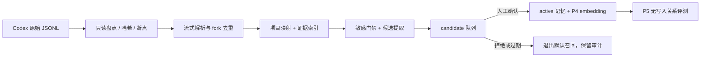

# P4/P6 基座完成后的推进路线：S0 收口与 P5 记忆智能层

> 日期：2026-08-17；最新同步：2026-08-18
> 状态：**P4/P6 历史阶段已执行；本文现为 S0/P5 的最新推进路线**
> 目标：回答“下一步做什么、各阶段什么时候做、Codex 会话以什么形式进入记忆系统、P5 何时值得启动”。
> 授权边界：本文不是对稳定数据写入、复制敏感会话、安装依赖、调用付费模型、打包或发布的授权；这些动作仍须按现有规则单独确认。

> **2026-08-17 修订（Cyrus 拍板，已生效）**：候选提取试点从「发布前、开发版候选库试点」改为「统一发布后、正式版上执行」——Cyrus 用正式版开发食溯项目，开发库不写食溯候选（避免无效提取与跨库迁移）。试点与全量导入整体移到统一发布之后，不再阻塞统一发布；开发版只承担工具开发与验证（P6-0C 提取工具已实现并提交）。

> **2026-08-18 状态更新**：v0.3.0 已统一发布；P6-1 六项硬门闭环；正式库试点已产生 329 条 candidate，20 条盲评质量 GO。P6-2 全量处理与 factual_at v5/backfill 因工作台/控制台完善主动后移。P5 最新定义见 [P5 记忆智能层统一架构](./P5-记忆智能层统一架构.md)，不再等同于可选图。

## 1. 一句话结论

**统一发布和正式版小批量候选试点均已完成。下一步主线：完成工作台/控制台当前收口 → S0（factual_at v5/backfill + P6-2 受控全量处理 + 三项目治理 UI + 512 规模限制修复/诚实规模合同）→ P5-R0 冻结基线 → R1 Context Compiler/确定性多线索召回 → R2 Curator/Observation/Doctor → R3 Procedure/Outcome → R4 条件式 Reflection/Graph。**

P5 不应直接进入 vendor graph、超级 Curator 或自动反思开发。先完成 S0 和 P5-R0/R1 的规模与召回地基，再逐层开放写入智能；任一层评测不足时 `NO-GO` 是合法结论。

## 2. 当前事实与本稿建议必须分开

### 2.1 已核实的当前事实

- P4 已完成并随 v0.3.0 发布：本地 bge-m3、异步回填、FTS/vector RRF、噪声门槛、FTS 降级和关闭保险丝；当前大规模限制是向量通道最多覆盖最近 512 条 active 向量。
- P5 Daydream/Reflection 已有完整评估文档，但仍是**提案**，没有上线；其正确定位是关系发现和经验提炼，不是 P4 语义召回。
- 记忆插件已有 SQLCipher、快照/恢复、shadow import、整机迁移、项目 reset、原生 JSONL 导出和 `memory_import_codex`；P6-1 六项硬门已闭环。
- 正式库 Codex 试点已运行 173 次调用，生成 329 条 candidate；20 条随机盲评质量 GO。它证明提取质量可继续扩大，不证明全量导入或长期召回已经完成。
- 2026-08-17 的最终盘点口径为 **308 个 Codex JSONL、约 3.32 GiB、33,622 条可识别消息、mapped 260 / quarantine 48**；其中包含 fork/subagent、工具事件、上下文压缩和其他非对话记录，数量会随继续使用 Codex 增长。
- OpenAI 当前没有文档化一个稳定的“Codex 全量导出到第三方”合同；本地 JSONL 可以作为迁移来源，但适配器必须显式记录源格式版本并允许未来修订。参考：[OpenAI 官方导入说明](https://learn.chatgpt.com/docs/import)。

### 2.2 已接受的历史调整与当前剩余

1. P6-0 盘点/合同/解析/dry-run、P6-1 恢复/shadow import/reset/迁移/并发已执行完成；
2. 统一发布和正式库小批量试点已完成；
3. 当前剩余是 P6-2 全量处理、factual_at v5/backfill、真实治理 UI 与长期使用评测；
4. P5 已从“可选图”改为记忆智能层，每一子层继续执行 GO/NO-GO，不因编号强行上线。

## 3. “全量导入”的正式语义

“全量”必须拆成三层，不能混为一谈：

| 层 | 覆盖目标 | 落点 | 是否进入默认召回 |
|---|---|---|---|
| A. 原始档案层 | 本机可见源文件 100% 登记；关闭后的文件可做加密只读快照 | live memory root 之外的加密归档或只读源引用 | 否 |
| B. 证据索引层 | 每个可识别 session/turn 有哈希、时间、角色、项目归属和可回溯 locator | 独立 import staging/index；记忆库只留必要 evidence pointer/短摘录 | 否，按需取证 |
| C. 长期记忆层 | 只提炼决定、偏好、约束、事故、根因、方法和未决事项 | `candidate + llm_extracted`，人工确认后才变 active | 仅确认后进入 |

因此：

- **可以保证历史不丢、来源可查、所有合格会话被处理；**
- **不能把“所有消息都成为记忆”当作成功标准；**那会制造重复、污染、泄漏和上下文膨胀；
- 第一阶段不追求把 Codex 历史伪装成 DSH 原生聊天列表。若以后确实需要聊天 UI 复原，应另立 Codex→DSH Session 转换项目，并单独验证格式保真度。



## 4. 阶段顺序与每阶段出口

> 状态说明：下列阶段 0–4 的设计与验收要求保留为审计依据，当前均已执行；阶段 5 的小批量质量门已通过但 P6-2 全量处理尚未执行。最新下一步见阶段 6 和第 5 节。

### 阶段 0：冻结 P4 状态口径（已完成，立即收尾）

目标：不再把 P4 当作待开发项，只做发布打包准备和遗留清理。

DSH 应确认：

- P4 测试、真实数据初验和关闭保险丝的证据仍然有效；
- 稳定版统一发布时把本地 bge-m3 ONNX 权重正确打包，不依赖临时 `F:\AI\bge-m3-onnx`；
- 验收用记忆从项目分片归档；
- 后续 P6/P5 修改不得破坏 P4 的 `scope/status/freshness` 优先级、噪声门槛和 FTS 降级路径。

出口：P4 状态保持“完成、待随统一发布落地”，不再阻塞 P6-0。

### 阶段 1：P6-0A——Codex 语料盘点与导入合同（下一步，最高优先级）

本阶段**只读、不调用 LLM、不写记忆库**。

需要完成：

1. 识别唯一真实 session root，避免 Windows junction/别名导致重复计数。
2. 生成只含元数据的 inventory：文件数、大小、mtime、SHA-256、可读/占用/损坏状态、session id、parent/fork、cwd、时间范围。
3. 冻结 `codex-session-import/v1` 源适配合同，至少包含：
   - `source_file_sha256`、`source_session_id`、`parent_session_id`；
   - `turn_id/event_id`、时间、role、事件类型；
   - `cwd`、项目解析状态、portable locator；
   - 内容哈希、解析器版本、源格式观察版本；
   - `processed/quarantined/retryable/skipped_with_reason` 状态。
4. 明确事件白名单：用户消息、助手最终答复和必要阶段结论可进入后续处理；reasoning、system/developer、token 统计、world state、agent 通信元数据、完整工具输出默认不进入记忆提取。
5. 明确“当前活跃/被锁文件”策略：登记为 retryable，关闭会话后续跑；不得静默漏掉或强行读取不一致快照。
6. 明确云端或其他设备但本机不存在的会话不在本次“全量”承诺内，报告必须写成“本机可见语料覆盖率”。

验收：

- 对所有源文件给出确定状态，`未说明的跳过 = 0`；
- 清单可重复生成，未变化文件哈希一致；
- 日志不输出消息正文、密钥、绝对敏感内容；
- Stable、Dev 记忆库和原始源文件均无写入。

### 阶段 2：P6-0B——流式解析、去重、项目映射与 dry-run

本阶段只写临时 fixture/staging，不写 Stable。

需要完成：

1. **流式逐行解析**，禁止 `readFileSync(...).split('\n')` 处理整批 3 GiB 语料；支持中断恢复、批次上限和坏行隔离。
2. 以 session lineage + turn id + 内容哈希去除 fork 继承上下文和重复摘要，只保留子会话新增贡献；去重不得删除唯一来源关系。
3. 项目映射优先使用 `cwd → Project Control project_id` 的已验证绑定：
   - 唯一匹配：进入对应项目 staging；
   - 路径迁移：通过显式 alias/rebind 表解决；
   - 无匹配或多匹配：进入 `unmapped/quarantine`，不得凭内容猜测项目，也不得自动写入 global。
4. 食溯先作为中型项目主样本；Amazon 和量化盯盘作为小型项目样本及跨项目泄漏负例。不得把三个项目合并成一个语料池。
5. 生成建议包：

```text
codex-import-<snapshot-id>/
├─ manifest.json
├─ source-files.jsonl
├─ sessions.jsonl
├─ turn-index.jsonl
├─ evidence-index.jsonl
├─ project-mapping.jsonl
├─ quarantine.jsonl
├─ import-state.json
└─ hashes.sha256
```

6. 原始正文保留在加密只读归档或源文件中；memory SQLite 不复制完整会话，只保存受控短摘录、摘要和 locator。

验收：

- 同一 snapshot 重跑结果确定且幂等；
- 中断后可从 checkpoint 续跑；
- 每个输出记录都可追溯到源文件哈希和 session/turn；
- fork 重复率、坏行、占用文件、未映射项目均有计数；
- 跨项目写入和召回泄漏均为 0；
- dry-run 报告经 Cyrus 查看后，才决定是否制作原始语料加密副本。

### 阶段 3：P6-1——先补齐可恢复、可回滚的稳定性硬门

P6-0B 让我们知道“要导入什么”；本阶段保证“即使导错也能安全退出”。在此之前禁止全量写入真实记忆。

DSH 应重新核查并补齐：

1. 面向真实迁移的 shadow import：哈希/版本验证 → 临时新库 → migration → 数量、外键、FTS、embedding generation 对账 → 召回回归 → 原子切换 → 旧库只读回滚。
2. 真实恢复命令与端到端演练：从加密 snapshot 恢复到临时根，验证口令、manifest、SQLCipher、integrity、FTS、claims/evidence/relations 和召回结果。已有“生成快照”不等于已经证明“能够恢复”。
3. `memory.reset_project` 或等价项目生命周期能力：预览、明确项目、双重确认、审计 receipt；分别定义 archive、restore、delete，不能用单条 `memory_archive` 冒充。
4. 整机/换目录迁移演练：Project Control 重绑、恢复密钥、导入包、重建 embedding、旧机数据只读保留与回滚。
5. 多项目并发：单写者/队列、分片路由、备份期间写入、导入期间读写隔离、一个项目失败不拖垮其他项目。
6. Dev/Stable/Test 边界：任何迁移先在临时根和脱敏/只读来源验证，不让 Dev 直接打开 Stable live DB。

验收以《记忆系统手册》§9.10.5 为上限，并额外要求：恢复演练和 shadow import 必须产生可复核 receipt；不能只以单元测试替代真实临时根的端到端恢复。

### 阶段 4：P6-0C——候选提取小批量试点（统一发布后，正式版上执行）

本阶段发生在统一发布之后，在正式版（Stable）上执行。2026-08-17 Cyrus 拍板：正式版才是食溯项目的实际开发环境，开发库不写食溯候选（避免无效提取与跨库迁移）；提取工具（memory_import_codex）随统一发布到达正式版后，试点直接落正式库。先 20 会话小批量 → Cyrus 验收提取质量与候选负担 → 达标才进入 P6-2 全量。

提取原则：

- bge-m3 只负责 embedding/召回，**不能生成或判断长期记忆**；
- 先做本地确定性筛选、去重、分段和缓存，再把少量合格文本交给生成模型；
- 若使用现有 DeepSeek 远程提取，必须先给 Cyrus 回显预计文本/token、调用数、单价与总价区间、缓存键、重试上限和停止条件，并单独获得授权；
- secret/PII/凭据和高敏文本在外发之前 fail closed；原始会话不得作为调试日志上传；
- 生成结果只能是 `candidate + llm_extracted`，必须带源 locator；不允许自动成为 active/global pattern；
- 按语义聚类压缩重复候选，避免让 Cyrus 逐条评审数千个近重复条目；候选队列必须有 batch/backpressure/TTL。

试点不以固定条数冒充质量。至少覆盖：决定、偏好、约束、事故/根因、成功方法、未决事项，以及三个项目的隔离负例。

验收：候选 grounding 可追溯、项目归属正确、敏感外发为 0、跨项目泄漏为 0；由 Cyrus 盲评接受率和实际可用性。达不到门槛就调整提取合同，不扩大批量。

### 阶段 5：P6-2——受控全量处理、发布候选与长期试用

这里的“全量”是：**所有本机可见会话进入档案/索引处理，只有合格内容形成候选，只有人工确认内容进入 active。**

执行顺序：

1. 统一发布先行：模型干净版打包 + 记忆系统（含 memory_import_codex 工具）随客户端上线正式版；
2. 正式版小批量试点（阶段 4）验收通过后，冻结源 snapshot 和 inventory；
3. Stable 危险变更前做 RPO=0 的一致性快照；
4. 全量 dry-run，先交付数量、错误、隔离、成本和预计候选规模报告；
5. 经批准后分项目、分批 shadow import；
6. 每批做哈希、数量、FTS、scope、敏感门、召回和 embedding 对账；
7. 人工抽样和候选评审；
8. 原子切换，旧库只读保留回滚窗口；
9. 进入真人长期试用，记录 helpful hit、错误记忆、候选积压、降级、恢复和跨项目泄漏。

停止条件：出现源文件被修改、哈希不一致、项目映射歧义扩大、敏感门失效、跨 scope 写入、恢复/回滚失败、候选污染显著或成本超预算时，立即停止扩大批量，保留现场与 receipt。

### 阶段 6：S0 收口后进入 P5 记忆智能层

P5 不按“累计多少条”机械启动，而按基线、覆盖和可评测证据启动。S0 必须先完成 factual_at/backfill、P6-2、三项目治理 UI，并解决最近 512 条向量覆盖限制或冻结诚实规模。随后至少应看到：

- 同一项目内有带来源的“决定 → 后续结果”；
- 有多次事故、修复和 Gate 的链条；
- 有重复问题或可复用方法，而不只是零散聊天；
- 能构造关系型任务回归集，并与 FTS/Hybrid、规则配对和随机配对做盲评比较。

最新顺序以 P5 统一架构为准：

1. **P5-R0：**冻结 Hybrid 基线、规模 fixture 和 Context/approval/observation/feedback/Procedure 合同；
2. **P5-R1：**Context Compiler + ID/Path、Temporal、Entity/Causal 多路候选 + RRF/Evidence Reranker；
3. **P5-R2：**Online Curator、History Analyzer、Memory Doctor、Reflection/Procedure Builder 四 Profile 共用引擎；先 observation candidate，再开放极少量低风险 policy-auto；
4. **P5-R3：**Procedure candidate + write/recall/task Outcome Ledger，先离线评测，不做在线 RL；
5. **P5-R4：**只有前述地基通过后才做 Latent Cue、Reflection 和可选 vendor graph。

任一子层没有可测提升时结论应为 `NO-GO / 暂缓`，保留现有 P3+P4+P6 或上一层。**不引入 graph/Reflection/在线学习不是记忆系统失败，而是避免把无收益复杂度带进稳定版。**

## 5. 推荐时间关系

| 顺序 | 当前/下一工作 | 状态与出口 |
|---:|---|---|
| 0 | P6-0/P6-1、v0.3.0、正式库试点 | 已完成；保留 receipt 与回滚证据 |
| 1 | 完成工作台/控制台当前主线 | 已在进行；为用户可见治理和分发体验提供宿主 |
| 2 | S0：factual_at v5/backfill + P6-2 全量处理 + 三项目治理 UI | 让真实历史进入正确项目、正确时间状态并可批量治理 |
| 3 | 修复 512 规模限制 + DSH Memory Challenge R0 | 没有规模地基不得宣传几万条召回或挑战 BEAM |
| 4 | P5-R1 Context Compiler/确定性多线索召回 | 先脚本、时间、实体、因果、RRF/rerank，不先调用 LLM 联想 |
| 5 | P5-R2 Curator/Observation/Doctor | 先 dry-run/diff/candidate，再开放极少量可复核自动审批 |
| 6 | P5-R3 Procedure/Outcome | 用任务成功、试错和复现证明价值，不用召回次数代替收益 |
| 7 | P5-R4 Agentic Recall/Reflection/Graph | 每项独立 GO/NO-GO，作为增强发布，不阻塞可信基座 |

## 6. 文档口径统一结果（2026-08-18）

此前“P5=可选图”“P5 在 P6 前”“P4 仍待实现”“统一发布仍待执行”四类冲突已在本轮消除：

- 《记忆系统手册》更新为 v4，P5 定义为记忆智能层；
- 新增 `P5-记忆智能层统一架构.md` 作为 P5 权威入口；
- 检索稿改为 P5-R0/R1 子方案，Daydream 改为 P5-R4 Reflection 子方案；
- 本路线图以 v0.3.0/P6-1/329 candidates/盲评 GO 为当前事实；
- graph、Reflection、Agentic Recall 和在线学习均不再是 P5 或基础版的强制完成项。

若其他早期评审稿仍保留旧术语，应视为历史论证；只有当前代码/DEVLOG、手册 v4、P5 统一架构和本路线图可以决定当前状态与顺序。

## 7. DSH 开工前必须回报给 Cyrus 的内容

DSH 在 S0/P5 开工前先做只读复核，然后一次性回报：

1. 工作台/控制台当前主线的完成门与 S0 可开工点；
2. factual_at v5/backfill、P6-2 批次、候选治理和回滚的精确计划；
3. 512 向量限制准备采用预过滤还是 ANN spike，如何证明旧而重要记忆不会被截掉；
4. P5-R0 的冻结快照、挑战集、1k/10k/50k/200k 规模数据和指标；
5. A2 自动审批首期只开放哪两类，如何做 diff、配额、纠正降级和撤销；
6. Context Kernel/Catalog 的最小常驻内容、Task Pack 选择理由和 token 成本算法；
7. Observation full/delta/dry-run/watermark/diff 与 Procedure/Outcome Schema；
8. 每个 P5 子层的开关、预算、停止条件与 NO-GO 回退路径。

## 8. 最终交接结论

可信基座、正式发布和小批量质量门已经完成。当前最有价值的工作是把大量历史**安全、带时间版本、可批量治理地**进入三个真实项目，然后逐层验证记忆智能是否真的减少试错。推荐主线固定为：

> **工作台/控制台当前收口 → S0 factual_at/P6-2/UI/规模门 → P5-R0 基线 → R1 Context Compiler/确定性多线索召回 → R2 Curator/Observation/Doctor → R3 Procedure/Outcome → R4 条件式 Agentic Recall/Reflection/Graph。**

这条顺序让食溯、Amazon 和量化盯盘先获得可靠、可解释的历史收益，再让自动审批和经验学习逐步获得权限；任何子层没有增益都可以停在上一层，不破坏 v0.3.0 已有能力。
