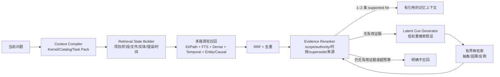

# P5-R0/R1 检索状态比较评测与召回架构升级子方案

> ⚠️ 本文已被《记忆系统手册 v4》（docs/记忆系统手册.md，唯一权威）吸收取代——2026-08-20 Cyrus 拍板（D2 §9 / D3 治理制度）。仅留档，勿据此开发。索引见 docs/INDEX.md。

> 日期：2026-08-18
> 状态：已纳入 [P5 记忆智能层统一架构](./P5-记忆智能层统一架构.md)；本文是召回与消融的详细子方案，不再单独决定 P5 编号和阶段顺序
> 定位：P5-R0/R1 的 Recall Orchestrator、Context Compiler 与规模评测
> 授权边界：本文只给出比较结果、接口合同、实验门槛和交接顺序；不授权修改 Stable 数据、发布版本或调用付费模型。

最新权威顺序以[记忆系统手册](./记忆系统手册.md)与[P5 统一架构](./P5-记忆智能层统一架构.md)为准。本文统一使用 A/B1/B2/B3/C/D 六层消融；不得从 Hybrid 直接跳到 LLM 潜在线索。

## 0. 结论先行

DSH 现有 P4 Hybrid（FTS5 + bge-m3 dense + RRF）已经解决了“措辞不同但意思相近”的一部分问题，却仍然把**当前问题文本**当成几乎唯一的召回线索。面对“用户自己也说不清方向”“错误表象与历史根因没有语义重合”“同一事实反复迭代”“几万条记忆只应注入 1–2 条”等情况，仅继续调余弦阈值或更换 embedding 模型不会解决根因。

建议把召回升级为六个可单独验证的层级，而不是一次性建成一个复杂 Agent：

1. **A：现有 Hybrid 基线**——项目/状态硬过滤，FTS 与向量两路召回，RRF 融合；
2. **B1：Context Compiler / Reinstatement**——恢复项目、阶段、文件、错误、工具、失败尝试、时间和实体，并选择 Kernel/Catalog/Task Pack/Deep Evidence；
3. **B2：确定性多路检索**——在 FTS/Dense 外增加 ID/Path、Temporal、Entity/Causal 通道；
4. **B3：Evidence Reranker**——在小候选集上按来源、时效、supersede、冲突和任务适配重排；必要时再比较本地 cross-encoder；
5. **C：Latent Cue Generator**——只有确定性路径不足时，LLM 提出 2–5 个低权重搜索假设；
6. **D：Iterative Re-retrieval**——首轮无有效证据时最多再走两轮，最终选 0–2 条或明确“不召回”。

推荐实现顺序是 **A → B1 → B2 → B3 → C → D**。每一层必须在同一冻结记忆快照上做配对比较；达不到增益和安全门槛就 NO-GO，保留更简单的上一层。

## 1. 已核对的当前事实

### 1.1 DSH 当前实现

- v0.3.0 已完成 P4 本地 embedding 与 Hybrid 默认开启；P6-2 的 20/329 盲审已判定提取质量 GO，但全量历史导入及 v0.3.1 被主动后移到工作台/控制台完善之后。
- P3-2 已有轮末 fire-and-forget 提取：只收顶层会话，需求门通过后调用独立提取连接，每轮最多写 2 条 candidate；失败不打断对话，candidate 仍需治理。
- 当前 `memory_query` 先给问题生成 query embedding，再从同 scope 读取 active 向量、做向量排名，并与 FTS 结果做 RRF。
- FTS 最多取 64 个 rowid；向量侧当前不是 ANN，也不是“全库严谨 top-k”，而是按更新时间读取最多 512 条（实现上限 1024 条）active 向量后 brute-force。**因此当前实现适合数百条规模，却不能据此宣称 5 万条语义召回仍完整**：旧而重要的记忆可能在向量计算前就因“最近 512 条”截断而消失。
- 现有单模型离线 spike 中，bge-m3 INT8 在 12 道本项目小样本上 Top1 11/12、Recall@3 100%、MRR 0.9444；这能证明模型可用，不能替代大规模系统评测。

### 1.2 MemoraX 公开实现能证明什么

[MemoraX Code 官方仓库](https://github.com/memorax-ai/memorax-code)当前公开了四客户端接入、npm 安装/升级/卸载、后台 writeback、Repo/Personal/Procedure Memory、Viewer 以及云端 API/Console；其[架构文档](https://github.com/memorax-ai/memorax-code/blob/main/ARCHITECTURE.md)也明确了四个客户端 Adapter、本地 Backend 和云 API 的边界。

本次只读源码快照为提交 `19e9dff237f9795d48ecef8a492f032114beea3c`。公开适配层能看到：

- 自动召回以当前 query 调 provider，并对注入上下文设置字符预算；
- 自动写回是独立后台分支，带 scope、redaction、缓冲、重试、去重和 reconciliation；
- Procedure Memory 以仓库内显式文件进入上下文，并提醒它只能作为流程参考，不能覆盖当前代码事实；
- 公开源码中没有找到可验证的写入奖励、召回奖励、任务结果奖励、GRPO 或 RL Training 闭环。

所以，MemoraX 的**分发、跨客户端、后台生命周期和产品化**是已经公开可核验的强项；其云端检索/训练内部质量无法从公开 Adapter 推断。DSH 也不应把文章或宣传中的 “Agentic RL” 当作已公开证明的实现事实。

### 1.3 Hindsight 与 Letta Code 带来的架构修正

本轮只读源码核验补充两类关键证据：

- [Hindsight](https://github.com/vectorize-io/hindsight)在 Recall 中并行使用 semantic、BM25、graph/entity/temporal/causal 通道，再做 RRF 与 cross-encoder rerank；其 consolidation/mental-model refresh 还提供 full/delta、snapshot/watermark、dry-run、current/candidate diff、based_on、retrieved-vs-used 和 trace。它证明“确定性多路 + 小集合重排”应排在潜在线索 Agent 之前。
- [Letta Code](https://github.com/letta-ai/letta-code)把 Recall、History Analyzer、Reflection 和 Memory Defrag/Doctor 拆开，并用 MemFS 的 diff/commit/worktree 追踪记忆变更。它证明召回子代理应拿到专门的检索任务包，而不是无差别继承全部主会话；写入治理应显示变更理由、diff 和回滚。

DSH 的取舍：吸收检索顺序、trace 与 diff 合同；保留 `project_id` 硬隔离、SQLCipher canonical store、candidate/approval/factual_at/supersede。Hindsight 的 memory-bank metadata/tag 不能替代项目门禁，自动 observation 在 DSH 中默认先成为 candidate。

### 1.4 当前比较结论

| 维度 | DSH 当前 | MemoraX 公开可核验 | 本轮判断 |
|---|---|---|---|
| 存储与隐私 | 本地 SQLCipher 分片、恢复口令、无强制云 | 云记忆需 Key；本地保留 trace/viewer 投影 | DSH 在纯本地和治理可控性上有差异化 |
| 项目与版本治理 | project_id、candidate/active、evidence、authority、supersede/factual_at 路线 | repo scope、native authority、含义比较/更新；云端内部不可见 | DSH 合同更显式，但仍需用真实旧版冲突题证明 |
| 自动写入 | P3-2 已有轮末候选提取，用户确认后 active | 后台 writeback、重试与 reconciliation 已产品化 | MemoraX 生命周期更成熟；DSH 的“先候选后确认”更保守 |
| 召回 | FTS + bge-m3 + RRF；数百条可用 | 公开层发 query 到 provider，核心排序不可见 | 无法宣布谁更强；DSH 必须通过盲测和规模门证明 |
| Procedure | 方案与治理合同已有，尚未自动构建上线 | 已有显式 Procedure Memory 文件和复用入口 | MemoraX 当前领先 |
| 安装与客户端 | DSH 单宿主，独立 bundle D0 在建 | 四客户端、一条 npm 安装与完整 update/uninstall | MemoraX 明显领先 |
| 公共证据 | 小型模型 spike，尚无公开系统 benchmark | 产品仓库无产品 benchmark 分数；团队另有 ScriptMem | 双方都不能仅靠叙述证明系统质量 |

最终表述应是：**DSH 在本地隐私、来源/时效/版本治理上具备形成更强产品的基础，但“总体不弱于 MemoraX”目前仍是待验证假设，不是可公开声称的结论。**

## 2. 为什么不能只依靠语义相似

### 2.1 一个 bug 的真实召回线索并不只是问题句子

例如当前表象是“问卷页偶尔显示旧选项”。历史记忆可能写的是“缓存 key 没带 schema version，数据迁移后必须失效旧缓存”。两者字面和句向量未必足够接近，但当前任务还有更多线索：

- 项目是食溯，不是亚马逊；
- 正在编辑问卷 schema、迁移器与缓存模块；
- 报错发生在切换版本之后；
- 刚尝试刷新 UI 无效；
- 历史根因属于“版本—缓存—失效策略”，而不是“页面显示”。

这些线索组合后才形成真正的检索锚点。

### 2.2 人脑研究能给设计启发，但不能当作软件证明

- 人类情景记忆研究发现，部分线索可能触发一个事件其他组成部分的 pattern completion 与皮层复现；这支持“用文件、地点、人物、阶段、时间等多线索重建事件”，而不是只比较一句话。[Evidence for holistic episodic recollection via hippocampal pattern completion](https://www.nature.com/articles/ncomms8462)
- 研究也观察到海马中的 item-context 关联复现早于后续皮层 item 信息复现，说明“先恢复上下文，再恢复具体内容”是值得工程验证的顺序。[Coordinated representational reinstatement in the human hippocampus and lateral temporal cortex](https://www.nature.com/articles/s41467-019-09569-0)
- 任务情境的重现与海马模式有关，提示“任务要求/阶段”本身可以成为检索线索，而不只是被检索内容中的词。[Prefrontal reinstatement of contextual task demand](https://www.nature.com/articles/s41467-020-15928-z)

这些论文只支持设计假设：**多线索、上下文复现、部分线索补全可能优于单句语义。**它们不证明某个 LLM“灵感生成器”一定提高 DSH 的召回，更不证明 Agent 越复杂越好。因此后续每层都必须做消融实验。

## 3. 六层比较实验

### 3.1 A：Current Hybrid（必须冻结的基线）

```text
query
  -> scope / project_id / status / authority 硬过滤
  -> FTS 候选
  -> dense vector 候选
  -> RRF
  -> 0–2 条注入
```

本组不能在实验途中调权重。先冻结模型、generation、RRF 参数、阈值、候选数和记忆快照，否则后续增益无法归因。

### 3.2 B：Context Reinstatement

在 A 前增加一个确定性 `retrieval_state`，优先从现成会话/工具状态采集，不先调用 LLM：

```json
{
  "project_id": "stable-id",
  "task_intent": "修复问卷旧版本显示",
  "phase": "debugging",
  "files": ["questionnaire-schema.ts", "cache.ts"],
  "entities": ["schema_version", "cache_key"],
  "errors": ["切换版本后仍显示旧选项"],
  "tools": ["test", "database migration"],
  "failed_attempts": ["只刷新前端状态无效"],
  "temporal_hint": "问卷 v10 之后",
  "requested_memory_types": ["project_fact", "pattern", "skill"]
}
```

由脚本生成多路 query：原问题、实体/路径、错误特征、任务阶段、时间/版本。各路独立召回后合并，不能把所有字段拼成一个超长 embedding。

Context Compiler 同时决定本轮上下文的四层装载：

- Kernel：project_id、安全/授权边界、最高优先级稳定规则；
- Catalog：system/AGENTS/Procedure/关键记忆的目录摘要，让 Agent 知道“还有什么可以查”；
- Task Pack：当前任务相关的规则和记忆正文；
- Deep Evidence：完整来源、旧版链和复合 bundle，按需展开。

每项记录 `reason/scope/freshness/estimated_value/token_cost`。评价标准是完成整个任务的 tokens、工具调用、试错和返工，而不是首轮 prompt 是否最短。

### 3.2.1 B2：Temporal / Entity / Causal 多路候选

在调用 LLM 之前，先用脚本和已登记关系产生可解释候选：

- Temporal：明确日期、相对时间、版本区间和 `factual_at/valid_from/to`；
- Entity：文件、模块、错误码、API、Schema、工具、项目对象；
- Causal：`CAUSED_BY / RESULTED_IN / SOLVED_BY / VALIDATED_BY / INVALIDATED_BY` 等小型 typed relation；
- ID/Path：claim id、文件路径、提交、测试和 artifact locator。

每路独立 top-k，再与 FTS/Dense 做 RRF。图数据库不是前置；先用 SQLite 关系表证明关系任务有增益。

### 3.2.2 B3：Evidence Reranker

RRF 后只对小候选集重排，特征至少包括：project/scope、authority/approval、source availability、factual time、applicable version、supersede/conflict、任务阶段、通道一致性和重复簇。先实现确定性规则；只有配对评测证明收益，再增加本地 cross-encoder。最终仍只能输出 0–2 条或 abstain。

### 3.3 C：Latent Cue Generator

只有 B 的高置信线索不足，或首轮没有 supported hit 时才调用小模型。它输出的不是答案，而是可搜索假设：

```json
{
  "hypotheses": [
    {"cue": "版本字段没有进入缓存键", "confidence": 0.46},
    {"cue": "迁移完成但旧派生数据未失效", "confidence": 0.38}
  ],
  "alternate_axes": ["版本治理", "缓存失效", "派生数据重建"]
}
```

硬规则：

- 最多 5 个 cue；每个 cue 有来源和置信度；
- cue 只能扩展搜索，不得写入记忆、不得注入最终上下文、不得当成“脑中已知事实”；
- 命中的记忆仍需来源、scope、时效和版本验证；
- cue 反复只命中同一错误簇时，必须降低该簇权重，避免确认偏误。

### 3.4 D：Iterative Re-retrieval

首轮结果通过证据重排器后，如果没有“正确、当前、同 scope、可支持任务”的记忆，最多再走两轮：

1. **抽象层切换**：从表象切到机制（例如 UI 旧数据 → cache invalidation）；
2. **因果/反例层切换**：搜索相同失败模式、被废弃方案、回归检查或“看似相同但不是”的案例。

停止条件任一满足即停止：

- 已选出 1–2 条 supported helpful memory；
- 两轮均无新候选；
- 预算、延迟或 token 上限达到；
- 只有低置信或已 superseded 内容，此时返回“不召回”。

## 4. 评测集：不能再用 8 条记忆抽 3 条

### 4.1 第一版最小覆盖矩阵

建议先做至少 140 个**脱敏、可人工判定**的 query-memory 配对，数字是启动下限，不是发布配额；如果某个风险格仍无覆盖，应继续补题。

| 分桶 | 启动下限 | 要证明什么 |
|---|---:|---|
| 明确词面/ID/路径 | 25 | FTS 强项不被复杂层破坏 |
| 同义改写/低字面重合 | 25 | dense/Hybrid 的真实增益 |
| 隐含方向/无直接语义 | 25 | B/C/D 是否真的解决“没有思路” |
| 旧版、冲突、反转、supersede | 25 | 最新事实优先，旧经验只作为历史参考 |
| 跨项目同词异义 | 20 | 食溯/亚马逊/量化不串库 |
| 无相关记忆/应 abstain | 20 | 不为“看起来聪明”而硬塞错误记忆 |

表格、代码、图片、复合方案不另凑一个数量桶，而是横切上述六桶；每种至少要有若干真实任务。图片只存受控资产引用、OCR/描述和 hash，不把二进制塞进 claim 文本。

### 4.2 记忆规模阶梯

同一评测集至少跑四个库规模：`1k / 10k / 50k / 200k active+confirmed`。非目标记忆必须包含真实相似干扰项、旧版本和跨项目同名项，不能只填随机文本。50k 之前必须修复“最近 512 条向量截断”问题，否则所谓大规模测试只是在测 FTS 和新近子集。

## 5. 指标与比较协议

### 5.1 首要指标

- **Supported Helpful Hit@2**：最终最多 2 条中，是否至少 1 条由人工判定为正确、当前、同 scope、确实能帮助任务；
- **Wrong-memory Injection Rate**：最终注入错误/过期/跨项目记忆的比例；
- **Stale Leakage**：存在新版时仍把旧版作为当前事实注入的比例；
- **Cross-project Leak**：必须为 0；
- **Abstention Accuracy**：无相关记忆时正确返回 0 条；
- **Task Success Delta**：同一 coding task 有/无记忆时最终完成率、试错轮数和验证质量差异。

辅助指标：Recall@K、MRR/nDCG、首次有效召回轮次、注入 token、query p50/p95、峰值 RAM、LLM 调用数与费用。

### 5.2 公平协议

1. 冻结记忆快照、模型、answer prompt、上下文/token 预算与机器；
2. A/B1/B2/B3/C/D 对每道题配对运行，顺序随机；
3. 标注者不看系统组别，只看 query、目标事实、候选来源和最终任务结果；
4. 检索指标与最终回答指标分开报告，不能用“回答模型猜对了”掩盖召回失败；
5. 公开配置、数据版本/hash、失败样例、延迟、硬件和成本；
6. 禁止 benchmark 专用关键词表、硬编码答案、提前把题目写进 Procedure。

### 5.3 建议晋级门槛（需 DSH 在实现前确认）

| 晋级 | 必须同时满足 |
|---|---|
| A → B1 | 隐含/上下文桶 Hit@2 提升 ≥10 个百分点；错误注入增加不超过 1 个百分点；跨项目泄漏仍为 0 |
| B1 → B2 | 时间/版本/实体/因果桶有新增 supported hit；stale leakage 不增；快速路径仍满足预算 |
| B2 → B3 | Wrong-memory/Stale Injection 下降，Hit@2 不显著回退；本地重排路径 p95≤1s |
| B3 → C | 隐含桶再提升 ≥8 个百分点；生成 cue 至少 30% 能带来新增相关候选；错误注入和 abstention 不恶化超过 1 个百分点 |
| C → D | 首轮 zero-hit 困难题再提升 ≥5 个百分点；平均额外轮次 <1；最多 2 轮；错误簇不放大 |
| 总体上线 | Cross-project leak=0；新版存在时旧版 active leakage=0；快速路径 p95≤300ms；本地重排路径 p95≤1s；需 LLM 的慢路径 p95≤4s |

门槛是首轮工程建议，不是已完成结果。真实数据若表明收益不足，正确结论是 NO-GO，而不是不断改题或放宽错误定义。

## 6. 升级版召回架构



### 6.1 脚本与 LLM 的边界

| 工作 | 默认实现 | 原因 |
|---|---|---|
| scope/status/authority/supersede 过滤 | SQL/脚本硬门 | 安全与一致性不可交给概率模型 |
| 文件、路径、错误码、工具、时间抽取 | 事件结构 + 规则 | 快、可复现、可解释 |
| FTS、向量、RRF/加权融合 | 脚本 | 低延迟基线 |
| 时效衰减与“新版压旧版” | 版本图 + 规则 | 不能靠 LLM 猜哪个更新 |
| 潜在线索/机制假设 | 小型 LLM，条件触发 | 只在缺少直接锚点时发挥开放联想 |
| 复杂候选相关性判断 | 小型 reranker/LLM，候选≤12 | 只看小集合，控制成本和幻觉 |
| 是否写入 active | 用户确认/治理策略 | 检索过程不得反向污染记忆库 |

### 6.2 数据合同

新增的是**短寿命检索状态和审计事件**，不是新的长期记忆：

- `retrieval_run`：run_id、session_id、project_id、query_hash、路径 A/B1/B2/B3/C/D、预算、耗时；
- `retrieval_cue`：来源（user/file/error/LLM）、cue、confidence、是否带来新候选；
- `retrieval_candidate`：claim_id、通道排名、版本状态、最终判定理由；
- `retrieval_feedback`：used/ignored/helped/harmed/unknown，默认不根据一次点击自动改 active 权重；
- 内容型 trace 默认本地、可关闭、短保留；产品遥测只允许无内容聚合指标。

### 6.3 大规模向量召回必须先补的地基

当前“按更新时间取最多 512 条再 brute-force”有两个问题：旧而关键的记忆不参与，且规模数字无法代表召回覆盖。进入 50k 门前二选一做 spike：

1. **SQLite 内强预过滤 + 小候选集向量重排**：按 scope、类型、实体、时间、版本、文件等将候选压到数百条；优点是简单、可解释，缺点是预过滤漏项会让 dense 失去补召回能力；
2. **本地 ANN sidecar/index**：为每个 shard/generation 建 HNSW 等近似索引；优点是能全量语义搜索，缺点是引入索引一致性、原生依赖、重建、加密派生数据和打包复杂度。

建议先做方案 1 的覆盖实验；如果 50k 隐含题 Recall@20 不过门，再做 ANN spike。无论哪种，embedding 派生数据都必须可重建，generation 不混比，删除/supersede 后索引同步，索引损坏可降级 FTS。

### 6.4 结构化与复合记忆

一套含表格、代码、图片的记忆不应被压成一条 4000 字 claim：

- `memory_bundle` 保存标题、摘要、scope、authority、时效和版本；
- 子块按 `text / table / code / image_ref / file_ref` 分块，各自 embedding；
- 图片仅保存本地受控 URI、hash、尺寸和经过确认的描述/OCR，默认不把原图送外部模型；
- 召回先命中 bundle/子块，再按预算展开最小必要片段；
- 更新时可 supersede 单个子块或整个 bundle，保留来源链；
- 最终注入 1–2 个 bundle 的少量片段，而不是把整份文档塞进 prompt。

## 7. 与 Curator、Procedure、Daydream 的关系

- **Context Compiler**服务“这轮必须带什么、目录里告诉 Agent 有什么、哪些正文按需加载、Recall 子代理拿 Light/Standard/Deep 哪一级任务包”。它计算总任务成本，不只追求初始 prompt 最短。
- **本文件的召回控制层**服务“当前任务要找什么、该找几轮、最终注入哪 0–2 条”。
- **Memory Intelligence Engine**以 Online Curator、History Analyzer、Memory Doctor、Reflection/Procedure Builder 四个 Profile 处理写入和维护；它提供更干净的检索语料，但不能在召回时临时改事实。
- **Memory Admission Controller**允许低风险、同项目、可确定性复核、无冲突、可撤销的内容由 Agent 按 policy-auto 批准；决策、偏好、覆盖、跨项目、Procedure/Skill 与安全规则仍需用户确认。
- **Procedure Builder**从多次成功且条件相似的经验中提出 procedure candidate；必须记录前置条件、例外、失败边界和验证步骤，不能把一次成功直接固化成 skill。
- **Daydream/Reflection**在离线低优先级时寻找跨记忆关系和新经验候选；它不能直接写 active，也不能成为每次 query 的必经链路。
- **Outcome/Reward**先作为可审计反馈事件存在。没有足够在线数据、反事实对照和污染防护前，不做“奖励高就自动强化/写入”的 RL 叙述。

## 8. 实施顺序与 DSH 交接

### E0（对应 P5-R0）：先冻结基线和修正规模声明

- 固化 A 组参数、测试快照和 query trace；
- 在文档/UI 中明确当前向量最多覆盖最近 512 条；
- 建 1k/10k/50k/200k fixture 与六类评测集；
- 输出 A 组完整结果，禁止只报 Recall@3。

### E1（P5-R1）：Context Compiler / B1

- 新增 Context Compiler、`retrieval_state` 与多路 query；
- 先用现有事件结构和规则，不加新 LLM；
- 通过 A→B1 门才进入 E2。

### E2（P5-R1）：B2/B3 确定性多路与 Evidence Reranker

- 增加 Temporal/Entity/Causal typed relation 通道、RRF、去重和规则 Evidence Reranker；
- 只有规则重排过门后才比较本地 cross-encoder；
- 依次通过 B1→B2→B3 门才进入 E3。

### E3（P5-R4）：条件式 C

- 复用独立“记忆检索推理”连接或 BYOK；
- 只在首轮无 supported hit 时触发；
- 保存 cue 审计和费用，但不保存原始敏感内容到外部遥测。

### E4（P5-R4）：D 有界再检索

- 最多两轮、候选≤12、最终≤2；
- 加入时效、authority、supersede、来源质量和负面反馈；
- 失败时显式 abstain，不退化成“随便给几条”。

### E5（P5-R2/R3）：与 Curator / Procedure / Outcome 汇合

- 先观察检索与写入指标，再决定哪些反馈可影响 importance；
- 接入统一 Memory Intelligence Engine 的四 Profile 和 A0–A4 Admission；
- observation/procedure 只产 candidate，只有低风险可复核项允许 policy-auto；
- Reflection 继续按统一 P5-R4 和 Daydream 子方案走无写入 spike。

### 交付物清单

- `retrieval-eval-v1.jsonl` 与脱敏说明；
- 冻结 memory snapshot 的版本/hash；
- A/B1/B2/B3/C/D runner 与固定配置；
- 分桶结果、置信区间、失败案例、延迟/内存/费用；
- 规模索引 spike 决策记录；
- `retrieval_state`、cue、candidate、feedback schema；
- Stable 开关与一键回退 A 组的 kill switch；
- 更新《记忆系统手册》中的“已实现/提案”状态，禁止把计划写成完成。

## 9. 可借鉴的公开 benchmark

- [LongMemEval](https://github.com/xiaowu0162/LongMemEval)：500 道长期对话问题，覆盖信息抽取、多会话推理、知识更新、时间推理和 abstention，适合验证时效/冲突与长期检索；
- [BEAM](https://arxiv.org/abs/2510.27246)：用于 100K–10M 规模的 agent memory 检索压力。DSH 先在修复最近 512 条截断后做 100K，再按证据推进 500K/1M；10M 只作远期，不用随机垃圾填充冒充真实干扰项；
- [ScriptMem](https://github.com/memorax-ai/ScriptMem)：457 道跨时间、跨事件、多参与者问题，适合关系和事件链；原始剧本文本不随仓库提供，使用前需解决数据可得性；
- [LoCoMo](https://snap-research.github.io/locomo/)：长对话、多 session、QA/摘要/多模态，可作补充，不足以代表 coding project memory；
- [MemoryArena](https://memoryarena.github.io/) 与 [LongMemEval-V2](https://github.com/xiaowu0162/LongMemEval-V2)：更强调多 session 的 agentic task 与 memory-action loop，适合 Procedure/Outcome 层完成后再挑战。

Hindsight 可作为公开 challenger，其官方仓库当前报告 LongMemEval 与 BEAM 成绩；这些是特定协议、模型和配置下的结果，只能在 DSH adapter、answer model、预算和数据完全对齐后比较。外部 benchmark 不能替代 DSH 自有六类挑战集，因为它们通常不测试 SQLCipher、project_id 隔离、候选确认、旧版 supersede、恢复演练和代码/表格/图片 bundle。

---

**给 DSH 的最终指令：**先完成 R0 并提交 A 组实测报告；再按 B1→B2→B3 走完不依赖 LLM 的确定性升级，最后才评估 C/D。不要把“人脑启发”“灵感”或“Agentic RL”写成已证明能力。最近 512 条规模覆盖问题不解决，任何 5 万条召回宣传和 BEAM 公共比较都应暂停。
