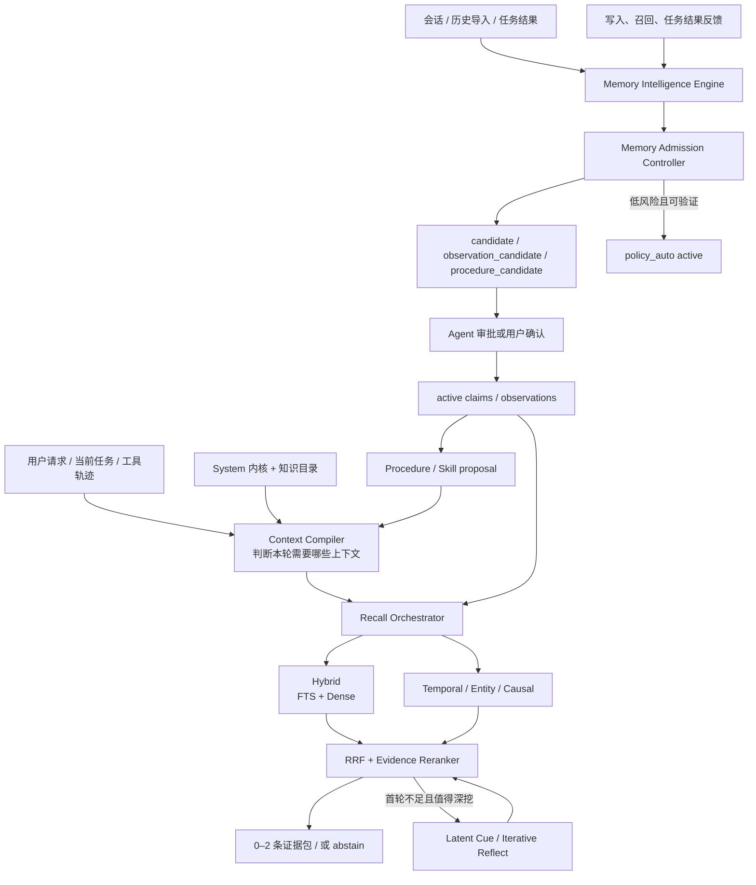

# P5 记忆智能层统一架构

> 版本：v1（2026-08-18）
> 状态：**当前 P5 权威架构；尚未实现，不构成 Stable 写入、付费调用或发布授权**
> 适用范围：P4 Hybrid 之后的召回控制、上下文编译、记忆治理、经验固化、反思与反馈闭环
> 取代口径：P5 不再等同于“可选图”。图只是 P5 的可选检索通道；本文件覆盖并统一此前分散在召回、Daydream、Curator、Procedure 和 Outcome 讨论中的方案。

相关子方案继续作为设计证据，不再单独决定阶段顺序：

- [P5 检索状态比较评测与召回架构升级方案](./P5-检索状态比较评测与召回架构升级方案.md)
- [P5 Daydream 记忆反思层评估与架构整合交接](./P5-Daydream记忆反思层评估与架构整合交接.md)
- [P4 完成后路线图](./P4完成后路线图-Codex历史导入-P6稳定化-P5后置.md)
- [记忆系统插件商业化路线](./记忆系统插件商业化-首发视频门槛与Benchmark路线.md)

---

## 0. 拍板结论

P5 的目标不是“再加一个 Agent”或“多建一种索引”，而是让 DSH 学会做四类判断：

1. **什么值得记、由谁批准、何时失效；**
2. **当前任务是否需要历史、需要哪部分、值得投入多少上下文；**
3. **多次经历能否合并成仍有来源、时效和适用边界的认识或 Procedure；**
4. **记忆是否真的减少试错并改善结果，而不是只增加召回次数。**

统一名称为 **Memory Intelligence Engine（记忆智能引擎）**。它不是一个拥有无限上下文和无限写权限的超级 Agent，而是一套共享合同下的四种运行 Profile：

| Profile | 何时运行 | 主要职责 | 默认权限 |
|---|---|---|---|
| Online Curator | turn/task 结束后 | 提取、去重、初步分类、冲突提示 | 低延迟、低预算；通常只写 candidate |
| History Analyzer | 历史导入或批处理 | 从长会话提取事实、决定、事故、经验和来源 | 分批、可断点；只写 staging/candidate |
| Memory Doctor | 手动或低频维护 | 找重复、过期、冲突、孤立来源、错误 scope 和索引异常 | 只出 diff/修复建议；低风险机械修复可自动执行 |
| Reflection / Procedure Builder | 低频、按需 | 建立 observation、洞察和可复用 Procedure 候选 | 默认 dry-run；不得直接改 active/Skill/Gate |

四个 Profile 共用 `project_id`、证据、时效、版本、审批、预算、trace、回滚和 kill switch，不各建一套事实库。

---

## 1. 设计来源与 DSH 的取舍

### 1.1 已核验参考

| 系统 | 最值得借鉴 | DSH 不照搬 |
|---|---|---|
| Hindsight | Retain/Recall/Reflect；语义、BM25、图、时间并行召回；RRF + cross-encoder；observation/mental model 的增量刷新、来源和历史 | 不让二阶 observation 默认自动成为可信当前事实；不以 memory bank metadata 代替 DSH 的 `project_id` 硬隔离 |
| Letta Code | 独立 Reflection、History Analyzer、Memory Defrag/Doctor、Recall 子代理；MemFS 的 diff、commit、worktree 和变更理由 | SQLCipher 仍是 canonical store，不把 Git 当数据库；不默认复制完整上下文给每个子代理 |
| MemoraX Code | 后台 writeback、Repo/Personal/Procedure Memory、跨客户端安装与产品化 | 不把不可见云端内部能力当公开证据；不牺牲本地治理与来源链换产品便利 |
| Daydream | 从多条历史材料主动发现联系，generator/critic 分离 | 不随机大量配对后直接写回；不把有趣联想当事实 |

本轮只读源码基线：Hindsight `0dd32a3d6d5912cb059c9432abaad9472b32f519`；Letta Code `5786193dd10dadde88a761f2f44bf3e7d4e5639e`。两份仓库位于 `D:\CodexData\research\memory-projects\`，不作为 DSH 构建依赖。

### 1.2 DSH 的差异化

DSH 不与市场竞争“谁能存最多聊天”，而竞争以下组合：

- DSH 原生项目身份与工作台联动；
- 本地 SQLCipher、离线 embedding、备份恢复和整机迁移；
- `project_id` 硬隔离 + tag/实体/时间/关系软检索；
- `factual_at`、`valid_from/to`、`supersedes` 区分当前事实与历史原因；
- Agent 自动化与人工控制分级，而不是全自动或全手工；
- 每次写入、合并、召回、Procedure 提升都有 evidence、diff、reason 和回滚；
- 以 task success、少试错、少返工衡量价值，而不是以“记了多少条”衡量。

---

## 2. 总体架构



两条主循环必须分开：

- **记忆循环**：经历 → 提取 → 审批 → 合并/失效 → Procedure；允许异步，不能阻塞主任务。
- **召回循环**：任务 → 上下文判断 → 多路检索 → 证据重排 → 最小注入；在线且有延迟预算，不能顺手修改 canonical memory。

---

## 3. 不可破坏的边界

### 3.1 `project_id` 与 tag 结合，但不能互相替代

执行顺序固定为：

```text
Project Control project_id / allowlisted global scope 硬过滤
  → status / authority / sensitivity / version 硬过滤
  → tag / entity / file / error / time / keyword / vector / relation 软检索
```

`project_id` 回答“谁有资格看到”；tag 回答“内容讲什么”。tag 不得扩大 scope。跨项目通用经验必须从项目事实生成新的 global/portfolio candidate，经审批后才可共享；原项目事实不因此改成 global。

### 3.2 当前事实源优先

源码、Schema、当前状态、Project Control 和机器可验证结果高于历史记忆。召回到旧事实时：

- 有新版：新版用于当前判断，旧版只在解释历史原因时展开；
- 无法重新验证：明确标记未验证；
- 冲突未解决：成对呈现或 abstain，不由相关性分数静默裁决。

### 3.3 图与中心性不是权威

图只负责提供候选和关系路径。PageRank、proof count、召回频率和用户点击都不能压过 scope、authority、factual time、supersede 和当前证据。

---

## 4. Memory Admission Controller：谁可以批准写入

### 4.1 核心原则

“LLM 生成内容不得直接 active”继续成立，但补充一个重要例外：

> Agent 可以在**明确策略 + 可复核证据 + 低错误代价**同时满足时代表系统审批；不能只因为模型自评置信度高就批准自己的推断。

### 4.2 五级动作

| 级别 | 动作 | 适用情况 |
|---|---|---|
| A0 Evidence-only | 自动登记事件、hash、locator、工具结果，不生成自然语言结论 | 测试结果、文件版本、导入索引 |
| A1 Candidate | 自动形成候选，默认不进入普通召回 | 会话提取、History Analyzer、二阶总结 |
| A2 Policy-auto active | Agent 按确定性政策批准，可召回但低于用户确认 | 低风险、同项目、可撤销、可直接验证、无冲突的内容 |
| A3 User-confirmed | 必须由用户确认 | 决策、偏好、冲突覆盖、跨项目经验、Procedure/Skill、权限和安全规则 |
| A4 Deny/Quarantine | 拒绝或隔离 | 密钥、禁止类型、来源不明、scope 冲突、prompt injection、无法解释的高风险结论 |

### 4.3 A2 自动批准必须全部满足

1. `project_id` 唯一确定，且不提升到 global/portfolio；
2. 来源可访问，至少一种确定性方式能复核；
3. 不与 active/current source 冲突，不覆盖或删除旧记忆；
4. 非敏感、非用户画像、非商业/医疗/权限/发布决定；
5. 内容是补充、精确去重/索引合并，或机器结果的受控规范化；
6. 错误可低成本撤销，有 diff、receipt 和来源；
7. 通过 freshness、版本和 secret/PII 门；
8. 自动审批配额未超，近期同类审批没有被用户纠正。

典型可自动批准：同一 active claim 增加一个新证据；完全重复候选合并来源；经过当前测试/文件直接验证的低风险事实索引。典型不可自动批准：从多轮讨论概括出产品决策；宣布某旧方案已经废弃；把项目经验提升为通用 Skill；修改 System/AGENTS/Gate。

### 4.4 信任与保险丝

- 每类自动审批策略单独统计 `accepted / corrected / harmed`；被用户纠正一次即可降级为 A1/A3；
- 每日、每项目、每 kind 有静默审批额度；连续冲突或错误达到阈值自动暂停；
- `policy_auto` 必须与 `user_confirmed` 分开显示和排序；
- 用户可以查看、批量撤销、暂停全部自动审批；
- Agent 不得批准自己刚生成的 Reflection/Procedure 候选。

---

## 5. Context Compiler：什么应该进入当前上下文

### 5.1 不是越少越好，而是看总任务成本

优化目标为：

```text
总任务成本 = 初始上下文 + 后续检索 + 重复推理 + 工具调用 + 走错方向/返工
```

只减少首轮 prompt tokens 可能增加总体成本；无差别常驻又会造成注意力稀释、旧内容压过新状态。Context Compiler 应估算每项内容的 `expected_value / token_cost / risk`。

### 5.2 四层上下文

| 层 | 内容 | 装载方式 |
|---|---|---|
| Kernel | 当前 project_id、安全/授权边界、最高优先级稳定规则、召回协议 | 每轮必在，严格小型 |
| Catalog | system/AGENTS/Procedure/关键记忆“有哪些”的目录、版本和摘要 | 每轮紧凑进入，让 Agent 知道可查什么 |
| Task Pack | 与当前阶段、文件、错误、工具、实体、时间相关的正文 | 任务开始自动选择 |
| Deep Evidence | 完整来源、旧版本链、关系路径、长文档块 | 需要时延迟展开 |

system 目录不能笼统全塞或全省。常驻的是 Kernel 和 Catalog；Task Pack、Deep Evidence 动态加载。每个装载项记录 `reason`、`scope`、`freshness`、`estimated_value` 和 `token_cost`，才能评估它究竟节省还是浪费 tokens。

### 5.3 Recall 子代理上下文

默认不给 Recall 子代理复制整段原始对话，而由 Context Compiler 生成检索任务包：

```text
project_id / 用户目标 / 当前阶段 / 相关文件与实体 / 错误
已尝试与失败原因 / 时间版本线索 / 允许访问的 scope
需要找哪类记忆 / 禁止项 / 预算 / 停止条件
```

三级升级：

1. Light：query + project + module + 时间；
2. Standard：再加任务摘要、失败轨迹、文件、实体和当前假设；
3. Deep：只有前两级无结果、高风险或复杂因果任务才读取完整会话/轨迹。

---

## 6. Recall Orchestrator：从几万条中选 0–2 条

### 6.1 推荐顺序

```text
0. 判断是否需要历史；不需要则零检索
1. project/scope/status/authority/version/sensitivity 硬过滤
2. Retrieval State Builder：任务、阶段、文件、实体、错误、工具、失败尝试、时间
3. 并行候选：ID/Path、FTS/BM25、Dense、Temporal、Entity/Causal
4. RRF 合并、精确与语义去重
5. Evidence Reranker：来源、时效、supersede、冲突、任务适配
6. 返回 0–2 条最小证据包；必要时延迟展开 bundle
7. 首轮无 supported hit 且任务值得深挖时，才启用 Latent Cue/有界再检索
8. 最多两轮仍无证据则明确 abstain
```

Hindsight 证明“语义 + 关键词 + 图/实体/时间 + RRF + reranker”是一条成熟参考路线，但 DSH 应先按可测增益逐路启用。图不是前置；小型 typed relation 表和 temporal filter 可以先于 vendor graph。

### 6.2 规模地基

当前向量通道按更新时间截取最多 512 条 active 向量，进入 50k/BEAM 评测前必须修复。顺序：

1. 先试 `scope + kind + entity + time + version` 强预过滤后的小候选向量重排；
2. 若 50k 的困难题 Recall@20 仍不过门，再评估每 shard/generation 的本地 ANN；
3. ANN 派生索引必须可重建、可加密/删除/迁移，损坏可降级 FTS。

### 6.3 结构化与复合记忆

使用 `memory_bundle` 表示一套含文本、表格、代码、图片或文件的记忆；子块类型为 `text/table/code/image_ref/file_ref`。先命中 bundle/子块，再按预算展开最小片段。图片保存受控 URI、hash、尺寸和确认后的描述/OCR，不把二进制塞进 claim，也不默认送外部模型。

---

## 7. Curator、Consolidation 与时效

### 7.1 Observation 必须有候选层

Hindsight 式 observation/mental model 能把大量事实压缩成更可用的认识。DSH 采用它的 consolidation 思路，但默认生成 `observation_candidate`，原因是二阶总结可能漏看新版、把讨论误当结论或把项目经验过度泛化。

可直接成为 active 的 observation 仅限 A2 条件全部满足；涉及冲突、覆盖、跨项目或解释性综合时必须 A3。

### 7.2 observation 合同

```text
observation_id
project_id / scope
canonical_text
status / approval_class
source_memory_ids[]
proof_count
contradiction_count
valid_from / valid_until / factual_at
based_on_snapshot / watermark
refresh_mode(full|delta)
history[] / superseded_by
retrieved_source_ids[] / actually_used_source_ids[]
generator / policy / prompt version
```

刷新必须支持 `preview/dry-run`、`full/delta`、snapshot/watermark、candidate/current diff、来源漂移和回滚。`proof_count` 只是支持度信号，不是正确性的替代品。

### 7.3 食溯问卷多次迭代的处理

- 每一版原始决定和证据保留为事件/历史；
- 当前有效版本是一条 active claim，明确 `factual_at/applicable_version`；
- 新版用 `SUPERSEDES` 指向旧版；旧版进入 Cold，但保留“为什么当时这样做”；
- 被证明错误且无复用价值的内容归档；
- 虽过期但包含可迁移教训的内容，拆成历史事实 + 独立 pattern candidate；
- 召回默认返回当前版；只有问题询问演变、原因或回归风险时才展开旧版链。

### 7.4 Memory Doctor

Doctor 每次先产可见 diff：

- exact/semantic duplicate；
- active 冲突、缺少 supersede 的版本链；
- 过期或来源不可用；
- scope/tag 错置；
- 孤立 evidence、embedding/FTS 不一致；
- 长期未使用但 importance 高的待复核项；
- 被频繁召回但经常 ignored/harmed 的可疑记忆。

精确去重、孤立派生索引修复等机械动作可按 A2 自动执行；语义合并、覆盖、归档、跨项目提升必须人工确认。

---

## 8. Procedure Memory 与反馈/奖励

### 8.1 Procedure Builder

Procedure 不是“把一次成功总结成 Skill”。候选至少需要：

- 两次以上条件相似、结果可验证的成功轨迹，或一次高价值轨迹 + 独立复现；
- 明确触发条件、输入、步骤、工具、验证、停止条件、失败模式、例外和回滚；
- 与当前代码/平台版本相容；
- 记录支持与反例轨迹；
- 先生成 `procedure_candidate` 和 diff，用户确认后才提升 Skill；
- Skill 仍需自己的测试/脚本验证，记忆系统不能直接改 System/AGENTS/Gate。

### 8.2 三类反馈事件

| 反馈 | 例子 | 初期用途 |
|---|---|---|
| Write feedback | confirm/reject/correct/expire/merge | 评估提取和审批策略 |
| Recall feedback | retrieved/used/ignored/helped/harmed | 评估召回与上下文选择 |
| Task outcome | test pass、返工、用户接受、问题复发 | 判断记忆是否真正改善结果 |

这些先进入 append-only event ledger，不直接在线训练或自动强化。原因是“被召回”不等于“有帮助”，“任务成功”也可能由模型或工具而不是记忆造成。只有在冻结数据、对照组、污染防护和可回滚权重版本齐备后，才允许离线学习排序参数；暂不使用“Agentic RL 已完成”的说法。

---

## 9. Reflection 与可选图层

### 9.1 Reflection

Daydream/Hindsight 式 Reflection 只在低频、按需、预算允许时运行：从高权威 active claims 中寻找“决定→结果、事故→Gate、重复问题→共同根因、规则→反例”等联系。输出必须包含来源、假设、反证、适用条件和建议验证，只能进入 candidate。

### 9.2 图层

先用现有 `claim_relations` 扩展少量 typed relation：`SYNTHESIZED_FROM / CAUSED_BY / RESULTED_IN / VALIDATED_BY / INVALIDATED_BY`。只有关系任务评测证明增益、规模需要且 Windows 打包/备份/迁移合同可接受时，才引入 vendor graph/ANN。图不是 P5 完成条件。

---

## 10. 运行预算与用户体验

| 路径 | 目标 | 是否阻塞对话 |
|---|---|---|
| Fast recall | scope + FTS/Hybrid + RRF，0–2 条 | 是；目标 p95 ≤300ms |
| Local rerank | 多路候选 + 本地 reranker | 是；目标 p95 ≤1s |
| Agentic recall | Latent Cue/最多两轮深挖 | 可显示“正在查找历史”；目标 p95 ≤4s，超时回退 |
| Online Curator | 每轮最多少量候选 | 否；fire-and-forget，有界队列 |
| History/Doctor/Reflection | 批量维护 | 否；低优先级、可暂停、可断点 |

任何后台任务都不得抢占主对话的 embedding worker、数据库 writer 或 CPU。建立优先级队列、backpressure、批量上限、缓存和 deadline；主任务繁忙时自动暂停批处理。

Workbench/Project Control 至少提供：Memory Inbox、Current/History 时间线、来源与召回解释、Curator/Doctor diff、Procedure candidate、自动审批策略与暂停开关。用户不应靠记住内部工具名治理记忆。

---

## 11. 实施顺序与出口

### S0：完成当前基座收口

- v0.3.1 factual_at v5/backfill；
- P6-2 受控全量历史处理；
- 三项目真实治理和用户可见候选/来源/版本 UI；
- 修复最近 512 条向量覆盖限制或冻结诚实支持规模。

出口：M1“可信跨会话记忆闭环”可复跑；不是 P5 智能层完成。

### P5-R0：冻结基线与数据合同

- DSH Memory Challenge v1；1k/10k/50k/200k 阶梯；
- 冻结 current Hybrid、记忆快照、配置和硬件；
- 定义 Context Pack、approval、observation、feedback、procedure schemas；
- 全部 P5 功能先有 preview/dry-run 与 kill switch。

### P5-R1：Context Compiler + 确定性多线索召回

- Kernel/Catalog/Task Pack/Deep Evidence；
- Retrieval State Builder；
- ID/Path、Temporal、Entity/Causal 多路候选；
- RRF + evidence rerank；
- Light/Standard/Deep Recall 包。

只有对 Hybrid 基线有可测增益且错误/串项目不恶化才上线。

### P5-R2：Curator + Consolidation + Memory Doctor

- 四 Profile 共用引擎；
- A0–A4 审批、配额、降级和回滚；
- observation candidate、full/delta refresh、watermark/diff；
- duplicate/conflict/stale/scope Doctor；
- 先无写入报告，再 candidate，最后只开放少量 A2。

### P5-R3：Procedure + Outcome Ledger

- procedure candidate 与 Skill diff；
- 写入/召回/任务结果事件；
- 任务成功、试错轮数、返工和错误记忆影响评测；
- 不做在线 RL，不让一次成功自动固化。

### P5-R4：Agentic Recall / Reflection / Graph

- 首轮无证据时的 Latent Cue 与有界再检索；
- Reflection candidate；
- 只有 typed relation 仍不够时才做 vendor graph spike；
- 每项都允许 `NO-GO`，不因阶段编号强行上线。

---

## 12. 评测与发布门

### 12.1 核心指标

- Supported Helpful Hit@2；
- Wrong-memory Injection、Stale Leakage、Cross-project Leak（必须 0）；
- Abstention Accuracy；
- Task Success Delta、试错轮数、验证质量、返工率；
- candidate 接受/纠正/过期率；
- policy-auto correction/harm rate；
- observation grounding 与 stale rate；
- procedure 复现成功率；
- 总任务 tokens、工具调用、延迟、RAM、费用，而非只看召回 prompt tokens。

### 12.2 外部路线

1. DSH Memory Challenge；
2. LongMemEval；
3. 修复 512 截断后挑战 BEAM 100K；
4. 规模地基稳定后挑战 BEAM 500K/1M，10M 只作远期；
5. ScriptMem 用于关系/事件链；
6. Procedure/Outcome 完成后再做 LongMemEval-V2 / MemoryArena。

Hindsight 是公开 challenger，不是 DSH 的依赖。任何对外比较必须同数据、answer model、prompt/token 预算、硬件和截止时间，报告失败样例、延迟和成本；协议不同的榜单分数不能直接横比。

---

## 13. 给 DSH 的交接要求

开工前先回报：

1. 接受本文件为 P5 权威入口后，旧“P5=可选图”口径在哪些文档/代码注释中仍存在；
2. S0 每项的真实状态和证据，尤其 512 限制、factual_at、P6-2 与 UI；
3. P5-R0 的 fixture、快照、预算、指标和停止条件；
4. A2 自动审批准备先开放哪两类，如何证明可验证、可撤销；
5. system Catalog 的最小字段和 Context Compiler 的 token 预算算法；
6. Recall 子代理何时从 Light 升 Standard/Deep；
7. observation full/delta/dry-run/diff 和来源历史怎样持久化；
8. Procedure/Outcome 如何避免自反馈、奖励投机和 benchmark 污染；
9. 哪些功能完全本地，哪些可能调用远程模型及其付费/隐私门；
10. 任一子层 NO-GO 后如何回退，不影响 P4/P6 已发布能力。

---

## 14. 外部来源

- [Hindsight 官方仓库](https://github.com/vectorize-io/hindsight)
- [Hindsight 论文](https://arxiv.org/abs/2510.27246)
- [Letta Code 官方仓库](https://github.com/letta-ai/letta-code)
- [Letta MemFS 文档](https://docs.letta.com/concepts/memfs)
- [MemoraX Code 官方仓库](https://github.com/memorax-ai/memorax-code)
- [LongMemEval](https://github.com/xiaowu0162/LongMemEval)
- [BEAM](https://arxiv.org/abs/2510.27246)
- [MemoryArena](https://memoryarena.github.io/)
- [LongMemEval-V2](https://github.com/xiaowu0162/LongMemEval-V2)

---

**最终原则：先让系统可靠地知道“该记什么、该信什么、该带什么上下文”，再让它尝试联想和学习。自动化越强，证据、时效、diff、回滚和用户控制也必须越强。**
