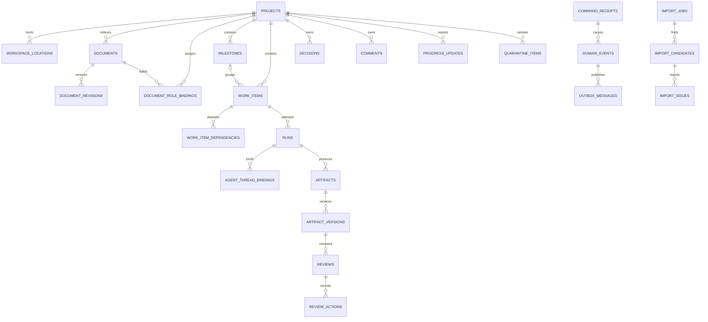
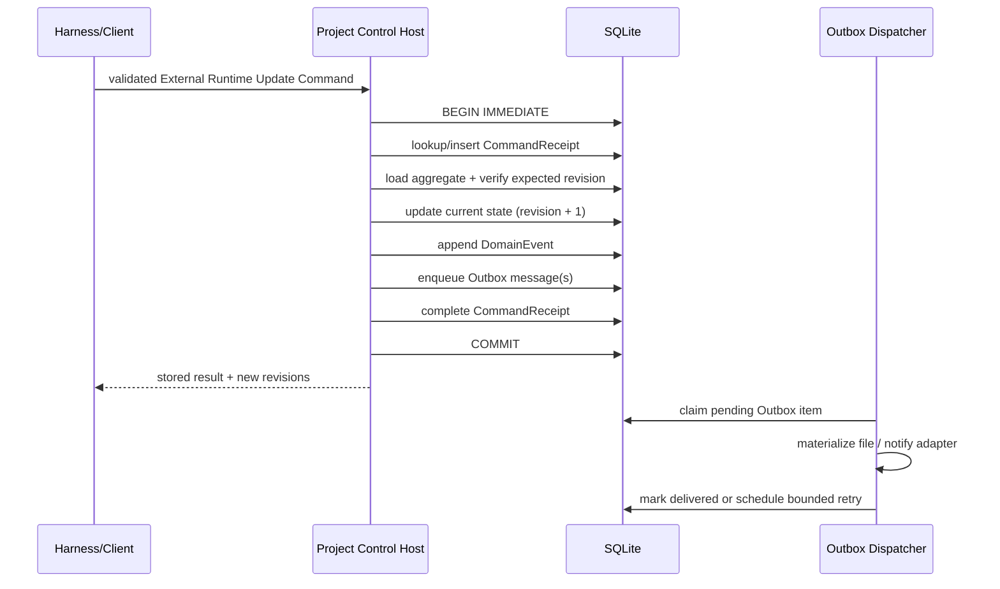
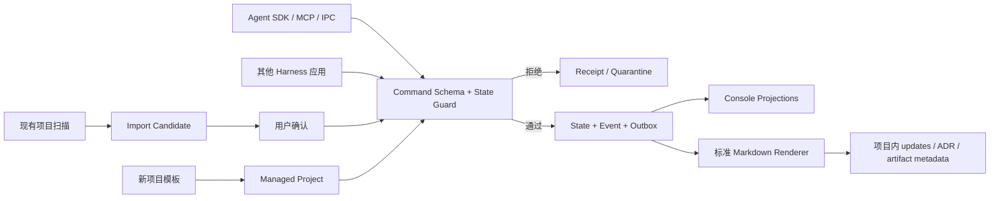

# Project Control Gate 2A：Project Protocol 与数据模型

状态：**Gate 2A 数据基线 + Gate 2B lifecycle/SQLite + Gate 2C intake 运行基线 + Gate 2D 完整落地**。当前 SQLite 为 `schemaVersion=8`（`0006_file_sync_plans.sql` 持久化 write plan 的 staged write → rename → re-verify → DB acceptance 状态机，`0007_file_sync_plan_refs.sql` 增加计划绑定 `loc_`/`srt_` 引用与 render 参数，`0008_document_index.sql` 新增逐绑定文档状态与重绑提案）；Gate 2D P1–P5（合同冻结、受控文件适配器、标准快速新建、legacy 安全升级、文档索引与重命名重绑定）已全部落地。  
开发维护：DeepSeek Harness（2026-08-15 起；见 [`HANDOVER_TO_DEEPSEEK_HARNESS.md`](HANDOVER_TO_DEEPSEEK_HARNESS.md)）  
协议代号：`project-control.dsh/v1alpha1`  
适用范围：Personal Harness Project Control，以及未来接入同一控制面的其他 Harness 应用  
日期：2026-08-14

## 1. Gate 2A 的结论

Project Control 采用一套协议、两个项目入口和四个事实层：

- **导入已有项目**：先只读发现和预览；用户确认后可保持为 `linked_legacy`，也可升级为 `managed`。
- **快速新建项目**：从标准模板生成项目目录、manifest 和初始文档，创建后直接成为 `managed`。
- 两个入口最终都获得同一种稳定 `project_id`，并进入同一命令、事件、审核和查询协议。
- 全部 Harness 应用通过唯一 Project Control Host 读写；不得直接打开 SQLite，也不得各自解释日志并推进状态。

存储结论固定为：

1. **一份全局 SQLite 控制面数据库**：保存事务性运行状态、审核、命令回执、审计事件、Outbox、本机路径绑定和可重建投影。
2. **每个项目自己的可移植文件**：保存 manifest、PRD、架构、ADR 和人可读记录；只使用相对路径，不保存本机绝对路径或凭据。
3. **Harness 原生数据**：Session 全文、流式消息和工具调用继续由 Harness 管理，Project Control 只保存稳定引用。
4. **版本化 Project Protocol**：固定 ID、状态机、命令/事件 Schema、冲突处理和输入输出语义；它是代码与 Schema，不是用户可编辑配置。

这不是纯事件溯源。数据库采用“**当前状态表 + append-only Domain Event + Outbox**”，三者在一次 SQLite 事务中提交。

## 2. 四个事实层与变化权限

“全局”不等于“不变”。必须区分不可由项目修改的协议常量、可变的全局控制状态、项目内长期资料和可重建视图。

| 层 | 示例 | 是否可变 | 谁能修改 | 是否为事实源 |
| --- | --- | --- | --- | --- |
| 协议层（全局、版本化） | ID 格式、状态枚举、命令/事件 Schema、审核语义、路径规则 | 只能随协议/迁移版本演进 | 发布 Project Protocol 的代码 | 是，协议语义唯一来源 |
| 控制面层（全局、本机） | Project 注册、WorkItem、Run、Review、路径绑定、CommandReceipt、Event、Outbox | 是 | 唯一 Project Control Host 的命令服务 | 是，事务性控制状态唯一来源 |
| 项目资料层（项目内、可移植） | manifest、PRD、当前架构、ADR 正文、人工维护资料 | 是 | 人或经校验的文件输出适配器 | 是，长期叙述内容唯一来源 |
| 投影层（全局、可重建） | 项目卡片、搜索索引、待审核数、最近活动、生成的 DEVLOG 汇总 | 是 | Projector/Indexer | 否；删除后必须能重建 |

Harness Session 是外部事实源：Project Control 可以保存 `session_id/thread_id`、角色和最后对账状态，但不复制会话全文，也不把“Session 中说已完成”直接写成验收通过。

### 2.1 字段级唯一事实源

事实归属按字段确定，不设置一条笼统的“manifest > PRD > DB > Markdown”优先级。

| 事实 | 唯一事实源 | 其他位置的角色 |
| --- | --- | --- |
| Project 稳定身份 | managed：`project.yaml.projectId`；legacy：全局 DB 注册记录 | 路径、文件夹名和 Git remote 只能用于发现，不能当 ID |
| Project 显示名称 | managed：manifest `name`；legacy：用户确认的 DB 名称，否则为可重建推断 | PRD 一级标题是候选或一致性证据，不覆盖已确认名称 |
| 文档角色与相对路径 | managed：manifest `documents`；legacy：DB 中已确认的 role binding | 文件名规则只负责发现候选 |
| 本机项目绝对根与主/镜像位置 | 全局 DB `workspace_locations` | manifest 禁止绝对路径 |
| 项目内相对 docs 根 | managed：manifest `documents.docsRoot`；legacy：DB 中已确认的 role binding 基准 | 只允许项目根相对路径，不能退化为机器绝对路径 |
| 目标、成功标准、产品范围 | 被绑定为 `prd` 的项目文档 | DB 只存解析投影、哈希和来源定位；manifest 不复制正文 |
| 当前架构正文 | 被绑定为 `current_architecture` 的文件 | DB 只索引版本、哈希和摘要 |
| WorkItem、Run、暂停、审核、批准状态 | 全局 DB 当前状态表 | Markdown 只能展示、提出候选或作为证据，不能直接推进状态 |
| Decision 的控制状态 | 全局 DB `decisions` | ADR 是相应版本的人可读材料；接受/否决必须经过命令 |
| 审计顺序 | DB `domain_events` | 生成的活动/DEVLOG 是投影 |
| Artifact 内容 | Workspace 内文件或受控外部对象 | DB 保存引用、版本、SHA-256、大小和生产 Run |
| Session 全文与工具调用 | Harness 原生存储 | DB 只保存 binding 和对账状态 |
| 凭据值 | Connection Center/系统凭据库 | Project Control 只保存 `credential_ref` |

## 3. 项目目录协议

### 3.1 managed 项目

标准项目至少包含：

```text
<project-root>/
  .dsh-project/
    project.yaml
    updates/
    decisions/
    artifacts/
  docs/                         # 名称可由 manifest 映射，不强制必须叫 docs
    PRD.md
    ARCHITECTURE.md
```

推荐的最小 manifest（YAML 解析后的对象必须通过 Project Manifest Schema）：

```yaml
apiVersion: project-control.dsh/v1alpha1
kind: ProjectManifest
metadata:
  projectId: prj_0198f4b2-7c3a-7d11-a5c6-6b6f39e34711
  name: DeepSeek Harness Personal
  createdAt: 2026-08-14T14:30:00.000Z
  createdBy:
    kind: human
    id: cyrus
  origin:
    kind: template
    templateId: software-standard
    templateVersion: 1.0.0
spec:
  documents:
    docsRoot: docs
    entries:
      - role: prd
        path: docs/PRD.md
        required: true
      - role: current_architecture
        path: docs/ARCHITECTURE.md
    standardOutputs:
      updatesRoot: .dsh-project/updates
      decisionsRoot: .dsh-project/decisions
      artifactsRoot: .dsh-project/artifacts
extensions: {}
```

约束：

- `projectId` 创建后不可修改或复用。
- 所有路径使用 `/` 分隔的规范化项目根相对路径；禁止盘符、UNC、绝对路径、反斜杠、控制字符、Windows ADS 冒号、`.`/`..` 段、重复或尾随斜杠，以及解析后逃出项目根的链接。只有 `documents.docsRoot` 可以用精确的 `.` 表示项目根。
- manifest 只声明身份、显示名、文档角色和协议扩展，不复制 PRD 的目标、范围、成功标准或数据库状态。
- `metadata.origin` 保存可移植的创建 lineage：模板项目记录不可变 `templateId/templateVersion`，分支副本记录原 `projectId`；它不授予原项目写权限，也不代表 Git 关系。
- `extensions` 只能使用命名空间键，例如 `com.example.connector`；未知扩展必须原样保留，但不能改变核心状态机。
- 修改 manifest 前后都必须校验；非法 manifest 不“尽力猜测”后继续写入，而是将项目置为 `needs_attention` 并建立隔离事项。

### 3.2 linked_legacy 项目

Legacy 项目没有标准 manifest，或用户明确选择暂不修改项目目录：

- 导入只在全局 DB 中建立 `project_id`、本机路径和已确认的文档 role binding。
- 默认只读，不移动、不改名、不创建 `.dsh-project`，也不重写原有 PRD/DEVLOG。
- 自动识别的名称、docs 目录和文档角色先作为候选；用户确认后才成为 DB 注册事实。
- Legacy 项目移动后若没有稳定 marker，只能通过人工重新定位或高置信候选确认恢复，不能用“同名文件夹”静默重绑。
- “升级为 managed”是显式命令：预览将新增的文件，校验无覆盖后再原子写入 manifest。升级保留原 `project_id`。

### 3.3 discovered 不是第三种持久项目

`discovered` 只是 `import_candidates` 的状态，表示扫描到了可能的项目。未确认前：

- 不出现在正式项目总览；
- 不创建 WorkItem/Run；
- 不监听文件变化；
- 不因其中的日志文字推进任何状态。

## 4. 身份、路径移动与引用规则

### 4.1 ID

核心 ID 使用“类型前缀 + UUIDv7 小写文本”，例如：

- `prj_<uuidv7>`、`wrk_<uuidv7>`、`run_<uuidv7>`
- `art_<uuidv7>`、`rev_<uuidv7>`、`dec_<uuidv7>`
- `cmd_<uuidv7>`、`evt_<uuidv7>`、`out_<uuidv7>`

ID 是身份，名称和路径只是属性。禁止从路径哈希、项目名称、Session ID 或 Git remote 派生 Project ID。删除后的 ID 永不复用。

### 4.2 路径

- 全局 DB 保存经过平台规范化的绝对路径和用于唯一比较的 `normalized_path`。
- 项目文件只保存项目根相对路径。
- 跨 Host 的 lifecycle DTO 不传绝对路径，只传 Host 预检后签发的 `locationRef=loc_<uuidv7>` 与 `sourceRootRef=srt_<uuidv7>`。Ref 必须绑定已认证 application instance、授权范围和有效期；数据库内部再解析为 location/source-root 记录。
- Windows 比较路径时按实际文件系统语义处理大小写，并保存显示路径；不能简单 `lowercase` 后就假定安全。
- 路径访问前必须解析 real path/reparse point，并再次验证仍位于已授权根内。
- 文件内容身份用 SHA-256；SHA-256 可以证明内容相同，但不能单独证明“这是同一个业务文档”。

### 4.3 项目移动

managed 项目的重绑定流程：

1. 扫描新位置并读取 manifest。
2. 用 `projectId` 找到既有项目。
3. 校验新根、manifest schema、重复挂载和权限。
4. 若旧位置已失效，更新 active `workspace_location`，把旧值写入 `project_path_history`。
5. 若旧、新位置同时存在，标记 `duplicate_location`，要求用户选择，不自动决定哪份是主项目。

linked_legacy 项目没有 portable ID，移动只能走“重新定位”：展示旧路径、候选路径、关键文档哈希/Git remote 等证据，用户确认后更新绑定。任何启发式匹配都不能直接改 active path。

文档改名由 `document_role_bindings` 保持业务角色。managed 项目以 manifest 新路径为准；legacy 项目可以用相同内容哈希提出重绑定建议，歧义时必须确认。

## 5. 全局 SQLite 控制面

默认逻辑位置是当前 Windows 用户稳定的应用数据目录，例如 Electron `userData\project-control\project-control.sqlite3`；可用显式 `PROJECT_CONTROL_HOME` 覆盖。数据库不跟随某个 Harness profile 的 `DSH_HOME`，也不能位于 Portable 临时解压目录、项目目录、Git 仓库、网盘或网络盘。其他 Harness 应用只连接唯一 Host，不需要也不得自行解析数据库路径。

数据库运行约束：

- SQLite `foreign_keys=ON`、`journal_mode=WAL`、`busy_timeout` 有界设置。
- 领域命令使用 `BEGIN IMMEDIATE`，关键控制状态采用 `synchronous=FULL`；批量只读索引不得降低命令事务的持久性。
- 所有时间存 UTC RFC 3339 文本（毫秒精度），显示时再转本地时区。
- 布尔值使用 `0/1 CHECK`；枚举使用 `CHECK` 或版本化 lookup，不接受任意字符串。
- JSON 列保存协议 payload 时必须同时记录 `schema_version`，写入前 Schema 校验，读取时设大小上限。
- 软删除使用明确的 `archived_at/deleted_at`；审计事件、命令回执和 ArtifactVersion 不做级联物理删除。

### 5.1 核心关系图



多态关联不依赖无外键的 `target_type + target_id` 作为唯一完整性机制。需要关联多个领域对象的 Event/Comment/Decision，保留主要 Project 外键，并通过专门 link 表或受校验的可空外键列绑定 WorkItem、Run、ArtifactVersion；数据库约束保证“至少一个合法目标、且目标属于同一 Project”。

### 5.2 系统与项目注册

| 表 | 关键列 | 主要约束 |
| --- | --- | --- |
| `schema_migrations` | `version PK`、`checksum`、`applied_at`、`app_version` | 迁移编号唯一；同编号 checksum 不同则拒绝启动 |
| `system_meta` | `key PK`、`value_json`、`updated_at` | 只存非敏感控制面元数据 |
| `host_instances` | `instance_id PK`、`started_at`、`heartbeat_at`、`app_version`、`protocol_versions_json` | 仅用于诊断，不代替 OS 单写者锁 |
| `projects` | `project_id PK`、`mode`、`name`、`origin_kind`、`template_id?`、`template_version?`、`forked_from_project_id?`、`lifecycle`、`health`、`revision`、`created_at`、`updated_at`、`archived_at` | `mode IN (linked_legacy,managed)`；origin 是 manifest lineage 的事务镜像；来源 Project 可尚未在本机注册 |
| `workspace_locations` | `location_id PK`、`project_id FK`、`kind`、`display_path`、`normalized_path`、`is_active`、`verified_at`、`revision` | active `normalized_path` 全局唯一；每 Project/kind 至多一个 active |
| `project_path_history` | `history_id PK`、`project_id FK`、`old_path`、`new_path`、`reason`、`changed_by`、`changed_at` | append-only |
| `project_settings` | `project_id PK/FK`、`review_policy_json`、`budget_policy_json`、`revision` | 仅允许协议定义的设置，不存任意业务字段 |
| `project_user_preferences` | `project_id PK/FK`、`display_name_override?`、`display_summary_override?`、`override_source_json?`、`pinned`、`follow_current_session`、`last_navigation_key?`、`revision` | 仅为本机 UI 偏好；覆盖名/摘要必须显式标注并保留来源，不改变 manifest/PRD 事实 |

`projects.name` 对 managed 项目是 manifest 已验证值在控制面的事务镜像，写入必须通过同步命令；它不是允许 UI 绕开 manifest 的第二事实源。若 manifest 与镜像不一致，见第 9 节冲突规则。

### 5.3 文档索引

| 表 | 关键列 | 主要约束 |
| --- | --- | --- |
| `documents` | `document_id PK`、`project_id FK`、`relative_path`、`normalized_relative_path`、`media_type`、`status`、`revision` | active `(project_id, normalized_relative_path)` 唯一 |
| `document_revisions` | `document_revision_id PK`、`document_id FK`、`sha256`、`byte_size`、`mtime_observed`、`indexed_at`、`parser_version`、`parse_status`、`metadata_json` | `(document_id, sha256)` 唯一；内容版本不可变 |
| `document_role_bindings` | `binding_id PK`、`project_id FK`、`role`、`document_id FK`、`source`、`confirmed_at`、`revision` | active `(project_id, role)` 唯一；`source IN (manifest,user_confirmed)` |
| `document_parse_issues` | `issue_id PK`、`document_revision_id FK`、`code`、`severity`、`location_json`、`message`、`created_at`、`resolved_at` | 不因解析失败改业务状态 |

解析出来的标题、目标摘要、下一步候选和日期均是带来源定位的投影，必须能追溯到 `document_revision_id + heading/line`。不保存整份文件副本；需要搜索时建立可删除重建的受限索引。

### 5.4 领域当前状态

| 表 | 关键列 | 主要约束 |
| --- | --- | --- |
| `milestones` | `milestone_id PK`、`project_id FK`、`name`、`status`、`target_at`、`revision` | `(project_id, milestone_id)` 归属一致 |
| `work_items` | `work_item_id PK`、`project_id FK`、`milestone_id FK?`、`title`、`instruction`、`acceptance_json`、`execution_status`、`review_status`、`priority`、`revision` | 状态轴分离；所有更新要求 expected revision |
| `work_item_dependencies` | `work_item_id FK`、`depends_on_work_item_id FK`、`kind`、`created_at` | 复合 PK；禁止自依赖；应用层检测环 |
| `runs` | `run_id PK`、`project_id FK`、`work_item_id FK`、`attempt_no`、`status`、`instruction_snapshot_json`、`acceptance_snapshot_json`、`retry_of_run_id FK?`、`started_at`、`ended_at`、`usage_json`、`revision` | `(work_item_id, attempt_no)` 唯一；历史尝试不覆盖 |
| `agent_thread_bindings` | `binding_id PK`、`project_id FK`、`run_id FK`、`harness_instance_ref`、`session_id`、`thread_id`、`role`、`status`、`last_reconciled_at`、`revision` | active `(harness_instance_ref, thread_id, role)` 唯一；不复制对话 |
| `artifacts` | `artifact_id PK`、`project_id FK`、`run_id FK?`、`kind`、`logical_name`、`revision` | 业务身份与文件路径分离 |
| `artifact_versions` | `artifact_version_id PK`、`artifact_id FK`、`version_no`、`workspace_location_id FK?`、`relative_path`、`external_ref`、`sha256`、`byte_size`、`produced_by_run_id FK?`、`created_at` | `(artifact_id, version_no)` 唯一；path/external_ref 恰有一种 |
| `reviews` | `review_id PK`、`project_id FK`、`work_item_id FK?`、`reviewed_work_item_revision?`、`artifact_version_id FK?`、`decision_id FK?`、`reviewed_decision_revision?`、`status`、`requested_by`、`requested_at`、`resolved_at`、`revision` | 三类审核目标恰有一种；可变目标必须固化被审 revision，Artifact 必须绑定不可变版本 |
| `review_actions` | `review_action_id PK`、`review_id FK`、`action`、`actor_ref`、`comment`、`created_at` | append-only；批准与评论分开 |
| `decisions` | `decision_id PK`、`project_id FK`、`work_item_id FK?`、`title`、`context`、`options_json`、`status`、`decision_revision`、`adr_document_revision_id FK?`、`superseded_by FK?`、`revision` | accepted/rejected/superseded 仅通过命令 |
| `comments` | `comment_id PK`、`project_id FK`、`work_item_id FK?`、`run_id FK?`、`artifact_version_id FK?`、`review_id FK?`、`author_ref`、`body`、`created_at`、`edited_at`、`revision` | 目标属于同一 Project；评论不改变状态 |
| `progress_updates` | `progress_update_id PK`、`project_id FK`、`work_item_id FK?`、`run_id FK?`、`kind`、`summary`、`evidence_json`、`reported_by`、`occurred_at`、`revision` | “completed”只是声明，不自动 done/approved |

跨表归属必须使用复合外键或事务内显式校验。例如 `runs(project_id, work_item_id)` 必须指向同一 Project 的 WorkItem，不能只验证两个独立 ID 都存在。

### 5.5 命令、事件、Outbox 与隔离

| 表 | 关键列 | 主要约束 |
| --- | --- | --- |
| `command_receipts` | `command_id PK`、`idempotency_scope`、`idempotency_key`、`kind`、`request_sha256`、`actor_ref`、`status`、`result_json`、`error_json`、`received_at`、`completed_at` | `(idempotency_scope,idempotency_key)` 唯一；hash 覆盖规范化后的完整有效 CommandEnvelope，同 key 任一核心字段不同都拒绝 |
| `domain_events` | `event_id PK`、`global_sequence UNIQUE`、`project_id FK?`、`aggregate_type`、`aggregate_id`、`aggregate_revision`、`event_type`、`schema_version`、`payload_json`、`actor_ref`、`command_id FK`、`correlation_id`、`causation_id`、`occurred_at`、`recorded_at` | append-only；v1alpha1 每次 aggregate revision 恰有一个事件，`(aggregate_type,aggregate_id,aggregate_revision)` 唯一 |
| `outbox_messages` | `outbox_id PK`、`event_id FK`、`destination`、`message_key`、`schema_version`、`payload_json`、`status`、`attempt_count`、`next_attempt_at`、`delivered_at`、`last_error` | `(event_id,destination,message_key)` 唯一；有界重试 |
| `quarantine_items` | `quarantine_id PK`、`project_id FK?`、`source_kind`、`source_ref`、`reason_code`、`payload_ref`、`detected_at`、`status`、`resolution_json`、`revision` | 原始大 payload 不直接塞 DB；解除必须审计 |

事件不可更新或删除。纠错通过新事件表达。`global_sequence` 由唯一 Host 单调分配，定义跨 Project 的审计/投影顺序；`event_id` 只负责身份，不能替代顺序水位。Event payload 只保存发生的领域事实，不保存完整命令、密钥、会话全文或无界日志。

### 5.6 导入

| 表 | 关键列 | 主要约束 |
| --- | --- | --- |
| `project_source_roots` | `source_root_id PK`、`kind`、`display_path`、`normalized_path`、`scan_preferences_json`、`is_enabled`、`revision`、`created_at`、`updated_at` | `kind IN (source_root,single_project)`；本机规范化路径唯一，配置不进入项目文件 |
| `import_jobs` | `import_job_id PK`、`source_root_id FK`、`root_path_snapshot`、`root_normalized_path_snapshot`、`scan_preferences_snapshot_json`、`mode`、`status`、`scanner_version`、`started_at`、`completed_at`、`summary_json` | 扫描只读；root 必须先授权和规范化；每次 Job 固化当时配置与路径以便审计 |
| `import_job_issues` | `import_job_issue_id PK`、`import_job_id FK`、`code`、`severity`、`details_json`、`status`、`resolved_at` | 保存来源目录不可读、边界项跳过等无法归属到单一候选的扫描问题；不因单项问题伪造候选 |
| `import_candidates` | `candidate_id PK`、`import_job_id FK`、`source_root_id FK`、`root_display_path`、`root_normalized_path`、`detected_mode`、`manifest_project_id`、`suggested_name/summary`、`confidence_json`、`status`、`status_before_ignored`、`matched_project_id FK?`、`revision` | 状态为 `discovered/conflict/relocation_candidate/ignored/imported`；确认前不是 Project；同一 job/path 唯一 |
| `import_candidate_documents` | `candidate_document_id PK`、`candidate_id FK`、`relative_path`、`suggested_role`、`sha256`、`title`、`preview`、`observed_at`、`evidence_json` | `(candidate_id,relative_path)` 唯一；preview 有界，不保存整份文件副本 |
| `import_issues` | `import_issue_id PK`、`candidate_id FK`、`code`、`severity`、`details_json`、`status`、`resolved_at` | 重复 ID、路径逃逸、文档冲突均阻止自动导入 |
| `intake_location_refs` | `location_ref PK`、`candidate_id FK`、`source_root_id FK`、`application_instance_id`、`scope`、`display_path`、`normalized_path`、`issued_at`、`expires_at`、`revoked_at` | Host-issued `loc_`；绑定候选、应用实例和 lifecycle scope，过期/撤销后不可解析 |
| `intake_source_root_refs` | `source_root_ref PK`、`candidate_id FK`、`source_root_id FK`、`application_instance_id`、`scope`、`issued_at`、`expires_at`、`revoked_at` | Host-issued `srt_`；不能与其他候选或应用实例混用 |

Import 只产生候选与问题。用户确认时由 Host 执行 `project.registerLegacy`、`project.registerManaged` 或 `project.rebindLocation` 领域命令，命令事务创建/修改控制状态；Importer 不直接写 `projects`。Gate 2C 要求确认前重新扫描并复验选择的文档 hash，ref 解析时验证 candidate revision、状态、应用实例、scope 和有效期；accepted 时把候选改为 `imported` 与 Project/Location/Binding/Receipt/Event/Outbox 放在同一事务。五类 lifecycle command、Result 与 lifecycle Event 已由 Gate 2B 的 `protocol/project-control/v1alpha1/lifecycle/` JSON Schema 冻结；它们不冒充只覆盖 progress/blocker/completion 的 External Runtime Update Command。

### 5.6.1 Gate 2B lifecycle 事务与 Gate 2C resolver

Lifecycle command target 固定为一个 Project aggregate。创建类 `registerLegacy`、`registerManaged`、`createFromTemplate` 使用 `expectedRevision=0`；修改类 `rebindLocation`、`upgradeManaged` 必须提交当前 Project revision。Host 在 Schema 之后继续校验 ref 归属/有效期、当前 mode、location revision、manifest projectId/hash、路径唯一性和文件预检状态。

Gate 2C 已为 `registerLegacy`、`registerManaged` 和 `rebindLocation` 接通 candidate-bound resolver；外部绝对路径不能替代 Host-issued ref。Managed relocation 还要求新位置 manifest 身份一致且旧 active 位置不可访问；两个可访问位置出现相同身份时保持冲突。

| Command | accepted 前置条件 | 当前状态事务 | Result/Event 文件同步状态 |
| --- | --- | --- | --- |
| `project.registerLegacy` | Project 不存在；location/source root ref 可解析；用户确认的相对 document binding/hash 可复验 | 创建 linked legacy Project、active location、document/binding；与 Receipt/Event/Outbox 同事务 | `not_required` |
| `project.registerManaged` | Project 不存在；现存 manifest Schema、projectId 和字节 hash 完全匹配 | 创建 managed Project、active location、manifest 事务镜像及 bindings；与 Receipt/Event/Outbox 同事务 | `verified_existing` |
| `project.createFromTemplate` | Project 不存在；write plan 未过期；未来 Gate 2D 已原子同步并复验 manifest | 同步完成后才创建 managed Project/location；与 Receipt/Event/Outbox 同事务 | accepted 只能是 `committed` |
| `project.rebindLocation` | Project/mode/revision 匹配；旧 location revision 匹配；新 ref 不冲突；身份佐证匹配 mode | 旧 location 失活、新 location 激活、path history、Project revision+1；与 Receipt/Event/Outbox 同事务 | `not_required` |
| `project.upgradeManaged` | 当前为 linked legacy；revision/location/fingerprint 匹配；未来 Gate 2D 已原子新增 manifest | 同步完成后才改 mode、保存 manifest 镜像/bindings、Project revision+1；与 Receipt/Event/Outbox 同事务 | accepted 只能是 `committed` |

`createFromTemplate` 与 `upgradeManaged` 的 write plan 只允许 `create_directory`/`create_file`、项目内相对路径和 `expectedState=absent`，不能声明覆盖、移动或删除。Gate 2B Host 若尚未实现 Gate 2D 文件同步，必须返回 `CAPABILITY_NOT_NEGOTIATED`，不创建/升级 Project、不产生 lifecycle Event。同步失败返回 rejected；回滚不完整时标记 `failed_recovery_required` 并建立 Quarantine，不能把 DB 状态先推进后再假装文件最终会成功。

Accepted/replayed Result 的 `eventId`、revision、outcome 与 `fileSync` 必须来自已保存的 CommandReceipt；replay 不能重跑文件计划。Rejected Receipt 不产生 Domain Event/Outbox。五种 lifecycle Event 仍遵守 `(aggregate_type, aggregate_id, aggregate_revision)` 唯一和 `afterRevision=beforeRevision+1`；注册/创建是 `0→1`。

### 5.7 投影

| 表 | 关键列 | 重建来源 |
| --- | --- | --- |
| `projection_checkpoints` | `projection_name PK`、`last_global_sequence`、`projector_version`、`updated_at` | Domain Event |
| `project_overview_projection` | `project_id PK`、目标摘要来源、生命周期、健康度、下一里程碑、待审核数、阻塞数、最近活动、`source_watermark` | 当前状态 + 文档索引 + Event |
| `review_queue_projection` | `review_id PK`、`project_id`、目标、材料版本、请求时间、风险、`source_watermark` | Review/ArtifactVersion/Decision |
| `global_activity_projection` | `event_id PK`、`project_id`、显示摘要、时间、actor | Domain Event |
| `document_search_projection` | `document_revision_id PK`、受限索引内容、`parser_version` | 项目文件 |

投影不得被领域命令当作前置事实。发现投影损坏时删除并从当前状态、文件索引和 Event 重建；`source_watermark` 用于判断 UI 是否落后。

## 6. revision、唯一性与外键规则

### 6.1 乐观并发

- 所有可修改 aggregate 带从 `1` 开始的整数 `revision`。
- 命令必须提交 `expectedRevision`；创建命令使用 `0` 或无 existing aggregate 的专用语义。
- 更新 SQL 必须包含 `WHERE id = ? AND revision = ?`，成功后 `revision = revision + 1`。
- 影响行数为 0 时返回 `revision_conflict`，并返回当前 revision 和可安全展示的最新摘要；禁止 last-write-wins。
- v1alpha1 的 External Runtime Update Command 一次只修改一个 `target.aggregateType/aggregateId`，并携带一个 `expectedRevision`；需要修改多个 aggregate 时拆成多条命令或由后续明确版本定义原子组合命令，不得读取后无条件覆盖。

### 6.2 唯一性和幂等

- `command_id` 全局唯一；重放相同 `command_id` 返回原回执。
- `idempotency_key` 在固定 scope `actor.applicationId + target.projectId` 内唯一；Host 必须把 `actor.applicationId` 与已认证 Capability Handshake 绑定核对，调用方不能靠 payload 自报另一套作用域。
- 同 scope/key 且规范化完整 envelope 的 `request_sha256` 相同：返回第一次结果；任一核心字段不同：返回 `idempotency_conflict`。
- 外部副作用只能由 Outbox dispatcher 发起；接收端若支持幂等，使用稳定 `message_key`。
- Outbox 保证**至少一次投递**，不宣称跨进程“恰好一次”；无法幂等的付费、发布、删除、外发动作必须有人审门和明确重试策略。

### 6.3 删除规则

- Project、WorkItem、Run、Review、Decision 默认归档或取消，不物理级联删除历史。
- 未被引用且尚未进入领域流程的草稿可走受审计删除命令。
- Event、ReviewAction、CommandReceipt、ArtifactVersion、PathHistory 为保留记录。
- 项目从控制台“移除”只停用 location/registration；项目目录文件另行明确确认，不能联动删除。

## 7. 命令与原子事务

标准输入 envelope：

```json
{
  "protocolVersion": "project-control.dsh/v1alpha1",
  "schemaVersion": "command-envelope/v1alpha1",
  "commandId": "cmd_0198f4b2-7c3a-7d11-a5c6-6b6f39e34711",
  "correlationId": "gate2a-contract-freeze",
  "idempotencyKey": "thread-42-progress-17",
  "kind": "progress.report",
  "occurredAt": "2026-08-14T14:30:00.000Z",
  "actor": {
    "kind": "agent",
    "id": "agent-1",
    "applicationId": "deepseek-harness-personal"
  },
  "target": {
    "projectId": "prj_0198f4b2-7c3a-7d11-a5c6-6b6f39e34711",
    "workItemId": "wrk_0198f4b3-1a32-7a10-8d12-2176c0044521",
    "runId": "run_0198f4b3-6846-7bc0-a0dd-3943791cd360",
    "threadId": "session-42",
    "aggregateType": "run",
    "aggregateId": "run_0198f4b3-6846-7bc0-a0dd-3943791cd360"
  },
  "expectedRevision": 4,
  "provenance": {
    "sourceType": "agent",
    "sourceId": "session-42",
    "observedAt": "2026-08-14T14:30:00.000Z",
    "applicationVersion": "0.1.0",
    "applicationInstanceId": "personal-desktop-01",
    "adapterId": "project-control-client",
    "adapterVersion": "v1alpha1"
  },
  "payload": {
    "summary": "Gate 2A 协议已完成严格校验",
    "completionPercent": 100
  }
}
```

成功事务顺序：



规则：

1. Host 先做 envelope/schema/权限/大小校验，再开启写事务。
2. 已有相同命令或 idempotency key 时，不重复执行。
3. 合法但业务上被拒绝的命令把 deterministic rejection 写入 CommandReceipt 后提交，不生成虚假状态事件。
4. 成功时当前状态、Domain Event、Outbox 和成功回执必须同事务提交；任一步失败全部回滚。
5. 进程在 COMMIT 前崩溃，重试命令；COMMIT 后响应前崩溃，重放通过回执获得原结果。
6. 文件、Session、网络和第三方调用绝不放在 SQLite 写事务内，由 Outbox 在提交后执行。
7. Dispatcher 崩溃可能重投，因此输出文件名/消息 key 必须稳定且可去重。

## 8. 标准输入和输出流水线



### 8.1 输入端

- UI、Agent、CLI、MCP 和其他 Harness 的 progress/blocker/completion 外部运行更新使用 `command-envelope/v1alpha1`；五类 Project lifecycle command 使用 Gate 2B 独立冻结的 `lifecycle-command-envelope/v1alpha1`。两组 kind/capability 不合并，但复用同一 Host 的认证、幂等、revision、Receipt/Event/Outbox 基础设施。
- v1alpha1 对外先冻结 `progress.report`、`blocker.raise`、`completion.declare` 三种强类型动作；Artifact、Review、Decision 等动作必须等后续协议版本明确定义，调用方不得自行拼状态字段。
- 普通 PRD/README/DEVLOG 解析只生成候选、摘要和问题；未经确认或正式命令，不转换成 WorkItem/Review/批准。
- 外部调用方必须声明协议版本、caller identity 和稳定 idempotency key。

### 8.2 输出端

标准更新采用“一事件/一记录文件”，避免多个 Agent 追加同一个大 DEVLOG：

```markdown
---
protocolVersion: project-control.dsh/v1alpha1
schemaVersion: progress-update-frontmatter/v1alpha1
kind: ProgressUpdate
updateId: upd_0198f4b4-3c51-79c0-a7de-06b95fe0cfd1
category: progress
projectId: prj_0198f4b2-7c3a-7d11-a5c6-6b6f39e34711
workItemId: wrk_0198f4b3-1a32-7a10-8d12-2176c0044521
runId: run_0198f4b3-6846-7bc0-a0dd-3943791cd360
threadId: session-42
sourceEventId: evt_0198f4b4-08dd-7cc0-95f2-302d38711550
commandId: cmd_0198f4b2-7c3a-7d11-a5c6-6b6f39e34711
aggregateRevision: 5
occurredAt: 2026-08-14T14:30:00.000Z
recordedAt: 2026-08-14T14:30:01.000Z
actor:
  kind: agent
  id: agent-1
  applicationId: deepseek-harness-personal
summary: Gate 2A 协议已完成严格校验
generatedBy:
  applicationId: deepseek-harness-personal
  applicationVersion: 0.1.0
  rendererVersion: progress-markdown/v1alpha1
---

# 一句话进展

人可阅读说明，以及带 SHA-256/路径的证据引用。
```

- Renderer 使用固定模板写临时文件，校验后原子 rename/replace；文件名包含时间与 `eventId`，重复投递不重复生成。
- `DEVLOG.md` 可以是人维护的 legacy 输入，也可以是系统生成的 managed 汇总，但必须在文档 role binding 或生成文件头明确 `mode: human-authored | generated`；生成文件禁止手工作为状态输入。
- 输出失败只使 Outbox 进入 `retry/needs_attention`，不回滚已经提交的领域事实；UI 明确显示“状态已提交、项目文件尚未同步”。
- 人修改生成文件时，Indexer 报 `generated_file_modified`，保留原文件并请求处理，不把修改反向执行成命令。

## 9. 冲突处理：不设静默覆盖

### 9.1 冲突矩阵

| 冲突 | 判定 | 系统行为 |
| --- | --- | --- |
| managed manifest `projectId` 与 DB 路径绑定的 Project 不同 | 身份冲突 | 阻止挂载，创建 quarantine；要求选择正确项目/副本 |
| 两个活动路径声明同一 `projectId` | 重复位置 | 两边均不自动取得主身份，要求用户选择或显式 fork 新 ID |
| manifest `name` 与 DB 镜像不同 | 同步冲突 | 若能证明由一次待投递命令产生则完成同步；否则冻结名称写入并人工选择 |
| PRD 标题与 Project name 不同 | 内容不一致，不是身份冲突 | 显示诊断；Project name 仍按第 2.1 节事实源，不自动改名 |
| PRD 目标与 DB 解析摘要不同 | 索引陈旧或解析变更 | 以当前已绑定 PRD 文件为准，重建投影；保留旧 DocumentRevision |
| DEVLOG 写“done”，DB WorkItem 仍 running | 声明与控制状态不同 | 导入为完成候选/证据；必须走验收/审核命令，不能自动 done |
| ADR 写 Accepted，DB Decision 仍 proposed | 非法直接状态写入 | 创建 import issue/quarantine；要求正式接受命令或还原 ADR 状态 |
| DB 已 approved，Artifact 文件哈希变化 | 审核材料失效 | 新建 ArtifactVersion，旧 Review 标记 superseded/过期，重新审核 |
| 文件更新与旧页面同时改同对象 | revision 冲突 | 拒绝旧命令，展示新 revision；不合并状态字段 |
| 不认识的 manifest/command 主版本 | 向前不兼容 | 只读展示可安全字段并阻止写入，要求升级 Host |

### 9.2 managed 同步规则

manifest 身份/名称变更和数据库镜像不能用两个独立无关联写入。命令先提交 DB + Outbox，再由文件适配器写 manifest；在 Outbox 完成前记录 `sync_pending`。反向发现未经命令的合法 manifest 编辑时：

- 身份字段变化永远不自动接受；
- 名称/文档路径变化生成 `manifest.changeDetected` 候选；
- 用户确认后再发正式命令并更新 DB；
- 对内容类文档（PRD、架构）则文件本身是事实源，Indexer 创建新 DocumentRevision 和投影，不要求把正文复制到 DB。

因此短暂不同步是可观察状态，不通过“谁最后写谁赢”解决。

## 10. 导入、隔离与恢复

导入管线固定为：

1. **授权扫描根**：只访问用户选择的目录，拒绝系统根、未授权 UNC 和逃逸链接。
2. **只读发现**：识别 manifest、README、PRD、DEVLOG、PROGRESS、NEXT、ARCHITECTURE、ADR 等候选；设置单文件/总扫描大小和超时上限。
3. **解析与证据**：记录为什么认为某文件是什么角色、文件哈希、冲突和置信度。
4. **预览确认**：显示项目名、项目根、docs 根、文档绑定、将要新增的文件和所有阻断问题。
5. **正式命令**：注册 legacy/managed，或新建标准项目。
6. **索引**：建立 DocumentRevision 和可重建投影。

进入 quarantine 的典型情况：

- 重复/非法 Project ID；
- manifest schema 不支持或被截断；
- 路径逃逸、reparse point 越界、循环链接；
- 同一文档角色有多个无法判定的候选；
- 标准生成文件被手工改写；
- 事件/命令字段非法、引用对象不存在或跨 Project；
- 凭据疑似被写入输入 payload。

Quarantine 不等于删除。它保存最少诊断、原来源引用和哈希；敏感或超大原文留在原位置，不复制进数据库。处理动作只有“修复后重试、明确忽略、绑定到既有对象、作为新对象导入”，每次处理都产生日志。

## 11. 多 Harness 接入与单写者

每个 Windows 用户的同一 Project Control 数据库只能有一个 Host 拥有写权限；不同 `%DSH_HOME%` 或不同 Harness 应用必须连接这个 Host，而不是各自创建写者：

- Host 启动时获取数据库旁的 OS 级独占锁，写入 `instance_id/pid/start_time` 仅用于诊断；不能只靠 PID 文件判断锁。
- 已有 Host 时，新的 Harness 通过版本化 IPC/MCP/本机受认证端点连接；不能退化为直接打开 SQLite。
- 所有查询也优先通过 Host，以便统一权限、Schema 兼容、投影水位和敏感字段裁剪。
- Host 内可以有读连接池，但领域命令经单一 command executor 串行进入短写事务；长解析、哈希和网络工作在事务外进行。
- Host 异常退出后由 OS 释放锁；新 Host 先检查 SQLite/WAL、未完成 Outbox、`dispatching/running` Run 和 Session 实际状态，再接管。
- 无法确认的 Run 标记 `orphaned/needs_attention`；禁止因 Host 重启自动重跑有副作用的命令。
- 其他 Harness 必须先协商 `protocolVersion` 和能力；不支持当前主版本时保持只读或拒绝连接，不做“尽量写入”。

## 12. 迁移、备份与向前兼容

### 12.1 数据库迁移

- 迁移是随应用发布、编号单调递增的 SQL/Host migration；启动时只允许从已知旧版本向前升级。
- 每个 migration 记录不可变 checksum；已应用编号的内容变化视为构建错误。
- 迁移前使用 SQLite Online Backup API 或等价一致性快照生成备份，同时保存应用版本、DB schema version 和时间。
- 破坏性迁移采用 expand → backfill/verify → switch → later contract，不在一次发布中直接丢列。
- 大迁移可断点续跑，但领域写入只有在兼容窗口明确时开放；失败则保持旧 DB 和备份，不用半迁移库启动。
- 不提供自动降级。旧客户端遇到新 DB 必须拒绝写入。

### 12.2 备份与恢复

- 备份对象：SQLite 一致性快照、WAL 处理信息、协议/应用版本和非敏感配置；项目文件由项目自己的 Git/备份策略负责。
- 备份目录继承严格 ACL，不跟随项目同步到公共仓库；不包含 Connection Center 凭据值。
- 保留策略采用最近若干版本 + 迁移前快照，并设置总大小上限；删除备份是独立维护动作。
- 恢复后执行 `PRAGMA integrity_check`、FK 检查、migration checksum 检查、Event/Outbox 连续性检查和投影全量重建。
- 定期做真实恢复演练；“成功写出备份文件”不等于可恢复。

### 12.3 协议与文件兼容

- `project-control.dsh/v1alpha1` 的不兼容变化必须使用新的协议线版本；同一精确线版本下不得静默新增核心字段或事件类型。
- Command 对未知核心字段、未知枚举和未知 event kind 采取拒绝写入；查询 DTO 可忽略明确标为 optional 的未知字段。
- manifest 的未知 namespaced `extensions` 原样保留；未知核心字段不得被旧 Host 重写丢失。
- Event 保存其写入时的 `schema_version`；Projector 使用版本化 upcaster 构建当前投影，不回写历史 Event。
- Markdown front matter 版本未知时只作为普通文档索引，不能驱动领域动作。

## 13. 凭据、权限与安全边界

- SQLite 不是 secret vault。API Key、OAuth token、Cookie、Webhook secret、私钥和密码只存在 Connection Center/系统凭据库。
- 项目设置、命令和 Outbox 仅保存不具备取值能力的 `credential_ref`；真正取值发生在获授权的连接适配器中。
- 日志、Event、错误堆栈和 CommandReceipt 在落盘前做字段白名单与敏感值脱敏；不记录请求头或完整第三方响应。
- DB 目录和备份使用当前 Windows 用户最小权限 ACL。由于 SQLite 默认不加密，威胁模型若要求静态加密，必须另行引入受支持的加密方案，不能宣称当前已有。
- 所有 SQL 参数化；Schema 校验设置 JSON 深度、字符串、数组和 payload 总大小上限。
- 文件读取限定已授权 root；写入还要求具体 role/path 权限、expected file SHA/revision 和原子替换。
- Artifact 外部引用使用允许的 scheme/host 策略；UI 打开前显示来源，不能让 `file:`、`javascript:` 或任意本机 URL 绕过边界。
- actor identity 区分 Cyrus、人、Agent、系统和外部 Harness。Agent 默认不能批准自己的 Artifact/Decision。
- 删除、发布、付费、外部发送和不可逆操作保持显式人工审核；Outbox 不能把“消息已排队”展示成“外部动作已成功”。

## 14. Gate 2A 冻结项与后续实现边界

Gate 2A 冻结：

- 一份全局 SQLite + 每项目可移植文件 + Harness 原生 Session 的三方边界；
- `linked_legacy` 与 `managed` 两种已注册模式；
- 字段级唯一事实源和冲突矩阵；
- 稳定 ID、路径移动、revision、FK、幂等和删除规则；
- 当前状态 + Event + Outbox + Receipt 原子事务；
- Import Candidate、Quarantine、Projection 和单写者 Host；
- 迁移、备份、协议兼容与凭据安全原则。

Gate 2B lifecycle 合同另外冻结：五类命令的 Envelope/payload、严格 Result、五类 normalized lifecycle Event、Host-issued 路径引用、manifest/write-plan hash、fileSync 状态和每命令事务语义。合同冻结不等于模板文件同步已经实现。

Gate 2A 本身只冻结了合同。当前实施进度与后续切片为：

1. **Gate 2B（已完成）**：migration runner、核心注册表、CommandReceipt/Event/Outbox 事务和只读查询已经落地；不包含 Outbox dispatcher 或 WorkItem 写入。
2. **Gate 2C（已完成）**：当前为 `schemaVersion=5`；`0003_intake_discovery.sql` 落地 intake 控制面，`0004_windows_path_nocase.sql` 保留来源级 `import_job_issues` 并作为 v4 阶段的 ASCII `NOCASE` 防线，`0005_windows_unicode_path_key.sql` 引入由 Host 生成的版本化 Unicode `path_key`（Windows 分隔符规范化、NFC、稳定 Unicode lower），供 source root、active workspace、候选 latest/ignore 与 register/rebind 统一判断路径身份。v4 若已有 Unicode 等价重复路径，升级会失败回滚并保留 pre-v5 backup，不静默合并或删除。系统目录签名授权、只读扫描、候选预览/忽略、legacy/managed 注册、候选文档映射和 managed 路径重绑定已经落地；不自动导入或写项目目录。
3. **Gate 2D（已完成）**：P1 冻结模板注册表/write plan/一致性合同（见 `PROJECT_TEMPLATE_SPEC.md`）；P2 实现受控文件适配器与 `file_sync_plans` journal（同盘 staging、fsync、哈希复验、原子 rename、回滚、启动恢复）；P3/P4 完成标准快速新建与 legacy 升级的 lifecycle 接线；P5 新增 `0008_document_index.sql`（`schemaVersion=8`）：`project_document_states` 逐绑定记录状态/哈希/字节数/解析诊断（managed 以 manifest mirror 为唯一事实源、legacy 以确认绑定为准，正文绝不入库），`project_document_rebind_proposals` 记录按内容哈希提议的重绑候选（无歧义可人工应用、多候选必须人工选择、managed 提案仅诊断且应用被拒、accepted/rejected 粘滞、恢复后 superseded）。刷新不产生 Domain Event/Outbox，也不根据文本语气推进 WorkItem/Review。
4. **Gate 2E**：实现 Agent/其他 Harness 的强类型输入、标准日志 Renderer、Quarantine 修复流程。

任何后续实现若需要让同一字段出现第二事实源，必须先修改本规范并提供迁移/冲突方案，不能在代码里隐式增加优先级。

## 15. Gate 2A 自洽验收清单

- [x] 导入已有项目和快速新建最终汇入同一 Project Protocol。
- [x] managed 与 linked_legacy 的写入权限、升级和移动规则明确。
- [x] 项目 ID 不依赖路径，绝对路径不进入可移植项目文件。
- [x] PRD、manifest、SQLite、Markdown 与 Session 逐字段指定唯一事实源。
- [x] 核心表、主键、外键、revision、唯一性和幂等边界已定义。
- [x] 状态、Event、Outbox 和成功 Receipt 在同一事务提交。
- [x] 导入文本不会静默推进状态，错误输入有 ImportIssue/Quarantine。
- [x] 投影可重建，不能被领域命令当作事实。
- [x] 多 Harness 只通过单写者 Host 接入，不直接竞争 SQLite。
- [x] 迁移前备份、失败回退、恢复校验和向前兼容边界已定义。
- [x] 凭据值不进入 Project DB、项目文档、日志、事件或 Agent 指令。
- [x] 五类 lifecycle command 与三类 external runtime update 使用互不重叠的严格 Schema/capability。
- [x] Lifecycle DTO 只携带 Host-issued location/source-root ref，不携带任意绝对路径。
- [x] 新建/升级只有在 fileSync committed 后才能产生成功 Receipt/Event 并推进 Project revision。
