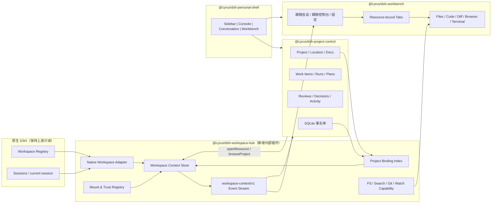
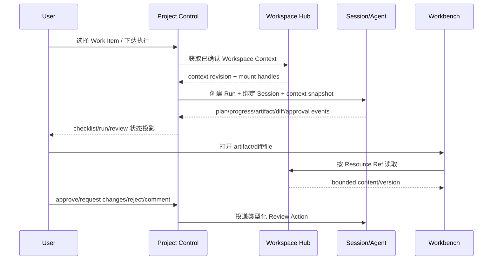

# 原生工作区 × Workbench × 项目控制台联动架构设计书（v5，可组合分发版）

> 日期：2026-08-18
> 状态：**Codex 第二轮复核完成，待 DSH 按 §0.8 最终验证后实施**（v4 调优沿用 `【调优 Codex C-×】`；本轮分发复核以 `【复核 Codex P-×】` 标记）
> 范围：原生 DSH Workspace、Workspace Hub、Workbench、Project Control、Personal Shell、可选集成适配器，以及插件独立安装/卸载/升级/分发合同。
> 本文继承 v4，并替代此前 v2–v4。v2 中“Workbench 是绑定所有者”“项目选择按 LWW 直接覆盖工作区”等结论不再采用。
> 授权边界：本文只形成架构与实施合同；不修改只读上游 `D:\Deepseek Harness`，不安装依赖，不打包发布。

---

## 0. 结论先行

### 0.1 架构判断

**不废弃现有 Personal Shell、Workbench 和 Project Control，也不重写原生 DSH Workspace。**

新增一个内部基础插件：

```text
@cyrus/dsh-workspace-hub
```

它是“工作区领域内核”，没有独立的大型 UI，负责把以下事实统一成一个可订阅、可审计、可扩展的工作区上下文：

- 原生 DSH Workspace 及其 Session 归属；
- Project Control 中登记的 Project 与有效位置；
- Workbench 当前应该浏览的资源根；
- 主目录、附加目录、项目文档、生成物和未来 Worktree 等 Mount；
- 目录信任、只读/可写、Git、终端等能力；
- Session、Project、Agent Run、Review 之间的稳定关联。

现有插件的职责保持清晰：

| 组件 | 保留职责 | 不再承担 |
|---|---|---|
| 原生 DSH Workspace | 左侧工作区与 Session 分组、创建/重命名/排序/归档、当前 Session | 项目 PRD、任务、审核、文件编辑器 |
| Workspace Hub（新增） | 工作区上下文、Mount、绑定索引、能力与事件 | 大型业务 UI、项目事实 |
| Project Control | 项目身份、位置、文档、清单、Run、Review、Decision、Activity | 通用文件系统服务、Workbench 布局 |
| Workbench | Files / Code / Outline / Diff / Browser / Terminal / Details 的展示与交互 | 项目事实、全局绑定仲裁 |
| Personal Shell | 四栏布局、折叠、拖拽和窄屏让步 | 工作区、项目和文件业务逻辑 |

### 0.2 最重要的产品变化

当前实现把“当前 Session 对应的工作区”和“控制台中点击的项目”共同写入 `workbench.projectWorkspace`，依靠最后写入者覆盖。这个模型会让用户只是查看另一个项目时，右侧文件树也被机械切走。

v3 改为四个互不混淆的状态轴：

1. **当前 Session**：由原生 DSH 决定；
2. **控制台当前 Project**：只表示用户正在管理哪个项目；
3. **Workbench 跟随模式**：`跟随会话 / 跟随控制台 / 已固定`；
4. **已打开 Tab 的资源绑定**：打开后固定到自己的 Mount 与相对路径，不随控制台或 Session 切换失效。

默认规则：

- Workbench 默认“跟随会话”；
- 在 Project Control 里只切换项目，不自动切换 Workbench；
- 点击“在工作台浏览”才切为“跟随控制台”；
- 从控制台打开一个文档/产物，只打开一个固定绑定的 Tab，不改变整个 Workbench；
- 用户选择“固定”后，Session 与控制台切换都不改变 Workbench 根；
- 所有自动路径匹配只生成绑定建议，不能静默改写持久项目事实。

### 0.3 第一阶段的目标

Workspace 主线的第一阶段不是再造一个文件管理器，而是先建立稳定的 Workspace Context。只有它通过后，文件树、多根目录、审阅和 Agent Run 才不会各自发明一套工作区逻辑。**【调优 Codex C-23】与此同时，Markdown 排版与 Document Session 属于 Workbench 内部能力，可按 §15 的文件所有权边界并行推进；两条线在 Resource Adapter 汇合。**

### 0.4 DSH 建议审核与本轮调优记录

| 编号 | DSH 建议 | 审核结论 | v4 调优 |
|---|---|---|---|
| DSH-A | 活动基线是 rc.7 托管运行时 `99f6f02f` | **接受**。已核对 `update-center.json`、实际目录、Git HEAD 和根版本；rc.5 仍是只读回滚位 | **【调优 Codex C-01】** 文档同时区分“活动运行时”和“本地回滚源码树”，兼容门禁针对活动 commit |
| DSH-B | CodeMirror 6 进入首批 | **接受并加强**。适合 Workbench，明显比 Monaco 更符合体积和插件边界 | **【调优 Codex C-02】** 不直接替换 textarea；先增加 `DocumentSessionStore`，编辑器只是其视图适配器 |
| DSH-C | Markdown 预览与 Hub 并行、编辑器在预览后接入 | **部分接受**。渲染核心可并行，但本地文件链接/媒体解析仍依赖资源能力；两个并行任务不能同时大改同一 Viewer | **【调优 Codex C-03】** 拆成 R-PV1 核心排版、R-PV2 Workspace 资源联动、R-ED 编辑器三步，并规定文件所有权 |
| DSH-C 依赖方案 | 新装 react-markdown/remark/rehype/KaTeX/Prism 栈 | **不采用**。rc.7 已有平台级安全 Markdown 管线、KaTeX 与 Shiki，重复引入会扩大 bundle 并产生两套语义 | **【调优 Codex C-04】** 直接复用 `@deepseek-ai/dsh-client-ui-primitives` 的 `MarkdownText`、`CodeBlock`；首批不装 Markdown/高亮依赖 |
| DSH-D | 更新器托管运行时成为版本门禁对象 | **接受** | **【调优 Codex C-05】** W0 必须补齐当前尚不存在的 `compat.json`，同时记录 active 与 rollback commit |
| DSH-E | W0 与 Markdown 双线开工 | **有条件接受** | **【调优 Codex C-06】** W0 仅改新 Hub 目录；R-PV1 先新增独立模块，最后由单一集成人合入 `WorkspacePreviewViewer.tsx` |
| DSH-F | 可分发性与可组合性成为横切约束（积木化） | **方向接受，原方案需实质修正**。当前只是源码目录分包，不是可独立安装的 DSH bundle；“零兄弟硬依赖”“无 Shell 独立挂载”“命名空间参数化”也不符合现有运行合同 | **【复核 Codex P-01】** 重写 ADR-09、§8.11、§17.5 与启动顺序：采用标准 DSH bundle + 显式依赖图 + Bridge 包 + 安装清单；稳定包名不可运行时参数化 |

### 0.5 CodeMirror 与 Markdown 的最终裁决

**【调优 Codex C-07】两项需求都适合进入本架构，而且应该进入首批，但所在层不同：**

| 能力 | 所在层 | 是否依赖 Workspace Hub | 首批结论 |
|---|---|---|---|
| Markdown 安全解析、GFM、数学公式、代码高亮、排版 | Workbench Presentation | 否 | 立即做 R-PV1，复用原生 UI Primitives |
| Markdown 本地链接、图片、文件提及 | Workbench + Resource Adapter | 部分依赖 | 先接现有 Workspace API，W2 平滑切 Hub |
| CodeMirror 编辑器 | Workbench Editor View | 否 | 在 DocumentSession 合同完成后做 R-ED |
| 读取、保存、版本冲突、Watch | Workspace Resource Adapter / Hub | 是或有兼容适配 | 先沿用 expectedSha256，W2/W5 切换 Hub |

“丝滑”的关键不在编辑器品牌，而在以下四点：

1. 编辑草稿不跟 React 组件挂载周期一起消失；
2. Markdown 预览不在每次键入时同步全量重算；
3. 右栏窄宽度不强制左右各占一半；
4. 保存冲突、外部文件变化和切换 Project 时不丢失草稿。

### 0.6 交给 DSH 的最终验证清单

**【调优 Codex C-28】DSH 在开始写功能代码前，应逐项给出“通过 / 不通过 / 证据路径”，不要只回复总体认可：**

- [ ] rc.7 active runtime、rc.5 build/rollback seam 与 Personal peer 声明的双基线策略已明确；
- [ ] `ui-primitives` 在 rc.7 可作为平台 external 被 Workbench 加载，且 API/安全行为与本文描述一致；
- [ ] R-PV1 构建不会重复内联 Shiki/KaTeX/第二套 Markdown parser；
- [ ] 远程图片实际联网行为已被产品文案和测试诚实覆盖；
- [ ] `DocumentSessionStore` 的状态、关闭、冲突和跨 Tab 生命周期没有落入 descriptor/localStorage；
- [ ] 420px 单面板与全屏分屏原型在 100/150/200% DPI 下可用；
- [ ] CodeMirror 的根依赖锁定、插件归属、许可证与干净环境构建路径已验证；
- [ ] W0/R-PV1/R-ED 的文件所有权没有并发覆盖点；
- [ ] 所有未完成项仍写为计划，不把 `compat.json`、CodeMirror 安装或 R-PV1 写成已交付。

### 0.7 当前可分发性事实与最终定义

**【复核 Codex P-02】截至本次复核，现有 Personal 插件尚未达到“其他 DSH 用户开箱即用”：**

| 实测项 | 当前结果 | 含义 |
|---|---:|---|
| `plugins/*/package.json` | 17 个 | 代码目录已经分包 |
| `private: true` | 17/17 | 不能作为普通 npm 发布包 |
| 声明 `dsh.bundle.patch` | 0/17 | `dsh plugin --profile web add` 只会把它们当普通依赖，不会激活 |
| 共享激活入口 | `plugins/cordis.patch.yml` + `PERSONAL_PLUGINS` | 安装集合由 Personal 启动器硬编码，不是每包自描述 |
| `@cyrus/*` Client/peer 依赖 | 7 个包 | 当前不是“任意拔一个仍可启动”的依赖图 |
| Personal Electron bridge 直接调用 | Desktop Integration、Update Center、Project Control picker、Workbench reveal、Billing | 不能把它们全部宣称为原生 DSH 通用插件 |
| 构建配置硬编码相邻上游 | 17/17 tsdown + 17/17 tsconfig | 预编译包可运行不等于第三方能从源码复现构建 |

因此，本文中的术语冻结为：

1. **独立分包**：每个可发布单元有自己的不可变包名、版本、许可证、构建产物与测试；其中运行时插件自带 `dsh.bundle` patch，需要状态的 Core 再拥有独立配置 Schema 和数据目录；
2. **可拔插**：通过依赖感知的安装器安装/移除，重启后组成合法图；不等于无依赖，也不承诺运行中热卸载；
3. **开箱即用**：在干净 rc.7 Profile 中，以一条安装命令装入目标功能及其必需依赖，重启后可用，无需 Personal checkout、junction、绝对路径或手改 YAML；
4. **可组合**：必需依赖显式且有向无环；可选跨域联动放进 Bridge 包，拔掉 Bridge 只损失联动，不阻断两个核心插件；
5. **数据独立**：程序包与用户数据分离；卸载默认保留数据，清除数据必须是独立、显式、可预览操作。

### 0.8 交给 DSH 的分发最终验证清单

**【复核 Codex P-03】实现前 DSH 必须逐项给出“通过 / 不通过 / 证据路径”：**

- [ ] rc.7 官方 `dsh plugin --profile web add/remove/update` 作为基础安装 seam；明确插件集合变化后需要重启；
- [ ] 每个拟发布的运行时插件都能从 `.tgz` 安装并声明 `dsh.bundle.patch`；纯 contracts/preset 明确标注非 runtime，不依赖共享 Personal overlay；
- [ ] 包名、`clientBundle(id)` handoff ID、patch row name 三者完全一致，未做运行时命名空间替换；
- [ ] 必需包、可选 Bridge、冲突包及安装顺序有机器可读清单，并通过环检测；
- [ ] Stock DSH 与 Personal Desktop 的支持范围分开，缺少 Electron bridge 时不出现 pending/启动失败；
- [ ] 从临时目录删除源码 checkout 后，已安装 `.tgz` 仍可启动；
- [ ] 卸载一个 Bridge 不影响两端核心插件；卸载核心包时安装器阻止留下失效依赖；
- [ ] 卸载/升级不会删除数据库、模型、凭据或用户配置；显式 purge 有目标预览和二次确认；
- [ ] 发布包不含个人路径、密钥、真实数据、源码引用路径或 Personal 专用 preload 假设；
- [ ] `npm pack --dry-run`、许可证/SBOM、校验和、干净 Profile smoke 与重启后 smoke 均有证据。

---

## 1. 术语与事实边界

### 1.1 六个核心概念

| 概念 | 定义 | 权威来源 |
|---|---|---|
| Native Workspace | 原生 DSH 左侧栏中的工作区记录，通常对应一个主路径和若干 Session | DSH Host Workspace Registry |
| Session | 一段真实 Harness 会话；具有 cwd，也可归属 Native Workspace | DSH Sessions / Workspaces |
| Project | 可跨 Session 持续存在的业务/软件项目，拥有 PRD、任务、Run、Review、Decision | Project Control SQLite + 项目内 Manifest/Docs |
| Workspace Context | 某一时刻 Workbench/Agent 可使用的工作区视图，含模式、主 Mount、能力和 revision | Workspace Hub |
| Mount | Context 中一个允许访问的根；例如主目录、附加目录、项目文档、产物、Worktree | Workspace Hub Host |
| Resource | `Mount + 相对路径 + 版本` 指向的文件、目录、Diff 或产物 | Workspace Hub |

### 1.2 必须坚持的边界

- **Workspace 不等于 Project**：一个 Workspace 可以尚未登记 Project；一个 Project 未来也可以关联多个 Workspace/Mount。
- **Session 不等于 Project**：Session 是执行与对话容器；Project 是跨 Session 的长期事实容器。
- **Tab 不等于事实库**：Tab 只保存恢复展示所需的最小资源标识，不能保存任务、审核结论或项目状态。
- **Project Control 不接管原生左侧栏**：避免和上游 Workspace Registry 产生双向同步、排序冲突和升级脆弱性。
- **Renderer 不决定权限根**：Renderer 可以选择 Host 已签发的 handle，但不能提交任意绝对路径要求 Host 读写。

---

## 2. 当前基线（2026-08-18 实测）

### 2.1 上游 DSH

**【修订 DSH-A：兼容基线 = rc.7 托管运行时（2026-08-17 已激活）】**

当前开发版实际运行的 DSH 源码树：

```text
托管运行时：%APPDATA%\DeepSeek Harness Personal Dev\harness-runtimes\99f6f02fecdb7dff40c3fbc9470f5907c29f74ca
commit 99f6f02fecdb7dff40c3fbc9470f5907c29f74ca（rc.7，activeHarnessRoot 已激活，冒烟 passed:true）
回滚位：D:\Deepseek Harness（commit 47f943859bef60e4160492346772ded9b24f765a，rc.5，只读保留）
```

- 2026-08-17 更新中心内置 prepare 在 pnpm 步骤静默失败（cmd 包装 + 最小环境），后经手动完整构建 + 冒烟预检 + 写 prepared 状态完成激活；`previousHarnessRoot` 记录 rc.5 支持一键回滚。
- 本文兼容基线以 **rc.7（99f6f02f）为准**；§2.1 下列 IWorkspaces 能力已复核：`packages/client/runtime/src/client/contract/workspaces.ts` 与 `sessions.ts` 在 rc.5/rc.7 之间**逐字节相同**，能力描述对两个版本均成立。

原生 `IWorkspaces` 已提供：

- `list`：Workspace、Session 分组、最近工作区等可观察状态；
- `create / rename / delete / insertBefore`；
- `startSession / connectWorkspace / insertSessionBefore / archiveSession`；
- `pickDirectory / listDirectory / createDirectory / openPath`。

它适合继续拥有左侧栏和 Session 分组，但 `listDirectory` 是目录选择能力，不是完整 IDE 文件系统，也没有多根 Context、信任、文本读写、搜索、Git 状态和 Watch 合同。

### 2.2 当前 Workbench

已存在并应复用：

- 八类 Viewer：`file / preview / outline / diff / artifact / browser / terminal / details`；
- 真实文件树、搜索、代码/Markdown/图片/PDF 预览；
- 有 `expectedSha256` 冲突保护的文本保存；
- Outline、双文件 Diff、受限 iframe Browser；
- 复用既有持久 PowerShell 的 Terminal Viewer；
- Viewer Registry、Tab 恢复、dirty 关闭保护、全屏与 Files Dock；
- 通过 `workspaceProjectId` 让已打开的项目文件不随控制台切换失效。
- **【调优 Codex C-22】上游平台已提供可直接共享的 `MarkdownText/CodeBlock/DiffBlock/ReadBlock`；Personal 当前 `markdown-lite` 和 `<pre>` 没有复用这组能力。**

当前主要问题不是“没有功能”，而是领域边界不稳：

1. `projectWorkspaceLink.ts` 在 Client 端读取 `/projects` 后逐项目请求 `/workspace/status`，存在 N+1 与竞态；
2. Workbench 同时承担 UI、资源解析和项目/Session 绑定仲裁；
3. 绑定只有一份 `projectWorkspace`，无法同时表达当前 Session、控制台 Project 和固定浏览根；
4. Workbench 与 Project Control 各有一套受限文件 API，安全和行为会逐渐漂移；
5. 文件列表通过截断而非 cursor 分页，大目录无法完整浏览；
6. 资源标识仍以 `workspace:*` 字符串和项目 ID 为主，缺少稳定 Mount/版本语义；
7. 当前只有单主根，无法正确表达 `/add-dir`、项目 Docs、生成物与 Worktree。

### 2.3 当前 Project Control

现有实现已经超出旧 v2 所描述的“占位控制台”：

- 数据库迁移 `0001` 至 `0009` 已覆盖项目核心、登记状态、导入发现、Windows 路径身份、文件同步计划、文档索引和 External Runtime；
- UI 已包含总览、清单、审阅、运行、动态、文档、会话；
- 已有 Work Item、Run、Progress Update、Review、Review Action、Decision、Event、Session Binding；
- `agent_thread_bindings` 已能连接项目、Run、Harness 实例和 Session；
- 已能扫描、审阅并登记现有项目，并安全解析项目根文件。

需要补的是 Native Workspace 的正式绑定模型，而不是另建一套项目数据库。

### 2.4 当前 Personal Shell

Personal Shell 已经稳定承载：

```text
原生侧栏 | Project Control | Conversation | Workbench
```

本轮不改变这个布局结论。Workspace Hub 是内部服务，不新增第五栏。

---

## 3. 四个参考项目的可借鉴结论

### 3.1 固定参考快照

| 项目 | 本地 commit | 许可 | 本设计采用的内容 |
|---|---|---|---|
| kimi-code | `1ab19190e9bd2f5bb5c40c8ba58fc121da6b4941` | MIT | Workspace Instance、Context、附加目录、Trust、受限 FS/Search/Watch、类型化审批预览 |
| kimi-cli | `cbc15c076d17f70fec9f89c90c0502e68657f505` | Apache-2.0 | cwd/session 边界、`/add-dir`、Session 文件面板、Approval Runtime、Subagent 持久状态 |
| codex | `06418909a0357f2248b5e35d82ec8d9138e99bb8` | Apache-2.0 | 服务端 Project 归属、Thread/Goal、流式文件搜索、Review Run、Plan/Diff、协作 Agent 状态 |
| claude-code | `ae58f7a0a23f0fddedd668de74622ff46646526b` | 专有商业条款 | 只借鉴交互与安全边界：Trust、附加目录、Worktree 隔离、后台 Agent、控制字符防护 |

### 3.2 kimi-code：采用领域分层，不照搬界面

值得采用：

- Workspace Catalog 与 Workspace Instance 分开；
- Session 通过 Workspace Context 使用工作目录；
- `primary root + additionalDirs`；
- `ready / trust / capabilities` 是 Workspace 的正式状态；
- FS 合同具备 `stat/read range/search/grep/git status/diff/watch`，不是只返回整文件；
- Approval 使用类型化 preview block，而不是一个泛化字符串弹窗。

不照搬：

- Kimi Code 浏览器 UI 源码状态与仓库说明并不完全适合作为当前 DSH UI 基线；
- 不复制其完整运行时容器，只吸收 Context/Instance/Trust 的领域拆分。

### 3.3 kimi-cli：采用 Session 范围和附加目录语义

值得采用：

- `work_dir` 是 Session 的明确执行根；
- 附加目录可区分“仅本次 Session”和“记住”；
- Approval 有 `pending/resolved/cancelled` 与来源、时间、反馈；
- Subagent 状态按 Session 持久，前台/后台运行可区分。

不照搬：

- 其文件面板偏轻量，不足以直接作为多项目 Workbench 架构；
- 不把 Subagent 目录文件当 Project Control 事实源。

### 3.4 Codex：采用服务端归属与类型化事件

值得采用：

- `ThreadProjectUpdated` 表明 Project 归属应由服务端确认，而非每次由 UI 猜测；
- Fuzzy File Search 支持多个 root、请求 token、流式增量与取消；
- Review 是独立的 Review Run，可选择未提交更改、分支、Commit 或自定义目标；
- Plan、Diff、Collab Agent、Tool Call 都是类型化事件；
- Goal/Run 状态与 token/time budget 可以投影到项目控制台。

不照搬：

- 开源仓库没有 Codex Desktop 的完整侧栏源码，本文不把“看到的 Codex UI”误当成可直接复制实现；
- 不要求 DSH 立刻复制完整 App Server，只采用稳定合同形态。

### 3.5 Claude Code：只借鉴安全和体验

由于其许可不是开源许可，只使用抽象经验：

- 未信任目录不能获得写入/执行能力；
- `/add-dir` 要区分当前 Session 与记住；
- Worktree 是执行隔离单元，不只是另一个文件夹；
- 后台 Agent、Git、软链接和 Worktree 清理需要独立安全审计；
- Approval 中必须显式呈现不可见 Unicode、双向控制符和相似字符风险。

---

## 4. 架构决策记录（ADR）

### ADR-01：新增 Workspace Hub，保留三个现有插件

**决定**：新增 `@cyrus/dsh-workspace-hub` 内部插件，不废弃 Workbench、Project Control、Personal Shell。

原因：

1. 现有 Workbench 的 Viewer/Tab/布局资产已经可用，推倒重来收益低；
2. Project Control 的数据库和业务域已经成熟，不能为了文件树另建事实库；
3. 原生 DSH 左侧栏与 Session 分组是上游能力，Fork 或 DOM 注入都会造成升级负担；
4. 真正缺失的是三者之间的领域中枢，而不是第四套 UI。

### ADR-02：Workspace Hub 拥有 Context，Workbench 不再拥有 Binding

**决定**：把当前 `projectWorkspaceLink.ts` 的职责迁入 Workspace Hub。Workbench 保留兼容 facade，但不再是绑定权威。

### ADR-03：Project 选择与 Workbench 目标解耦

**决定**：控制台导航不会自动抢占 Workbench。只有显式命令才能改变 Workbench 模式或打开资源。

### ADR-04：Native Workspace Registry 继续是原生 Workspace 权威

**决定**：Workspace Hub 只做 Adapter 和关联，不复制原生 Workspace 的标题、顺序、Session 列表作为另一份可写事实。

### ADR-05：Project Control SQLite 存长期关联，Context 本身不永久化

**决定**：Project ↔ Native Workspace 的确认关系属于本机全局事实，写入 Project Control SQLite；当前激活 Context 是运行时投影，仅保存必要偏好。

### ADR-06：文件能力统一到 Host Capability

**决定**：Workbench 和 Project Control 最终只消费 Workspace Hub 的统一 FS/Search/Git/Watch 能力。旧 HTTP 保留兼容适配，完成同等验证后删除重复实现。

### ADR-07：Markdown 复用原生 UI Primitives，不另建第二套解析栈

**【调优 Codex C-08】决定**：Workbench 直接消费平台模块 `@deepseek-ai/dsh-client-ui-primitives` 导出的 `MarkdownText`、`CodeBlock`，不在 Personal 插件里再次安装 `react-markdown`、`remark-*`、`rehype-*`、`katex` 或 `react-syntax-highlighter`。

实测依据：

- rc.7 的 `MarkdownText` 已支持 GFM、TeX/KaTeX、脚注、安全外链、代码复制和文件提及；
- `CodeBlock` 已使用 Shiki、CSS variable theme 和按语言动态 grammar；
- raw HTML 只显示为文字，相对链接与危险协议默认禁用；
- `ui-primitives` 已在 DSH `PLATFORM_MODULES` 中，Workbench bundle 可把它作为共享 external 使用；
- rc.5 回滚树与 rc.7 活动树的 `MarkdownText/render/CodeBlock/highlight` 源码哈希一致，迁移风险可控。

这不是把聊天消息样式原样搬进文档，而是复用它的**安全解析与基础组件**，再由 Workbench 的 scoped CSS 提供项目文档排版。

### ADR-08：CodeMirror 通过 Document Session 接入，不拥有文件状态

**【调优 Codex C-09】决定**：CodeMirror 6 是编辑视图，不是文件状态仓库。新增 Workbench 内部 `DocumentSessionStore`，统一持有 base/draft/save/conflict/selection 状态；CodeMirror、Markdown Preview、Diff 都订阅同一个 Document Session。

这样可以避免：

- 切 Tab 卸载 CodeMirror 后草稿丢失；
- Preview 与 Editor 各维护一份文本；
- 外部文件变化时直接覆盖用户输入；
- 保存接口从旧 workspace API 迁入 Hub 时重写编辑器。

### ADR-09：标准 DSH Bundle + 显式依赖图 + Bridge 组合【复核 Codex P-04】

DSH 把可分发性提升为底层约束是正确的，但 v4 的“四原则”混淆了“独立分包”和“零依赖”，并假定了 rc.7 不存在的 manifest/热插拔能力。v5 作出以下决定。

#### A. 官方字段只承担官方语义

每个运行时插件包必须使用 rc.7 已存在的合同：

```json
{
  "name": "@publisher/dsh-example",
  "exports": {
    ".": "./lib/index.js",
    "./client": "./lib/client.js",
    "./package.json": "./package.json"
  },
  "dsh": {
    "bundle": { "patch": "./cordis.patch.yml" },
    "client": { "platform": "web", "inject": [] }
  }
}
```

- `dsh.bundle.patch` 让官方 CLI 将包加入 Profile layer；每个 runtime row 只能由一个 bundle patch 拥有；
- `dsh.client.inject` 只声明真实的 Client 模块启动边，不拿它表达可选能力；
- `export const inject = [...]` 仍是 Cordis 必需服务合同；缺失会等待或失败，不能在文档中称为“自动降级”；
- rc.7 官方并不消费自定义 `provides/consumes`。如安装器需要能力元数据，使用独立、带 Schema 版本的 `dshComposable` 扩展字段，并明确它只由我们的 installer/doctor 读取。

#### B. 必需依赖允许存在，可选联动必须隔离

- “独立分包”不要求每个包零依赖。Workbench 可以要求 Shell/Workspace Hub；必需的**运行时插件**作为 peer + `dshComposable.requires.packages`，由 installer 展开成 Profile 直接依赖，并同步 Client boot graph/Cordis service contract。普通可内联库才放 dependencies；
- Client bundle 禁止跨插件 value-import，服务交互走 Cordis；共享类型放独立 contracts 包或使用 type-only import；
- 可选联动不散落为到处 `ctx.get()` 的探测分支，而是优先形成小型 Bridge 包。例如 `project-control-workbench-bridge` 同时依赖 Project Control 与 Workbench，拔掉它后两端仍各自可用；
- installer/doctor 负责依赖闭包、环检测、冲突检查与安全卸载。绕过它直接运行原始 pnpm/remove 造成的坏图不宣称可恢复。

#### C. Core、Adapter、Bridge、Preset 四种包角色

| 角色 | 作用 | 示例 |
|---|---|---|
| Core | 拥有领域状态、Host API 或稳定 Client service，不依赖 Personal Electron | Workspace Hub、Project Control Core、Memory Core |
| Adapter | 把 Core 接到某个 UI/平台容器 | Personal Shell panel adapter、Stock DSH picker adapter、Personal Desktop bridge adapter |
| Bridge | 连接两个本来能独立工作的插件 | Project Control ↔ Workbench、Memory ↔ Project Control |
| Preset | 机器可读的安装集合与版本锁，不承载运行时状态 | Workspace Suite、Personal Desktop Suite |

Preset 不是另一个会重复插入 row 的 Cordis bundle。它由安装器展开为多个**直接 Profile 依赖**，避免 pnpm transitive hoist 和重复 patch ID 决定运行正确性。

#### D. 包身份稳定，不做运行时命名空间参数化

rc.7 的 Client bundle handoff ID 与 package name 绑定。发布时选择稳定 publisher scope，并保持以下三者完全一致：

```text
package.json name = clientBundle(id) = cordis.patch.yml row name
```

Fork 若需要新 scope，必须重建包及 bundle，不可对同一制品做字符串替换。可配置的是显示名称、数据目录和功能选项，不是 npm 身份。

#### E. 配置、凭据和数据独立

- Host Config 使用 DSH/Cordis 既有 Schemastery 风格合同，不强制每个插件再内联 zod；
- 普通设置通过插件 Config/Settings；秘密只保存 Credential Ref，值交给 `ctx.credentials`；
- 默认数据目录从官方 DSH home 合同派生到包专属目录，允许显式配置覆盖，但不得依赖 `D:\Deepseek Harness Personal`、Electron portable 解压目录或兄弟包物理位置；
- 升级时包内 migration 只操作本包数据；卸载保留数据；purge 独立执行；
- Personal Electron 能力通过 Adapter service 提供，Core 不能直接读取 `window.deepseekHarnessPersonal`。

#### F. 安装与拔插是“重启边界”，不是热卸载

rc.7 已提供 `dsh plugin --profile web add/remove/update`，内部由 pnpm 安装并按 `dsh.bundle` 对 Profile layers 做 reconciliation；Client package metadata 会缓存到重启。因此首批合同是：

```text
安装/移除/升级 → 校验 Profile 图 → 重启 DSH → smoke/doctor
```

不把 Cordis stop/remove UI 当作持久安装器，也不承诺运行中动态加入全新 Client 包。

Stock DSH 的“一条命令开箱即用”以前置已有可用 Node/pnpm 为边界，因为官方 CLI 明确委托环境中的 pnpm。installer/doctor 必须先检查版本并给出可执行提示；Personal Desktop 若要真正一键安装，应使用自己验证过的包管理运行时，不能悄悄依赖用户 PATH 中任意 `pnpm.cmd`。

#### G. 记忆插件独立化

移除 Memory 对 `personal-foundation/lib/index.js` 的相邻路径动态 import。Memory Core 自己拥有 Config、数据库与平台 Credential Ref；连接注册表若存在，通过可选 Bridge/Service 适配，缺失时使用明确配置的官方连接或关闭提取。ONNX/Transformers 等大体积原生能力应评估拆为可选 embedding addon，并声明 OS/arch/下载体积矩阵。

---

## 5. 总体架构



### 5.1 依赖方向

```text
Personal Shell  ←  Workbench UI
      ↑                 ↑
      └── Project Control UI

Native DSH Adapter ──→ Workspace Hub ←── Project Control Host projection
                              ↓
                       Workbench viewers
```

约束：

- Workspace Hub 不 value-import Workbench/Project Control 的 UI；
- Project Control 可以调用 Workspace Hub 的资源打开命令，但不能直接改 Tab Store；
- Workbench 不通过 N+1 HTTP 猜项目位置；
- Personal Shell 不参与 Workspace 状态。

---

## 6. Workspace Domain Model

### 6.1 Workspace Context

建议合同：

```ts
type WorkbenchTargetMode = 'follow-session' | 'follow-console' | 'pinned'

interface WorkspaceContextSnapshot {
  contextId: string
  revision: number
  mode: WorkbenchTargetMode
  currentSessionId?: string
  nativeWorkspace?: {
    workspaceId: string
    title: string
    primaryMountId: string
  }
  consoleProjectId?: string
  resolvedProjectId?: string
  primaryMountId?: string
  mounts: readonly WorkspaceMountView[]
  status: 'ready' | 'unbound' | 'missing' | 'conflict' | 'untrusted' | 'degraded'
  capabilities: WorkspaceCapabilitySet
  changedAt: string
  reason: WorkspaceContextChangeReason
}
```

`revision` 每次 Context 语义变化递增，Client 丢弃旧 revision，避免依靠对象引用和 LWW 猜竞态。

### 6.2 Mount

```ts
type WorkspaceMountKind =
  | 'primary'
  | 'additional'
  | 'project-docs'
  | 'generated'
  | 'artifact'
  | 'worktree'

interface WorkspaceMountView {
  mountId: string
  label: string
  kind: WorkspaceMountKind
  projectId?: string
  access: 'read-only' | 'read-write'
  trust: 'trusted' | 'untrusted' | 'missing'
  persistence: 'session' | 'project' | 'global'
  status: 'ready' | 'missing' | 'stale' | 'conflict'
  capabilities: WorkspaceCapabilitySet
}
```

安全要求：真实绝对根保留在 Host 的 handle registry。Renderer 默认只得到 `mountId + label`；即使原生 Workspace API 已暴露 path，新的特权读写接口也不能把 Renderer 传入的绝对 path 当作授权。

### 6.3 Resource Identity

```ts
interface WorkspaceResourceRef {
  version: 1
  mountId: string
  relativePath: string
  kind: 'file' | 'directory' | 'diff' | 'artifact'
  etag?: string
}
```

规则：

- `relativePath` 使用规范化 POSIX 分隔符；
- 禁止绝对路径、`.`/`..`、控制字符、Windows ADS；
- 每次 Host 操作重新做 realpath/reparse containment；
- Tab 打开后保存 Resource Ref，不保存“当前活动根”的指针；
- 文件移动后进入 `stale`，由用户修复，不静默打开同名其他文件。

### 6.4 Binding

Project 与 Native Workspace 的关联不是简单“路径相等”，而是一个有来源、有状态、可修复的事实：

```ts
interface ProjectWorkspaceBinding {
  bindingId: string
  projectId: string
  harnessInstanceRef: string
  nativeWorkspaceId: string
  workspaceLocationId: string
  relation: 'exact' | 'workspace-inside-project' | 'project-inside-workspace' | 'manual'
  source: 'confirmed-match' | 'user-selected' | 'project-import' | 'project-create'
  status: 'confirmed' | 'stale' | 'conflict' | 'detached'
  revision: number
}
```

自动匹配只产生 proposal：

- exact：可在 UI 中提供“一键确认”；
- ancestor/descendant：必须显示关系后确认；
- 多 Project 命中：进入 conflict，不自动挑最长路径写库；
- Project 位置变化：旧 binding 标 stale，等待修复；
- Native Workspace 删除：Project 不删除，binding 变 detached。

### 6.5 Agent/Run Context Snapshot

Agent Run 启动时记录不可变快照：

```ts
interface RunWorkspaceSnapshot {
  contextRevision: number
  projectId?: string
  nativeWorkspaceId?: string
  primaryMountId: string
  additionalMountIds: readonly string[]
  trustRevision: number
  startedAt: string
}
```

运行过程中用户切换 UI 不改变 Agent 的执行根。若要迁移 Run，必须显式暂停并创建新快照。

---

## 7. 状态轴与交互规则

### 7.1 三种 Workbench 模式

| 模式 | 主 Mount 来源 | Session 切换 | 控制台 Project 切换 |
|---|---|---|---|
| 跟随会话（默认） | 当前 Session 的 Native Workspace/cwd | 自动更新 | 不影响 |
| 跟随控制台 | 控制台当前 Project 的 active location | 不影响 | 自动更新 |
| 已固定 | 用户明确固定的 Mount | 不影响 | 不影响 |

### 7.2 显式命令

| 用户动作 | 结果 |
|---|---|
| 在左侧切 Session | 更新 `currentSessionId`；仅 follow-session 改 Workbench 根 |
| 在控制台切 Project | 更新 `consoleProjectId`；仅 follow-console 改 Workbench 根 |
| 点击“在工作台浏览” | 切换 follow-console 并 reveal Workbench |
| 从控制台点击文档/产物 | 打开固定 Resource Tab；不改变整体模式 |
| 点击 Workbench“固定” | 当前 Mount 成为 pinned target |
| 点击“跟随会话” | 解除 pinned/follow-console，回到当前 Session |
| 删除/移动目录 | Context 变 missing/stale，显示修复入口 |

### 7.3 禁止的隐式行为

- 只打开控制台项目就重绑整个 Files 树；
- 后台 Agent 产出自动抢焦点并展开 Workbench；
- 路径模糊匹配后静默写入 Project Binding；
- 切换 Session 时让已打开的项目文件 Tab 指向另一个根的同名文件；
- 以 localStorage 中的旧绝对路径恢复特权访问。

---

## 8. 功能需求拆解

### 8.1 Workspace Context（P0）

- **WS-C01**：订阅 `ctx.sessions.list` 和 `ctx.workspaces.list`，生成 current Session / Native Workspace 投影。
- **WS-C02**：支持 follow-session / follow-console / pinned 三种模式。
- **WS-C03**：所有更新带单调 revision 与 reason。
- **WS-C04**：Context 无根、根缺失、冲突、未信任、Host 降级均有稳定状态。
- **WS-C05**：当前 Session 与控制台 Project 可以同时显示且互不覆盖。
- **WS-C06**：提供 snapshot + subscribe；插件热重载时不产生重复 owner。
- **WS-C07**：当 Hub 不可用时，Workbench 降级到当前旧单根 API，不阻断 Conversation。

### 8.2 Project Binding（P0/P1）

- **WS-B01**：Host 一次返回紧凑 Project/Location/PathKey 索引，消除 Client N+1。
- **WS-B02**：精确/包含/被包含/多重匹配形成 proposal。
- **WS-B03**：用户确认后写 durable binding；幂等、revision、事件、outbox 同事务。
- **WS-B04**：Project move/rebind 后自动检测 stale binding。
- **WS-B05**：Native Workspace 删除只 detach binding，不删除 Project/Session。
- **WS-B06**：Project Console 显示绑定健康与修复动作。
- **WS-B07**：复用 Project Control v5 path-key 规则；Client 不另写简化 lowercase 比较作为权威。

### 8.3 Mount 与多根目录（P1）

- **WS-M01**：每个 Context 恰好一个 primary mount，可有多个 additional mount。
- **WS-M02**：`添加目录` 默认“仅当前 Session”；用户可选择“记住到项目”。
- **WS-M03**：Project Docs 可作为只读或可写独立 Mount，不要求它一定在代码根下。
- **WS-M04**：每个 Mount 独立信任和能力，不因主目录已信任而自动信任附加目录。
- **WS-M05**：Mount 删除/不可访问后保持稳定 ID 和 stale 状态，便于 Tab 修复。
- **WS-M06**：未来 Worktree 使用独立 kind 与生命周期，不伪装为普通 additional mount。

### 8.4 文件树与读取（P0/P1）

- **WS-F01**：目录列表 cursor 分页，不用 `.slice(0, 200)` 伪装完整结果。
- **WS-F02**：懒加载树；节点含 kind/size/mtime/etag/mime/language/binary/symlink/gitStatus/childCount。
- **WS-F03**：`statMany/listMany` 合并往返；同一屏批量取状态。
- **WS-F04**：文本支持 offset/length 与编码识别；256 KiB 预览上限不等于文件读取上限。
- **WS-F05**：Blob 流式/分段返回，有总量、Mime 和超时限制。
- **WS-F06**：默认遵守 `.gitignore`，隐藏文件默认关闭，用户可显式切换。
- **WS-F07**：文件 Watch 合并抖动、限制队列、断线后用 revision/rescan 恢复。
- **WS-F08**：树展开、选择、筛选按 `contextId + mountId` 保存，不按绝对路径保存。

### 8.5 搜索与大纲（P1）

- **WS-S01**：Fuzzy Search 接收 query、mountIds、requestId/cancellationToken。
- **WS-S02**：结果流式增量，含 mount、相对路径、匹配类型、score、indices。
- **WS-S03**：Grep 单独合同，限制深度、文件数、字节数、结果数和执行时长。
- **WS-S04**：新搜索会取消旧搜索；Client 不等待过期结果覆盖当前 UI。
- **WS-S05**：Outline 优先使用语言服务 `documentSymbol`；无能力时用受限 parser fallback。

### 8.6 编辑与写入（P1/P2）

- **WS-W01**：首阶段只统一现有文本 save；使用 expected etag/sha256。
- **WS-W02**：Host 原子写：同目录临时文件、flush、replace；冲突不覆盖。
- **WS-W03**：未信任/只读 Mount 不提供 write capability，按钮也不显示。
- **WS-W04**：脏 Tab 切根不丢草稿；Tab 保持自己的 Resource Ref。
- **WS-W05**：第一阶段不提供通用 delete/move/rename；后续需独立恢复与确认设计。
- **WS-W06**：**【调优 Codex C-10】编辑器选型定为 CodeMirror 6**；首批支持 Markdown 与纯文本，其他语言通过 Editor Language Registry 后续按需增加，完整 Monaco 继续后置。
- **WS-W07**：直接使用 `@codemirror/state/view/commands/language/lang-markdown/search` 的受控组合，不采用大而全的 `basicSetup` 黑盒。
- **WS-W08**：主题使用 DSH/Personal Theme CSS tokens 自建 CodeMirror theme，不引入固定 One Dark 作为产品主题。
- **WS-W09**：一个激活 Viewer 挂载一个 `EditorView`；不活跃 Tab 只保留 Document Session，避免多编辑器常驻内存。
- **WS-W10**：切 Tab 时保存 selection/scroll 到内存态；返回时恢复。selection/scroll/draft 不进入 Tab descriptor。
- **WS-W11**：Ctrl+S 保存、Ctrl+F 搜索、撤销/重做、Tab 缩进、括号匹配、行号和换行属于 R-ED 最小集；自动补全/LSP 后置。
- **WS-W12**：保存先经 Resource Adapter 调现有 expectedSha256；W2/W5 只替换 Adapter 为 Hub save，不改 CodeMirror 组件。

### 8.7 Git 与 Review（P1/P2）

- **WS-G01**：先提供只读 status/diff/log/commit metadata。
- **WS-G02**：Review Target 支持 workspace diff、文件版本、artifact、commit、custom。
- **WS-G03**：Review 生命周期归 Project Control；Workbench 只渲染 target 与 action UI。
- **WS-G04**：Review 可选择 inline（当前 Session）或 detached（独立 Review Session）。
- **WS-G05**：stage/discard/commit/cherry-pick 不进入首批，避免把文件预览直接升级为 Git 客户端。
- **WS-G06**：Diff/Review 结论写 Review Action/Event，不写 Tab descriptor。

### 8.8 Agent 与项目管线（P1/P2）

- **WS-A01**：启动 Run 时保存 RunWorkspaceSnapshot。
- **WS-A02**：复用现有 `agent_thread_bindings`，不新增第二套 Project-Session-Run 关系表。
- **WS-A03**：Agent 状态统一为 pending/running/waiting-review/paused/completed/failed/cancelled。
- **WS-A04**：Plan step、Diff、Approval、Artifact、Progress 都是类型化事件。
- **WS-A05**：Project Control 投影 checklist/run/review；Workbench 展示文件、Diff、终端和 Artifact。
- **WS-A06**：后台 Agent 不自动改变用户当前 Context；只发布可点击通知。
- **WS-A07**：所有 Approval 记录来源（用户/前台 Agent/后台 Agent）、预览摘要、决策、反馈和时间。

### 8.9 Markdown 文档渲染（首批）

**【调优 Codex C-11】R-PV 不再定义一套新的 Markdown 生态，而是分成安全渲染、文档排版和 Workspace 资源三层。**

#### 8.9.1 安全渲染层

复用 `@deepseek-ai/dsh-client-ui-primitives`：

- `MarkdownText`：GFM、表格、任务列表、删除线、脚注、数学公式；
- `CodeBlock`：Shiki 高亮、未知语言纯文本 fallback、复制按钮；
- `MarkdownFileMentions`：只有 Workspace resolver 证明真实存在的 inline-code 路径才变成按钮；
- raw HTML 不执行；危险协议、相对 URL 和不安全图片默认拒绝。

首批禁止为了“更灵活”而加入 `rehype-raw` 或 `dangerouslySetInnerHTML`。KaTeX/Shiki 内部生成的受控树沿用上游安全实现。

#### 8.9.2 文档排版层

Workbench 增加 scoped `WorkspaceMarkdownDocument.module.css`，只在本 Viewer 下调整语义元素：

- 正文行高 1.65–1.75，中文/英文混排；
- 正常右栏采用紧凑字号，但标题层级必须仍然清楚；
- 全屏/宽栏使用约 72–82ch 阅读宽度并居中；
- 表格可横向滚动，不挤破 Workbench；
- 代码块、引用、任务列表、脚注、公式适配 light/dark 和 Personal Theme；
- 长英文路径/URL 可断行，代码仍保持横向滚动；
- 打印、复制和选择文本行为不被装饰层破坏。

不能直接复制 kimi-code 的具体字号。它是 TUI/另一套页面密度的参考，最终刻度必须在当前 420px Workbench、全屏和 100/150/200% DPI 下实测。

#### 8.9.3 Outline 与锚点

- 复用当前 `extractOutline` 作为第一阶段 heading 模型；
- heading identity 使用 `contentHash + heading ordinal + normalized text`，不只用标题文字；
- 点击大纲在 Viewer 容器内按 heading ordinal 定位，不操作全局 DOM；
- IntersectionObserver 只观察当前 Viewer 标题，实现可选的当前章节指示；
- MarkdownText 当前不生成 heading id，首批不伪造可分享 URL hash；等稳定 resolver seam 后再支持持久锚点。

#### 8.9.4 本地链接与媒体

上游 `MarkdownText` 当前只暴露 inline-code `fileMentions`，并明确禁用相对链接/图片。因此分阶段：

1. R-PV1：不为每个 inline-code token 发起 `/file` 或 `/search` 请求；没有已知文件词表时保持普通代码样式，普通相对链接保持文字/安全禁用；
2. R-PV2：通过 Workspace Resource Adapter 的 `statMany` 一次解析本轮收集的候选，再向 `MarkdownFileMentions` 提供同步、只读词表；
3. 若上游仍无 link/image resolver seam，不复制整份上游 renderer；先以文档附件区或显式“打开资源”组件呈现，之后再评估一个最小、可测试的上游兼容 seam。

本地图片使用有生命周期的 Blob URL；Viewer 卸载时 revoke。PDF 继续使用现有 Blob Viewer，不塞进 Markdown HTML。

**【调优 Codex C-24】远程图片必须单独说明，不能把 `no-referrer` 写成“完全不会泄露”。** 原生 `MarkdownText` 会加载绝对 `http(s)` 图片并使用 `no-referrer`，仍然会向远端发起网络请求。R-PV1 采用以下边界：

- 只有用户明确打开的 Workspace 文档才挂载完整 Markdown Preview；Project 卡片、候选列表和后台索引只使用纯文本摘要，不得后台渲染 Markdown；
- 首次遇到远程媒体时在文档区显示一次“该文档包含远程内容，可能联网加载”的状态提示；
- R-PV1 如无法在不 fork renderer 的前提下提供可靠 media policy，就如实沿用平台 `no-referrer` 行为，不声称“远程内容默认已阻断”；
- 真正的默认阻断/按域允许，需要平台提供可测试的 `mediaPolicy` seam 后再实现，不能用脆弱正则改写 Markdown 冒充安全解析。

#### 8.9.5 大文档策略

- 当前 256 KiB 截断继续作为第一道可靠边界；
- R-PV1 不实现“段落虚拟化”：表格、列表、脚注、引用和锚点跨块语义容易被切坏；
- W2 range read 完成后，再基于真实四项目的最大文件和性能数据决定分页、只读大文件模式或 Worker 解析；
- 预览更新采用自适应 idle debounce：小文档约 150 ms，中等文档约 300 ms，大文档约 500 ms/手动刷新；具体阈值由基准测试冻结。

### 8.10 Document Session 与 CodeMirror 集成

**【调优 Codex C-12】每个可编辑 Resource 对应一个内存态 Document Session：**

```ts
interface DocumentSessionSnapshot {
  documentId: string
  resource: WorkspaceResourceRef
  baseEtag: string
  baseText: string
  draftText: string
  dirty: boolean
  saveState: 'idle' | 'saving' | 'saved' | 'conflict' | 'error'
  externalEtag?: string
  errorMessage?: string
  selection?: { anchor: number; head: number }
  scrollTop?: number
  revision: number
}
```

规则：

- Store 以稳定 Resource Identity 建键，Tab 只引用 `documentId`；
- CodeMirror transaction 更新 draft，Preview 读取 debounce 后的 draft snapshot；
- `baseText/baseEtag` 只有加载、成功保存或明确 reload 时改变；
- clean 文档遇到外部版本更新可提示并自动 reload；dirty 文档必须进入 conflict；
- conflict 提供“比较三方 / 重新加载 / 保留草稿副本”，不只弹一句保存失败；
- 关闭 dirty Tab 继续使用现有保护；关闭后是否保留草稿由明确动作决定；
- 首批草稿只在进程内存中保存，不把正文写入 localStorage；Crash Recovery Journal 后置且必须加大小/隐私/清理策略。

#### 8.10.1 CodeMirror React Adapter

- 使用直接 `EditorView` adapter，不额外引入 React CodeMirror wrapper；
- `useLayoutEffect` 创建/销毁 EditorView，外部文档更新只有在内容不同且允许 reload 时 dispatch；
- 用 `Compartment` 动态切换 theme、line wrap、line numbers、language、readOnly，避免重建 EditorView；
- CSS theme 读取 DSH token，Personal Theme 变化时 reconfigure；
- Viewer 卸载前把 selection/scroll 写回 Document Session。

#### 8.10.2 响应式编辑体验

- Workbench 普通宽度小于 720px：默认单面板，以“编辑 / 预览”切换；
- 宽度不小于 720px 或 Workbench 全屏：允许左右分屏，分隔线可拖拽；
- 用户选择保留为 UI 偏好，不写入 Project 或 Tab 事实；
- Preview 出错不能阻塞 Editor；Editor 输入不能等待 Preview 渲染完成；
- 分屏 Preview 使用 Document Session draft，不重新读取磁盘。

### 8.11 可分发性与可组合性（D 系列，横切约束）【复核 Codex P-05】

- **D-01 标准 Bundle**：每个运行时包自带 `cordis.patch.yml` 和 `dsh.bundle.patch`；安装后不读取 Personal checkout、共享 overlay 或 junction。
- **D-02 不可变身份**：package name、Client handoff ID、row name 一致；禁止运行时 namespace 参数化。
- **D-03 显式依赖图**：必需 packages/services、可选 Bridges、冲突 bundles、支持的 DSH 版本均写入版本化 `dshComposable` 元数据；CI 做环检测与三份合同一致性检查。
- **D-04 单 row 所有权**：一个 Cordis row 只由一个 bundle patch 插入；Preset 不插 row，只展开安装集合，避免多层重复 ID。
- **D-05 两类独立性**：Core 在无可选 Bridge 时必须启动；用户可见产品包允许有必需依赖，但 installer 一次装齐。不得把“缺必需 Shell 仍独立面板挂载”写成已实现。
- **D-06 平台适配隔离**：Stock DSH、Personal Desktop、headless 的差异放 Adapter。Core 不直接访问 preload、Electron IPC 或 Personal updater。
- **D-07 配置与数据可迁移**：Config 有 Schema/default；凭据只存 ref；数据在包外专属目录；uninstall 保留、purge 显式；迁移/降级 fail closed。
- **D-08 发布制品完整**：`private` 移除；包带 LICENSE/NOTICE、README、兼容矩阵、files 白名单、Schema/migrations/assets；registry 与 `.tgz` 均可装。
- **D-09 原生依赖声明**：含 node-pty、SQLCipher、ONNX 等能力的包必须给出 os/cpu/Node ABI/体积矩阵；可选重能力优先拆 addon。
- **D-10 重启式拔插**：install/remove/update 后重启；doctor 验证 fibers、services、slots 与残留数据。首批不承诺 Client 热装载。
- **D-11 零个人信息**：源码、bundle、source map、README fixture 和默认 Config 都不得含个人盘符、密钥、真实数据或 Personal AppData 路径。
- **D-12 可复现锁定**：Preset lock 固定精确包版本、integrity、安装顺序和兼容 DSH commit；不以 Git shallow checkout 作为普通用户安装来源。
- **D-13 构建独立**：发布 tarball 必须预编译；源码构建通过 `DSH_SOURCE_ROOT`/build-kit 解析并校验 rc.7 commit，不允许 `../../../Deepseek Harness` 成为公开合同；干净 clone CI 必须能 typecheck/bundle。

### 8.12 本架构涉及包的目标拓扑

**【复核 Codex P-06】不要一次把 17 个目录全部重构。先冻结以下最小公开拓扑：**

| 发布单元 | 类型 | 必需依赖 | 可选联动/适配 | 缺失时行为 |
|---|---|---|---|---|
| `dsh-personal-shell` | UI Adapter/布局 bundle | rc.7 Slots/Theme/Layout 合同 | 无 | 安装时替换官方 layout；卸载重启后恢复官方 layout |
| `dsh-workspace-hub` | Core bundle | sessions/workspaces/Host FS 合同 | Project Binding Bridge | 无 Project 时仍服务原生 Session Workspace |
| `dsh-workbench` | 产品 bundle | Personal Shell + Workspace Hub | Desktop Reveal、Terminal provider | 必需依赖由 installer 一次装齐；可选 Viewer 显示未安装状态 |
| `dsh-project-control` | Core + Console bundle | Personal Shell | Workbench Bridge、Memory Bridge、Desktop Picker | 无 Workbench 仍可管理项目；相关“在工作台打开”入口不注册 |
| `dsh-project-workbench-bridge` | Bridge bundle | Project Control + Workbench | 无 | 拔掉只失去 typed open/viewer contribution |
| `dsh-memory` | Core bundle | DSH tools/systemPrompt/credentials | Project Bridge、Connection Registry、Embedding addon | 无 Bridge 仍可使用显式全局/项目配置；提取能力可关闭 |
| `dsh-memory-project-bridge` | Bridge bundle | Memory + Project Control | 无 | 拔掉只失去项目绑定与控制台候选投影 |
| `dsh-desktop-adapter` | Personal Desktop-only Adapter | Personal Electron bridge | Picker/Reveal/Billing/Updater 子能力 | Stock DSH 不安装；Core 必须有原生 fallback 或隐藏入口 |
| `workspace-suite.lock` | Preset lock，不是 runtime bundle | Shell + Hub + Workbench + Project Control + Bridge | Memory 可选 | 安装器展开为直接 Profile 依赖 |

`dsh-project-control` 当前 Client 对 Workbench 是硬 `inject`，因此“无 Workbench 仍可管理项目”是**迁移目标，不是当前事实**：需要把候选/进展 Viewer contribution 移入 `dsh-project-workbench-bridge`，Console 自身只依赖 Shell。类似地，Workbench 当前硬依赖 Personal Shell；首批公开 Workbench 安装集合必须包含 Shell，不虚构原生三栏独立挂载。

### 8.13 Stock DSH 与 Personal Desktop 支持矩阵

**【复核 Codex P-07】开箱即用必须写清宿主，而不是只写“支持 DSH”：**

| 能力 | Stock DSH web | Personal Desktop | 处理方式 |
|---|---|---|---|
| Workspace/Session/文件能力 | 支持 | 支持 | 走 DSH Host/Client 合同 |
| 目录选择 | 优先原生 `workspaces.pickDirectory` | 可选 Electron picker | DirectoryPicker Adapter |
| Explorer reveal | 能力存在时使用 `workspaces.openPath` | 可用 Electron reveal | Reveal Adapter；无能力隐藏按钮 |
| 充值内置窗口 | 不支持 | 支持 | Billing Desktop Adapter；余额查询与充值 UI 解耦 |
| Personal 启动器更新 | 不支持 | 支持 | Update Center 保持 Desktop-only，不包装成通用 DSH 插件 |
| 托盘/快捷方式/进程 Job | 不支持 | 支持 | Electron 主进程能力，不属于 DSH runtime plugin |

任何 Core 包直接读取 `window.deepseekHarnessPersonal` 都视为架构违规；只能由 Desktop Adapter 封装并提供有界能力。

### 8.14 现有 17 个目录的迁移分组

**【复核 Codex P-13】分发改造按风险分组，不按目录字母顺序一口气重写：**

| 分组 | 当前目录 | 迁移原则 |
|---|---|---|
| 轻量叶子 PoC | AnySearch、Trajectory Island、Personal Policy | 先补标准 bundle/config/package 验收；用 AnySearch 证明 Stock DSH 安装 |
| Foundation 耦合组 | Personal Theme、Skill Library、Plugin Organizer、Connection Center、Image Vision | 删除对“万能 Foundation”的隐式硬依赖；各自拥有设置，真正共享的连接能力抽成窄 `connection-registry` service/Bridge |
| 工作区产品组 | Personal Shell、Workbench、Project Control、未来 Workspace Hub | 按 §8.12 必需依赖 + Bridge 拆分；提供 Workspace Suite Preset |
| 重原生依赖组 | Memory、Session Terminal、Image Vision 的本地推理部分 | 声明 OS/arch/ABI/体积；Embedding/PTY/provider 优先拆 addon，不让基础包被原生模块拖死 |
| Desktop-only 组 | Desktop Integration、Update Center、Usage Balance 的充值窗 | 明确只面向 Personal Desktop；通用 Core 与 Electron Adapter 分包 |
| 内部基础设施 | Personal Foundation | 不继续作为所有插件必装的“厨房水槽”；拆成窄服务后逐步退休，或仅保留 Personal Desktop 私有 preset |

首轮不要求同时发布 17 包。D0 只建立模板和两个 PoC；随后每迁一组，都必须先有消费者迁移和数据兼容计划，再删除旧 Foundation/overlay seam。


---

## 9. Workspace Hub 合同

### 9.1 Client Service

```ts
interface WorkspaceHubClient {
  getSnapshot(): WorkspaceContextSnapshot
  subscribe(listener: () => void): () => void

  setMode(mode: WorkbenchTargetMode): Promise<void>
  pinMount(mountId: string): Promise<void>
  clearPin(): Promise<void>
  setConsoleProject(projectId: string | undefined): void

  addDirectory(input: {
    directoryTicket: string
    persistence: 'session' | 'project'
  }): Promise<WorkspaceMountView>
  removeAdditionalMount(mountId: string, expectedRevision: number): Promise<void>

  openResource(intent: WorkspaceOpenResourceIntent): void
}
```

### 9.2 统一 Host Capability

```ts
interface WorkspaceResourceHost {
  list(input: {
    mountId: string
    relativePath: string
    cursor?: string
    limit?: number
    sort?: 'name' | 'type' | 'modified'
    includeHidden?: boolean
    respectGitIgnore?: boolean
  }): Promise<PagedDirectoryEntries>

  statMany(refs: readonly WorkspaceResourceRef[]): Promise<readonly ResourceStat[]>
  read(input: {
    ref: WorkspaceResourceRef
    offset?: number
    length?: number
    encoding?: 'auto' | 'utf8' | 'utf16le'
  }): Promise<ResourceReadResult>

  search(input: WorkspaceSearchRequest): AsyncIterable<WorkspaceSearchUpdate>
  grep(input: WorkspaceGrepRequest): AsyncIterable<WorkspaceGrepUpdate>
  gitStatus(input: { mountId: string }): Promise<GitStatusSnapshot>
  diff(input: WorkspaceDiffRequest): Promise<WorkspaceDiffSnapshot>
  watch(input: WorkspaceWatchRequest): AsyncIterable<WorkspaceWatchEvent>

  saveText(input: {
    ref: WorkspaceResourceRef
    expectedEtag: string
    content: string
  }): Promise<ResourceWriteResult>
}
```

### 9.3 资源打开 Intent

```ts
interface WorkspaceOpenResourceIntent {
  apiVersion: 'workspace-open/v1'
  resource: WorkspaceResourceRef
  viewer: 'auto' | 'preview' | 'code' | 'outline' | 'diff' | 'artifact'
  reveal: boolean
  source: {
    kind: 'files' | 'project-console' | 'agent-run' | 'review' | 'conversation'
    projectId?: string
    sessionId?: string
    runId?: string
    reviewId?: string
  }
}
```

Workbench 把该 Intent 翻译为现有 `WorkbenchOpenIntent`。迁移期继续对外保留 `ctx.workbench.open()`，避免一次性修改所有调用者。

### 9.4 Event Stream

最小事件：

```text
workspace.context.changed
workspace.mount.added
workspace.mount.updated
workspace.mount.removed
workspace.binding.proposed
workspace.binding.confirmed
workspace.binding.stale
workspace.trust.changed
workspace.capability.changed
workspace.resource.changed
```

公共字段：

```ts
interface WorkspaceEventEnvelope<T> {
  apiVersion: 'workspace-context/v1'
  eventId: string
  contextId: string
  revision: number
  occurredAt: string
  causationCommandId?: string
  payload: T
}
```

Snapshot 是恢复权威；Event 用于增量和审计。Client 发现 revision 跳跃时重新取 Snapshot。

---

## 10. 持久化设计

### 10.1 事实归属矩阵

| 数据 | 存储位置 | 原因 |
|---|---|---|
| Native Workspace 标题/顺序/Session 分组 | 原生 DSH | 上游权威，不复制可写事实 |
| Project、Location、Docs、Work Item、Run、Review | Project Control SQLite | 跨 Session 项目事实 |
| Project ↔ Native Workspace 确认绑定 | Project Control SQLite | 本机全局、需 revision/审计/修复 |
| 当前 Context Snapshot | Workspace Hub 内存 | 派生状态，不做第二事实库 |
| Workbench 模式偏好 | 本地设置 | 用户 UI 偏好 |
| Session additional mounts | Host Session metadata；无 seam 时暂存 Personal DB | 与 Session 生命周期一致 |
| Project additional mounts | Project Control SQLite | 跨 Session 项目配置 |
| Tab descriptor | Workbench scoped storage | 仅展示恢复 |
| dirty draft | 内存；后续可做受限 recovery journal | 不能混入项目事实 |
| Trust 决策 | Host 本机安全存储 | 机器相关，不写入可移植项目文件 |

### 10.2 Project Control 建议迁移 0010

不新建第二个数据库。建议在 Project Control 后续迁移中加入：

```sql
CREATE TABLE native_workspace_bindings (
  binding_id TEXT PRIMARY KEY,
  project_id TEXT NOT NULL REFERENCES projects(project_id),
  harness_instance_ref TEXT NOT NULL,
  native_workspace_id TEXT NOT NULL,
  workspace_location_id TEXT NOT NULL REFERENCES workspace_locations(location_id),
  relation TEXT NOT NULL,
  source TEXT NOT NULL,
  status TEXT NOT NULL,
  confirmed_at TEXT,
  last_seen_at TEXT NOT NULL,
  revision INTEGER NOT NULL,
  created_at TEXT NOT NULL,
  updated_at TEXT NOT NULL,
  UNIQUE (harness_instance_ref, native_workspace_id, project_id)
);
```

另加可选：

```sql
CREATE TABLE project_workspace_mounts (
  mount_id TEXT PRIMARY KEY,
  project_id TEXT NOT NULL REFERENCES projects(project_id),
  workspace_location_id TEXT NOT NULL REFERENCES workspace_locations(location_id),
  relative_root TEXT NOT NULL,
  label TEXT NOT NULL,
  kind TEXT NOT NULL,
  access_mode TEXT NOT NULL,
  status TEXT NOT NULL,
  revision INTEGER NOT NULL,
  created_at TEXT NOT NULL,
  updated_at TEXT NOT NULL
);
```

注意：

- 表名/迁移号在实现前需和实际 schema version 再核对；
- 不存可伪造的 Renderer 绝对路径，引用已有 `workspace_location_id`；
- 所有写入使用既有 Receipt/Event/Outbox 事务模式；
- `agent_thread_bindings` 继续是 Run/Session 关联权威，不重复建表。

---

## 11. UI 与交互设计

### 11.1 宽屏最终形态

```text
┌─────────────┬──────────────────┬─────────────────────────┬──────────────────────┐
│ 原生侧栏     │ Project Control  │ Conversation            │ Workbench            │
│ Workspace    │ 项目事实与决策    │ 当前 Session             │ 文件/代码/审阅/终端    │
│ Session 列表 │ 可与会话不同项目   │ 始终完整                  │ 独立目标模式           │
└─────────────┴──────────────────┴─────────────────────────┴──────────────────────┘
```

原生侧栏不增加拖拽；Project Control 与 Workbench 保持现有可折叠/调整宽度设计。

### 11.2 Workbench Header

Header 固定显示：

```text
[跟随会话 ▼] [食溯App / 主目录 ▼] [可信] [Git 3] [刷新] [固定] [⋯]
```

- 第一枚 Chip：目标模式；
- 第二枚 Chip：当前 Project/Mount 与 Mount 切换；
- 状态 Badge：trusted/read-only/missing/conflict；
- Git Badge：只读状态摘要；
- `⋯`：添加目录、在资源管理器打开、显示隐藏文件、遵守 .gitignore、修复位置。

### 11.3 Files

- 多根以顶级节点呈现，不把所有根平铺混合；
- 目录懒加载 + cursor；
- 搜索结果带根标签；
- 文件状态显示 modified/untracked/conflict/ignored；
- 右键第一阶段只提供打开、复制相对路径、复制引用、外部打开；
- 删除、移动、Git mutation 后置。

### 11.4 Project Control

项目 Header 增加：

- 当前绑定状态：已连接 / 建议关联 / 冲突 / 路径失效；
- `在工作台浏览`：显式切 follow-console；
- `打开文档`：打开固定 Tab，不重绑；
- `关联当前工作区`：显示 Project 和 Workspace 路径关系后确认；
- `修复位置`：复用既有 rebind/locator 安全流程。

Project Control 仍然显示总览、清单、审阅、运行、动态、文档、会话，不塞入通用文件树。

### 11.5 空状态与冲突

| 场景 | UI 行为 |
|---|---|
| Session Workspace 未登记 Project | Workbench 正常浏览；提示“关联到项目 / 导入为项目” |
| 控制台 Project 与 Session Project 不同 | 同时显示两者；不自动切换；提供“在工作台浏览” |
| 一个 Workspace 匹配多个 Project | 显示 conflict，用户选择后确认 |
| Project 根移动 | Project Control 显示 stale；Workbench 已开 Tab 保留 stale，不误读其他文件 |
| Mount 未信任 | 只显示名称和授权说明，不读文件/启动终端 |
| Host Capability 降级 | Conversation 保持可用；Workbench 展示受影响能力 |

### 11.6 窄屏

按现有让步顺序：

1. 收起 Workbench；
2. 收起 Project Control；
3. 保留完整 Conversation；
4. Native Sidebar 进入自身窄栏。

不能使用 `document.body` fixed portal 或 `nth-child` CSS 推动布局。

---

## 12. Project Control、Review 与 Agent 联动

### 12.1 项目管线



### 12.2 Review 所有权

- Project Control 保存 Review、target、状态、action、comment 与审计；
- Workspace Hub 解析 Review Target 所需的 Resource/Diff；
- Workbench 渲染审阅界面；
- Session/Agent 接受 Project Control 发出的结果；
- Tab 关闭不等于 Review 完成，Workbench 折叠也不改变 Review 状态。

### 12.3 Review Target

建议支持：

```ts
type ReviewTarget =
  | { kind: 'workspace-changes'; mountId: string; base?: string }
  | { kind: 'file-version'; resource: WorkspaceResourceRef; expectedEtag: string }
  | { kind: 'artifact'; artifactId: string }
  | { kind: 'commit'; mountId: string; commit: string }
  | { kind: 'custom'; title: string; resourceRefs: readonly WorkspaceResourceRef[] }
```

首批只做只读呈现、comment、approve/request changes/reject；Git apply/stage 后置。

### 12.4 子 Agent 状态

项目控制台的 Agent Runs 页面最终投影：

- Agent 名称/角色；
- foreground/background；
- pending/running/waiting-review/paused/completed/failed/cancelled；
- 当前步骤与进度；
- Context revision、Mount、Session；
- 最新 Artifact/Diff/Approval；
- token/time budget（上游可提供时）。

点击 Agent 产出只发送 typed open intent，不直接操作 Workbench DOM。

---

## 13. 安全模型

### 13.1 路径与 Handle

- 目录选择由 Electron/Host 签发一次性 ticket；
- Host 建立 mount handle，Renderer 不能自造；
- 每次操作进行 canonical path、realpath、reparse/symlink containment；
- 复用 Project Control `windows-unicode-v1` path-key 作为数据库身份；
- UI 比较不得以简单 `.toLowerCase()` 成为权威；
- UNC、网络盘、映射盘能力需要单独策略，默认不自动获得写/执行权限。

### 13.2 Trust 与 Capability

能力拆分：

```text
read-files
read-hidden
watch-files
write-files
read-git
mutate-git
run-terminal
run-agent-tools
```

规则：

- 新 Mount 默认 untrusted；
- 信任按 Mount、机器和 revision 记录；
- read/write/exec 分离；
- Background Agent 不继承 UI 当前新加目录，除非 Run Context 明确包含；
- Trust 撤销后立即关闭 Watch/Terminal/Agent capability。

### 13.3 Approval

Approval 必须是类型化预览：

- file read/write/diff；
- shell command 与 cwd；
- Git mutation；
- URL/navigation；
- workspace add/remove；

显示限制与防护：

- 内容与行数有界；
- 对控制字符、Bidi 和可疑相似字符做可见化；
- 展示真实 Mount/相对路径，不只显示文件名；
- `批准一次` 与 `本 Session 批准` 分开；
- 拒绝可带反馈，并进入 Review/Run 审计。

### 13.4 浏览器与终端

- Browser 继续只允许 http(s)，默认 sandbox，不共享应用凭据；
- localhost/file/javascript/data 等按策略禁用或显式高风险解锁；
- Terminal 复用现有 PTY owner，不因在右侧/底部切换而新建 Shell；
- Terminal 与 Agent 执行均绑定 Run/Session Context，不读取 UI 当前随后的切换。

---

## 14. 性能与可靠性预算

| 项目 | 目标 |
|---|---|
| Context 切换本地投影 | P95 < 50 ms（不含磁盘首次验证） |
| 目录首批列表 | P95 < 150 ms，本地 SSD、100 条 |
| 大目录 | cursor 分页；单响应 ≤ 256 KiB |
| Fuzzy Search 首批结果 | P95 < 200 ms；支持取消 |
| 文本预览 | 首批 ≤ 256 KiB；范围读取 |
| Markdown 首次排版 | 100 KiB 文档 P95 < 200 ms；不阻塞 Conversation |
| 编辑输入 | 本地 transaction P95 < 16 ms；Preview 与磁盘 I/O 不在输入路径 |
| Preview 更新 | 自适应 debounce；旧任务可丢弃，最新 draft 最终一致 |
| Workbench bundle | R-PV1 不重复内联 Markdown/Shiki/KaTeX；R-ED 单独记录增量与启动解析时间 |
| Watch | 100 ms 合并窗口；有界队列；溢出触发 rescan |
| Context/Event | 单调 revision；断线后 Snapshot 恢复 |
| 文件保存 | expected etag/sha256；冲突零覆盖 |
| Project binding | Receipt/Event/Outbox 同事务 |

可靠性要求：

- Hub Host 失败不能阻止 Harness Conversation 启动；
- Client 插件不能因为一个坏 Tab 阻断其他 Viewer；
- 退出时终止 Search/Watch，释放句柄；
- 重启后只恢复可重新授权的 handle，不信任陈旧绝对路径；
- 上游 DSH 升级时先跑兼容门禁，再启用 Hub。

---

## 15. 分阶段实施计划

### D0：分发地基与两类安装 PoC（所有功能开发前）【复核 Codex P-08】

目标：先证明“包离开当前 checkout 仍能安装和组合”，避免 W0/R-PV1 完成后再倒拆依赖。

交付：

- 冻结 runtime bundle package 模板、`dshComposable/v1` Schema、Preset lock Schema 与 package/row/handoff 一致性检查器；
- 冻结 build-root resolver/build-kit：显式接收并验证 rc.7 `DSH_SOURCE_ROOT`，替换公开构建合同中的相邻 `../../../Deepseek Harness`；
- 把共享 `plugins/cordis.patch.yml` 从“分发事实源”降为 Personal 开发 Preset 的生成产物；
- PoC A：选一个轻量叶子插件（优先 AnySearch）制作独立 `.tgz` + 自有 `dsh.bundle`，在干净 rc.7 Profile 安装/启动/移除；
- PoC B：Personal Shell + Workbench 两个直接 Profile 依赖分别拥有自己的 row，验证安装器依赖闭包与“禁止先移除 Shell”；
- 记录官方 CLI 的真实边界：转发 pnpm、bundle reconciliation、无新 Client 包热加载、重启生效；
- 写 `plugin-set.lock.json`，Personal Desktop 构建从它生成插件清单/overlay，消除 `PERSONAL_PLUGINS` 与 YAML 双维护。

验收：

- 从临时 `.tgz` 安装后删除/移动源码 checkout，功能仍启动；
- Profile package.json 中所有 runtime package 都是直接依赖，bundle layer 顺序可解释；
- 单 row 单 owner，无重复 ID；
- installer 拒绝产生缺必需依赖、环或冲突的图；
- remove + restart 后 fiber/slot/service 无残留，数据仍在；
- `npm pack --dry-run` 只包含 files 白名单资产，无绝对源码路径和隐私内容。
- 在不位于 `D:\Deepseek Harness Personal` 旁边的干净 clone 中完成 typecheck/bundle，证明源码构建可复现。

D0 不发布、不迁移真实用户数据，也不要求一次改完 17 个包。PoC 通过后才把模板扩展到 Workspace Hub、Project Control 与 Memory。

### W0：兼容实验与影子 Context（1 个小阶段）

目标：证明 Workspace Hub 能观察原生 DSH，而不改变 UI/行为。

交付：

- 新 `plugins/workspace-hub`；
- Native Workspace Adapter；
- 只读 Context Snapshot/Subscribe；
- Host handle registry 最小骨架；
- **【调优 Codex C-27】建立双基线兼容矩阵**：活动运行时 rc.7、回滚源码/构建 seam rc.5 分开记录，扫描 Personal manifest 与 tsdown import 的实际版本；
- 使用 D0 已验证的标准 bundle 模板；不再把“寻找未知动态加载入口”作为 W0 前置；
- 影子运行：同时计算现有 `projectWorkspaceLink` 与新 Context，记录差异但不切换。

验收：

- 原生侧栏、Project Control、Conversation、Workbench 全部正常；
- current Session/Workspace 切换 100 次无重复订阅/内存泄漏；
- 没有 Project 时 status=`unbound`，不报错；
- Hub 关闭/失败时现有 Workbench 仍可工作；
- 不写 Project DB，不改用户目录。

### 【调优 Codex C-13】W0∥：预览排版并行包（R-PV1）

目标：不等待 Hub，先解决 Markdown 文档排版、安全渲染和代码块体验；不在本阶段承诺完整本地媒体解析。

交付：

- Workbench 增加 `WorkspaceMarkdownDocument`，内部复用平台 `MarkdownText`；
- scoped 文档排版 CSS，覆盖窄栏、全屏、DPI、light/dark；
- 复用平台 `CodeBlock` 的 Shiki 高亮和复制；
- 保留 `MarkdownFileMentions` 接口，但 R-PV1 不做 N+1 存在性探测；R-PV2 再接 Hub `statMany` 词表；
- Outline 点击定位和当前章节观察；
- 保留 256 KiB 截断，不做未经基准证明的段落虚拟化；
- 建立 R-PV fixture 集：中英文、GFM 表格/任务、嵌套列表、脚注、数学公式、长代码、raw HTML、危险 URL、Unicode 路径。

依赖策略：

- Workbench 增加 `@deepseek-ai/dsh-client-ui-primitives` peer/dev dependency；它已是平台 external；
- **不新增** react-markdown、remark、rehype、KaTeX、Prism/react-syntax-highlighter；
- 先记录 Workbench 当前 `client.js` 基线（约 130 KiB，具体以构建时为准），R-PV1 不应重复打入 Shiki/KaTeX。

验收：

- 安全 fixture 与 scoped DOM/CSS 测试；
- 原生 `MarkdownText` 与 Personal 文档 wrapper 没有第二套解析结果；
- raw HTML 不执行，危险链接不可点击；
- 渲染一份含 100 个 inline-code token 的文档不会产生 100 次文件请求；
- 420px、全屏、100/150/200% DPI 走查；
- 四个真实项目各抽取至少一份 Markdown；
- bundle 不出现第二份 `shiki`、`katex` 或 `react-markdown`。

并行边界：W0 只改新 `workspace-hub` 目录；R-PV1 先新增 Workbench markdown 模块和测试，最后由一个集成人修改 `WorkspacePreviewViewer.tsx` 与 `package.json`，避免并发覆盖。

### W1：正式 Context 与三种模式（第一可见版本）

目标：解决当前 LWW 绑定体验。

交付：

- follow-session/follow-console/pinned；
- Workbench Header Context Chip；
- Project Control `在工作台浏览`；
- Resource Tab 固定绑定；
- `ctx.workbench.setProjectWorkspace/clearProjectWorkspace` 兼容转译。

验收：

- 控制台切 Project 不改变 follow-session Workbench；
- 显式浏览 Project 后 follow-console 正常；
- Session、Project、Pinned 三种切换矩阵全部通过；
- 已打开 Tab 不因切根读取同名其他文件；
- 旧调用者无编译/运行回归。

### W2：统一只读资源层

目标：合并 Workbench 与 Project Control 的重复 FS 逻辑。

交付：

- Mount Handle；
- list/statMany/read range/blob；
- cursor 文件树；
- fuzzy search/grep + cancel；
- 旧 API adapter。

验收：

- 目录 > 200 项能完整分页；
- symlink/reparse 越界全部拒绝；
- 取消搜索后旧结果不覆盖新结果；
- Workbench 与 Project Docs 读取结果一致；
- 旧 HTTP 与新能力在迁移期有契约对照测试。

### 【调优 Codex C-14】R-PV2：Workspace 文档资源联动（W2 Adapter 就绪后）

目标：把 Markdown 中的文件和媒体安全连接到 Mount/Resource Ref，不让 Renderer 自己解析绝对路径。

交付：

- inline-code 文件提及从旧 Workspace API 切到 Hub statMany；
- 相对文档、图片、PDF 先解析为 Resource Ref，再打开 Viewer/Blob；
- Blob URL 生命周期、取消、大小和 Mime 限制；
- 缺失、越界、未信任资源保持不可点击并给出可解释状态。

验收：跨两个 Project 的同名相对路径不会串根；symlink/reparse 越界拒绝；Viewer 卸载后 Blob URL 清理。

### 【调优 Codex C-15】R-ED：Document Session + CodeMirror 6（R-PV1 后即可启动）

目标：把裸 textarea 升级为不会因切 Tab、切 Project、外部变化或预览重渲染而丢状态的编辑器。

交付顺序：

1. `DocumentSessionStore`、Resource Adapter 接口及纯逻辑测试；
2. 直接 `EditorView` React Adapter 与 CSS-token theme；
3. Markdown/纯文本语言、Ctrl+S/Ctrl+F、撤销重做、行号、缩进、换行；
4. 小于 720px 编辑/预览切换，宽栏/全屏左右分屏；
5. Preview 自适应 debounce；
6. expectedSha256 保存、外部更新、三方冲突处理；
7. 编辑偏好设置卡片。

依赖（MIT，安装时锁定并审计实际版本）：

```text
@codemirror/state
@codemirror/view
@codemirror/commands
@codemirror/language
@codemirror/lang-markdown
@codemirror/search
```

首批不安装 `codemirror` umbrella、React wrapper、`@codemirror/theme-one-dark` 或完整语言包集合。主题由 DSH tokens 生成，语言按 Editor Language Registry 增量加入。

**【调优 Codex C-25】【复核 Codex P-14】依赖归属也属于 R-ED 门禁。** 当前 Personal 根不是以 `plugins/*` 为 pnpm workspace packages 自动安装依赖，不能只改 `plugins/workbench/package.json` 就认为 CodeMirror 已可构建。v5 不再让 R-ED 临时在根包“借装”依赖：

- D0 先冻结可复现的插件 workspace/lock 策略，使独立 Workbench 源包声明的 CodeMirror 依赖能在干净 clone 安装；
- 仓库 lockfile 锁定精确解析版本，Workbench manifest 是归属、发布与许可证事实源；
- 增加 lock/manifest 一致性测试，禁止只靠开发机根 `node_modules` 偶然解析；
- 不在 R-ED 阶段再临时改变 workspace 结构；结构变更必须在 D0 完成并由两个 PoC 证明；
- tsdown 产物必须内联 CodeMirror，并断言 `lib/client.js` 不残留无法由 rc.7 平台解析的 `@codemirror/*` runtime import；
- 安装依赖前仍按仓库授权边界由 Cyrus/接手者确认，本文不把尚未安装的包写成已完成事实。

验收：

- Tab A/B 各自草稿、selection、scroll 不串；
- 切 Session/Project 后已打开编辑 Tab 不换根；
- 420px 不出现不可用的强制双栏；全屏可拖拽双栏；
- Preview 慢/失败不阻塞输入；
- stale save 进入 conflict，不覆盖磁盘；
- 冲突可打开 base/current/draft 三方 Diff；
- R-ED 构建后记录 bundle 增量与 Electron boot 时间；
- W2/W5 把 Adapter 从旧 API 切 Hub 后，同一 Document Session 契约测试继续通过。

### W3：Project ↔ Native Workspace 正式绑定

目标：把路径猜测升级成可确认、可修复的事实。

交付：

- Project Control 0010 类迁移；
- binding proposal/confirm/detach/repair；
- 紧凑 Binding Index；
- Project Header 健康状态；
- Workspace 未登记 Project 的导入/关联入口。

验收：

- exact/ancestor/descendant/conflict/stale/detached 全覆盖；
- 同命令重放不重复事件；
- Native Workspace 删除不删除 Project；
- Project move 后不静默重绑；
- Windows Unicode path-key 与现有 Project Control 一致。

### W4：Watch、Git 只读与 Review

目标：让 Workbench 能支撑持续开发与审阅。

交付：

- Watch + rescan；
- Git status/diff；
- Review Target/Run；
- Project Control Review ↔ Workbench Diff typed intent；
- comment/approve/request changes/reject。

验收：

- Git 变化实时投影，无事件风暴；
- Review 状态不依赖 Tab 是否打开；
- 后台事件不抢焦点；
- 未信任 Mount 无 Git/Watch/写能力。

### W5：多根目录、Trust 与写入收敛

目标：支持真实大型项目的代码、Docs 和附加资料。

交付：

- additional/project-docs mounts；
- session-only/remember 两种添加；
- Trust UI；
- 统一 atomic save；
- Editor 草稿/冲突恢复。

验收：

- 多根搜索结果标识正确；
- 每个 Mount 独立信任；
- 取消信任立即撤销 capability；
- 写冲突不覆盖；
- Session-only Mount 重启不误恢复为 Project 配置。

### W6：Agent Run、计划与项目流水线

目标：完成此前设想的“控制台下达指令 → 合适 Session/Agent 执行 → 审核产出”。

交付：

- RunWorkspaceSnapshot；
- typed plan/progress/diff/artifact/approval events；
- Agent Runs 状态树；
- 通过/审核/执行/暂停/评论动作；
- 产物打开与 Review 闭环。

验收：

- 一个 Project 多 Session/Agent 并行时状态不串；
- UI 切换 Context 不改变运行中 Agent 根；
- Review Action 可追溯到 Run/Session/资源版本；
- 暂停/恢复/取消有明确最终状态；
- 应用退出无孤儿 PTY/Agent 进程。

---

## 16. 迁移与兼容策略

### 16.1 保留并逐步退役

| 当前资产 | 迁移方式 | 删除条件 |
|---|---|---|
| `projectWorkspaceLink.ts` | W0 影子对比；W1 改为 Hub Adapter | W1 真实使用稳定且无旧调用 |
| `WorkbenchSnapshot.projectWorkspace` | 兼容投影到 Hub 当前 target | 所有持久旧状态已清洗且调用者迁移 |
| `setProjectWorkspace/clearProjectWorkspace` | 转译为 follow-console/ follow-session 命令 | 跨插件调用者清零后下个兼容版本 |
| Workbench workspace remote | W2 适配统一 Host Capability | 契约对照、packed smoke、真实文件验收通过 |
| Project Control project-workspace API | W2 适配统一 Host Capability | Docs/Manifest/Review 全部验证通过 |
| `workspace:*` resourceKey | 解析为 v1 Resource Ref | 恢复清洗完成，旧 Tab 可安全丢弃 |

### 16.2 不采用“大爆炸重写”

每一阶段必须允许旧路径作为 fallback，直到：

1. 单测与契约测试通过；
2. 开发 Electron smoke 通过；
3. 真实 Session 聊天/切换/关闭通过；
4. packed `win-unpacked` smoke 通过；
5. 人工验证关键交互后再删除旧实现。

### 16.3 上游版本门禁

由于 Personal 插件依赖上游内部源码 seam：

- **【调优 Codex C-16】** `compat.json` 当前尚不存在；W0 必须创建并记录**当前激活的托管运行时 commit**（rc.7 = 99f6f02f）、回滚位（rc.5 = 47f9438）和已验证的 platform exports；文档不得把计划中的门禁写成已完成事实；
- **【调优 Codex C-27】当前不能把“运行在 rc.7”等同于“开发合同已迁到 rc.7”**：Workbench 等 manifest 仍精确声明 rc.5，tsdown preset 仍从 `D:\Deepseek Harness` rc.5 源码导入。W0 必须明确二选一：若维持双版本支持，则 peer range、typecheck、bundle 和 smoke 都覆盖 rc.5/rc.7；若正式转 rc.7-only，则同步 build root/peer contract，并定义回滚到 rc.5 时哪些 Personal 插件降级停用。禁止仅修改版本字符串而不跑两套合同验证；
- 上游升级走更新中心托管运行时机制；内置 prepare 的 pnpm 步骤已在 2026-08-17 暴露 cmd 包装/最小环境问题（长路径 core.longpaths 已修、环境允许列表已补 HOME/APPDATA 系），手动备用流程（完整环境 clone+install+build+冒烟预检+写 prepared 状态）已验证可用；
- Native Workspace 合同发生变化时 Hub fail closed 并降级，不让整个 App 启动失败；
- 上游升级顺序：只读 diff → build → 全测 → Electron smoke → 真实 chat/close → 更新 `DEVLOG.md`；
- 不在上游 `D:\Deepseek Harness` 写 Personal patch。

---

## 17. 测试与验收矩阵

### 17.1 纯逻辑测试

- Context mode reducer；
- revision/旧事件丢弃；
- Binding proposal 与冲突；
- Project path-key 等价；
- Resource Ref canonicalization；
- cursor/limit sanitation；
- capability/trust 决策；
- Tab 固定绑定与恢复清洗。
- Document Session reducer：load/edit/save/conflict/reload/close；
- Markdown file mention resolver、heading identity 与 debounce 策略。

### 17.2 Host 集成测试

- 临时目录主根/附加根；
- Junction/symlink/reparse 逃逸；
- 隐藏文件、`.gitignore`、二进制、UTF-8/UTF-16；
- 大目录分页、范围读取、超限；
- search/grep 取消与超时；
- Watch overflow/rescan；
- atomic save/etag conflict；
- Git read-only；
- close 后 handle/watch/process 清理。

### 17.3 跨插件测试

- Native Session → Hub Context → Workbench；
- Project Control browseProject → Hub → Workbench；
- 控制台切 Project 不抢 follow-session；
- 资源从控制台打开后固定；
- Binding confirm 同事务 Event/Outbox/Receipt；
- Review 从 Project Control 打开 Diff，关闭 Tab 后 Review 仍在；
- RunWorkspaceSnapshot 与 `agent_thread_bindings` 一致。
- Workbench 只从 platform module 解析 `MarkdownText/CodeBlock`，bundle 不内联第二份 Markdown 栈；
- Personal Theme 切换后 CodeMirror 与 Markdown 同步更新且 EditorView 不重建。

### 17.4 真实 UI 验收

至少覆盖现有四个真实项目：食溯App、Amazon Store、Cyrus量化模拟、Cyrus Music。

场景：

1. 从原生左栏进入项目 Session，Workbench 跟随正确；
2. 控制台查看另一个 Project，Conversation 与 Workbench 不跳；
3. 点击“在工作台浏览”，右侧明确切换；
4. 打开两个 Project 的同名 `README.md`，Tab 各自读取正确；
5. 添加一个 Session-only 目录并搜索；
6. 固定 Workbench 后切换两个 Session；
7. 目录移动/失联后进入修复，而非空白或误读；
8. 100%/150%/200% DPI 和窄屏让步；
9. 退出后无孤儿 Search/Watch/Terminal/Agent 进程。
10. 在普通右栏编辑 Markdown 使用单面板切换，在全屏使用双栏；输入、滚动、Tab 切换无明显卡顿。
11. 模拟磁盘外部修改，验证 clean reload 与 dirty conflict 两条路径。
### 17.5 可分发性验收（D 系列）【复核 Codex P-09】

每个拟发布包必须在**不引用仓库源码目录**的临时环境完成：

1. `npm pack --dry-run` 清单、tarball SHA-256、license/SBOM 检查；
2. 在无相邻上游目录的干净 clone 中，通过显式、已校验的 rc.7 build root 完成 typecheck/bundle；
3. 新临时 `DSH_HOME` 中使用官方 `dsh plugin --profile web add <tgz...>` 安装完整依赖闭包；
4. dump-config 断言 bundle layer 顺序、每个 runtime row 唯一、禁用/替换关系正确；
5. 冷启动断言所有 fibers settled，Client boot table 只含已安装包，无 missing factory/service；
6. 执行一个最小真实功能，而不只是看到 UI 标题；
7. 移除可选 Bridge，重启并验证两个 Core 均继续工作；
8. 尝试移除被依赖 Core，installer 必须给出 dependents 并拒绝；
9. 合法移除最后一个使用者，重启后 row/slot/service 消失，数据目录与 Credential Ref 保留；
10. 重新安装同版读取原数据；升级/降级按 migration 合同处理；
11. 删除 tarball 和原 checkout 后再重启一次，排除 junction/相邻目录/源码路径偷跑；
12. Stock DSH web 与 Personal Desktop 分别执行支持矩阵；Desktop-only 包在 Stock DSH 必须拒绝安装或明确标为 incompatible，不能 boot pending；
13. source map、bundle、fixtures、日志中无个人路径、密钥、真实项目内容。

标杆组合不是“Memory 和 Workbench 都零依赖”：

- 叶子标杆：AnySearch；
- 必需依赖标杆：Shell + Workbench；
- 可选 Bridge 标杆：Project Control + Workbench Bridge；
- 重原生依赖标杆：Memory Core + 可选 Embedding addon；
- Desktop-only 标杆：Update Center/桌面集成，验证宿主拒绝而非伪装通用。


---

## 18. 首批开发任务拆分

### Task A：Workspace Hub 骨架

- 新插件 package/Host/Client/contract/test；
- 注入 `sessions/workspaces`；
- Snapshot/revision/subscribe；
- 无 UI、无数据库写。

### Task B：Context Reducer

- 三种模式；
- Session/console/pinned 三轴；
- missing/conflict/degraded；
- 完整纯函数测试。

### Task C：Workbench 兼容层

- Header Context Chip；
- facade 转译；
- Tab Resource Binding v1；
- 旧 localStorage 清洗。

### Task D：Project Control 紧凑索引

- 一次返回 project/location/path-key/binding health；
- 不回传不必要绝对路径到通用 Client；
- Project Header “在工作台浏览”。

### Task E：影子对比与 Smoke

- 新旧匹配并行；
- 差异只进本地诊断，不含文件正文；
- 四项目与真实 Session 验收；
- 决定是否进入 W1 正式切换。

### 【调优 Codex C-17】Task F：Markdown 排版 R-PV1

- 复用 `ui-primitives/MarkdownText/CodeBlock`；
- scoped 文档排版、Outline 定位、File Mentions；
- 安全 fixture、DPI 与真实四项目验收；
- 不触碰 Hub Host、Project DB 或编辑草稿状态。

### 【调优 Codex C-18】Task G：Document Session + CodeMirror R-ED

- 先 Store/Adapter，再 EditorView；
- 窄栏单面板、宽栏双栏；
- 保存/外部变更/冲突/三方 Diff；
- bundle 与启动性能门禁。

推荐开工关系：

```text
D0 分发门禁 → Workspace 主线：A → B → D → C → E
D0 分发门禁 → 文档体验线：F → G
交汇点：C 为 Tab 引入 Resource Ref；G 只依赖稳定 Document Adapter，不等待 W3–W6
```

并行时 A/B/D 不改 `plugins/workbench`；F/G 不改 `plugins/workspace-hub` 与 Project Control migration。最终接线由单一集成人处理。

---

## 19. 已裁决与后置项

### 19.1 本文已裁决

- 保留现有三插件，新增内部 Workspace Hub；
- 原生 DSH 左侧 Workspace 不替换；
- Project Control 与 Session 可同时显示不同上下文；
- Workbench 默认 follow-session；
- Project 选择不静默重绑；
- Tab 资源绑定不可变；
- Project ↔ Native Workspace 绑定写 Project Control SQLite；
- 文件能力统一到 Hub Host；
- 多根目录在单根 Context 稳定后实现；
- Git mutation、完整 Monaco、Worktree 不进入第一批；
- **【调优 Codex C-19】预览排版 R-PV1 与 CodeMirror R-ED 进入首批**；R-PV1 复用 DSH 平台 Markdown 能力，不新增解析/高亮依赖；R-ED 使用精简 CodeMirror 6 包并以 Document Session 为状态权威。
- **【调优 Codex C-20】并行不是无边界并发**：Workspace Hub 与 Markdown 新模块可并行，`WorkspacePreviewViewer.tsx`、Workbench manifest、Tab/Document 接线由单一集成人修改。
- **【调优 Codex C-26】`#hex` 色块、任意路径自动识别等“文本富化”不进入 R-PV1 核心**：它们属于可插拔 enrichment，不应混进 Markdown 安全解析；待真实使用证明价值后通过有界 token extension 增加。
- **【复核 Codex P-10】可分发性不是后补发布工作，而是 D0 门禁**：标准 bundle、稳定身份、显式依赖图、Bridge 隔离、数据保留和干净 Profile 安装先通过，再开始 W0/R-PV1；Memory 去除 Foundation 物理路径依赖并评估拆出 Embedding addon。

### 19.2 明确后置

- 自由分栏和跨上下容器拖拽；
- 完整 Monaco IDE；
- Git stage/discard/commit/cherry-pick；
- 自动创建/清理 Worktree；
- Office 重型预览；
- Remote/SSH/容器工作区；
- 通用插件第三方 Mount provider；
- 多机同步 Trust 和本机 Workspace Binding。

这些不是否定，而是要等 Workspace Context、Mount 与权限模型稳定后再做，否则会把复杂性直接压到 UI 上。

---

## 20. 主要风险与缓解

| 风险 | 后果 | 缓解 |
|---|---|---|
| 上游内部合同变化 | Personal 插件 pending/启动失败 | compat gate、降级、真实 smoke |
| 新旧 FS 长期并存 | 行为与安全漂移 | W2 契约对照，设明确删除门槛 |
| Context 与 Project 互相抢状态 | 文件树跳转、Agent 根错误 | 三轴状态 + 显式模式 + revision |
| Renderer 绝对路径越权 | 任意文件读写 | Host mount handle + containment |
| Markdown 远程媒体自动联网 | 隐私与可解释性不足 | 仅显式打开文档才渲染、状态提示、后续 mediaPolicy seam；不虚假宣称已阻断 |
| CodeMirror 依赖只写子插件 manifest | 开发机可编译但干净安装/封装失败 | 根 lockfile 锁定 + manifest 对齐测试 + bundle unresolved import 门禁 |
| 目录分包被误当成可发布插件 | 离开 Personal launcher 无法激活 | D0 `.tgz` + `dsh.bundle` + 干净 Profile 验收 |
| 可选联动仍写成必需 inject | 拔掉兄弟包导致 boot pending | Bridge 包隔离；必需边由 installer 闭包管理 |
| 多个 bundle 重复插同一 row | 配置树重复、启动或卸载行为不确定 | 单 row 单 owner；Preset 不插 row；dump-config 唯一性门禁 |
| 运行时替换 npm namespace | Client handoff ID 与模块表失配 | 稳定包名；fork 必须重建，不做字符串改写 |
| 把 Desktop bridge 当通用 DSH 能力 | Stock DSH 安装后功能报错 | Core/Adapter 分层与宿主兼容矩阵 |
| 卸载同时删除用户数据 | 不可恢复的数据损失 | package/data 分离；默认保留；purge 独立确认 |
| 大目录/搜索阻塞 Host | UI 卡顿、进程不稳 | cursor、范围读取、取消、预算、背压 |
| 多根目录扩大权限 | 读取无关目录 | 每 Mount Trust/Capability |
| Worktree/Git 复杂度过早进入 | 残留进程、仓库损坏 | 只读 Git 先行，Mutation/Worktree 后置 |
| 项目事实落 localStorage | 丢失、跨 Session 不一致 | Project Control SQLite 单一事实源 |

---

## 21. 本地证据索引

### 当前 Personal 实现

- `plugins/workbench/src/client/contracts.ts`
- `plugins/workbench/src/client/projectWorkspaceLink.ts`
- `plugins/workbench/src/workspace-remote.ts`
- `plugins/workbench/src/client/WorkspaceFilesViewer.tsx`
- `plugins/workbench/src/client/WorkspacePreviewViewer.tsx`
- `plugins/workbench/src/client/WorkspaceDiffViewer.tsx`
- `plugins/workbench/src/client/SessionTerminalViewer.tsx`
- `plugins/project-control/src/client/ProjectConsole.tsx`
- `plugins/project-control/src/project-workspace.ts`
- `plugins/project-control/migrations/0009_external_runtime.sql`
- `plugins/personal-shell/src/client/AppFrame.tsx`
- `plugins/cordis.patch.yml`
- `src/personal-plugins.js`
- `plugins/workbench/package.json`
- `plugins/project-control/package.json`
- `plugins/memory/src/core/foundation-runtime.ts`
- `plugins/project-control/src/client/directoryBridge.ts`
- `plugins/workbench/src/client/desktopReveal.ts`

### 原生 DSH

- `D:\Deepseek Harness\packages\client\runtime\src\client\contract\workspaces.ts`
- `D:\Deepseek Harness\packages\client\runtime\src\client\contract\sessions.ts`
- `D:\Deepseek Harness\packages\client\web\src\platform.ts`
- `D:\Deepseek Harness\packages\client\ui-primitives\src\markdown\MarkdownText.tsx`
- `D:\Deepseek Harness\packages\client\ui-primitives\src\markdown\render.tsx`
- `D:\Deepseek Harness\packages\client\ui-primitives\src\markdown\CodeBlock.tsx`
- `D:\Deepseek Harness\packages\client\ui-primitives\src\markdown\highlight.ts`
- **【复核 Codex P-15】活动 rc.7 对应证据**：`$ACTIVE_DSH_ROOT/apps/cli/src/plugin.ts`（官方 pnpm forwarder + bundle reconciliation）、`$ACTIVE_DSH_ROOT/packages/boot/app-boot/src/profile.ts`（`dsh.bundle` 与 Profile layers）、`$ACTIVE_DSH_ROOT/packages/client/modules/src/index.ts`（Client metadata 重启缓存）、`$ACTIVE_DSH_ROOT/packages/client/tsdown.client.ts`（handoff ID 与 bundle purity）。

### kimi-code

- `refs/kimi-code/packages/agent-core-v2/src/app/workspace/workspaceService.ts`
- `refs/kimi-code/packages/agent-core-v2/src/workspace/workspaceInstance/workspaceInstanceManager.ts`
- `refs/kimi-code/packages/agent-core-v2/src/workspace/workspaceContext/workspaceContext.ts`
- `refs/kimi-code/packages/agent-core-v2/src/workspace/workspaceDirs/workspaceDirs.ts`
- `refs/kimi-code/packages/agent-core-v2/src/workspace/workspaceFs/fs.ts`
- `refs/kimi-code/packages/agent-core-v2/src/workspace/workspaceTrust/workspaceTrust.ts`
- `refs/kimi-code/apps/kimi-code/src/tui/components/dialogs/approval-preview.ts`

### kimi-cli

- `refs/kimi-cli/web/src/features/chat/components/session-files-panel.tsx`
- `refs/kimi-cli/web/src/features/chat/components/chat-workspace-header.tsx`
- `refs/kimi-cli/src/kimi_cli/approval_runtime/models.py`
- `refs/kimi-cli/src/kimi_cli/subagents/store.py`
- `refs/kimi-cli/tests/utils/test_is_within_workspace.py`

### Codex

- `refs/codex/codex-rs/app-server/src/fuzzy_file_search.rs`
- `refs/codex/codex-rs/app-server-protocol/schema/typescript/v2/ThreadProjectUpdatedNotification.ts`
- `refs/codex/codex-rs/app-server-protocol/schema/typescript/v2/ReviewStartParams.ts`
- `refs/codex/codex-rs/app-server-protocol/schema/typescript/v2/ThreadGoal.ts`
- `refs/codex/codex-rs/app-server-protocol/schema/typescript/v2/TurnDiffUpdatedNotification.ts`
- `refs/codex/codex-rs/app-server-protocol/schema/typescript/v2/TurnPlanUpdatedNotification.ts`
- `refs/codex/codex-rs/app-server-protocol/schema/typescript/v2/CollabAgentState.ts`

### Claude Code

- `refs/claude-code/CHANGELOG.md`
- `refs/claude-code/LICENSE.md`

---

## 22. 最终建议

**【复核 Codex P-11】下一步先做一个短而硬的 D0 分发门禁，再进入两条功能线：**

1. 先执行 **D0：标准 bundle + 依赖图 + `.tgz` 干净 Profile PoC**；
2. D0 通过后，Workspace 主线执行 **W0：Workspace Hub 兼容实验**；
3. 同时，文档体验线执行 **R-PV1：复用原生 UI Primitives 的 Markdown 排版升级**，随后建立 `DocumentSessionStore` 并接入 **R-ED：CodeMirror 6**。

R-PV1 不等待 Hub，但必须使用 D0 冻结后的 Workbench 包合同；R-PV2 的本地链接/媒体必须通过 Workspace Resource Adapter；R-ED 不等待 W3–W6，但必须先完成 Document Session 合同。不要先给 Project Control 增加更多按钮，也不要另装一套 Markdown/Prism 技术栈。

W0 的价值是把“我当前在哪个 Session、这个 Session 属于哪个原生 Workspace、这个 Workspace 是否对应某个 Project、Workbench 当前为什么显示这个根”变成一份稳定、可解释、可测试的 Context。这个内核成立后：

- 文件树和搜索可以统一；
- Project Control 不再和 Session 抢右侧工作台；
- 多根目录有安全边界；
- Agent Run 能固定执行环境；
- Review 能稳定指向文件版本；
- 未来项目管理流水线能在同一套 Project/Run/Resource 身份上继续扩展。

因此，**新建的是内部 Workspace Hub 和 Workbench 内部 Document Session；复用的是 DSH 已有 Markdown/CodeBlock 平台能力；废弃的是旧的 Client 端 LWW 绑定模型、两套重复文件能力和裸 textarea，而不是已经可用的 UI 资产。**

---

## 23. 新 Session 开工指引（v5 固化版）

> **【复核 Codex P-12】本节已从 §13 中间移到文档末尾。** v4 把开工指引插进 Approval 条款，打断了 §13.3 的语义结构；v5 已恢复正文顺序。后续架构改动继续使用明确修订标记并交 Cyrus 复核。

### 23.1 开工前必须读完

1. 本架构书全文，重点为 §0、ADR-09、§8.11–8.13、§15、§17.5、§22；
2. `docs/DEVLOG.md` 最近条目；
3. `docs/WORK_RULES_AND_PITFALLS.md`、`docs/PUBLISHING_RULES.md`；
4. 受保护路径：`D:\Deepseek Harness` 只读上游、稳定版目录、稳定数据根、两个 Personal AppData、`%USERPROFILE%\.dsh`；
5. 当前真实活动运行时与 rollback/build root，不从目录名猜版本。

### 23.2 开工顺序

```text
D0 分发 PoC
  ├─ 通过 → W0 Workspace Hub → W1/W2...
  └─ 通过 → R-PV1 Markdown → Document Session → R-ED CodeMirror
```

- D0 阶段不改真实 Profile、稳定数据或发布 registry；只用临时 `DSH_HOME` 与本地 `.tgz`；
- W0 主要拥有 `plugins/workspace-hub/`；
- R-PV1 先新增 Workbench markdown 模块，最后由单一集成人修改 Viewer/manifest；
- Bridge 拆分涉及现有 Workbench/Project Control 时单独成阶段，不与功能 UI 重写并发。

### 23.3 仍需在 D0 给出证据的决策

| 决策 | v5 推荐 | 证据要求 |
|---|---|---|
| DSH 基线 | rc.7-only 公共包；rc.5 仅 Personal 整体回滚，不承诺新包继续运行 | peer/build root/clean profile smoke 一致 |
| 发布 scope | 选择一个长期稳定的 publisher scope | npm 可用性、包名/handoff/row 一致 |
| 安装体验 | 官方 `dsh plugin` 为底层，Preset installer 展开直接依赖 | add/remove/update + restart 实测 |
| CodeMirror | R-ED 才安装六个精简包 | lockfile、license、bundle 增量、干净构建 |
| Memory embedding | 倾向拆可选 addon | OS/arch/体积/离线安装矩阵 |

### 23.4 每阶段门禁与汇报

- 源码门禁：typecheck、包测试、全量测试、bundle purity；
- 分发门禁：pack 清单、临时 Profile install、dump-config、冷启动、功能 smoke、remove/reinstall、数据保留；
- 桌面门禁：开发 Electron smoke；需要交付制品时再做 packed smoke；
- 汇报按验收矩阵逐项写“通过 / 不通过 / 证据路径”，不以“总体正常”替代。

### 23.5 阶段固化

- 更新 DEVLOG：改动、证据、遗留与兼容范围；
- 更新 package/preset lock/checksum，但不手工维护第二份插件列表；
- 涉及架构改变时更新本文并保留修订标记；
- 本地 commit 不等于发布；push/npm publish/安装稳定版仍需单独授权。
