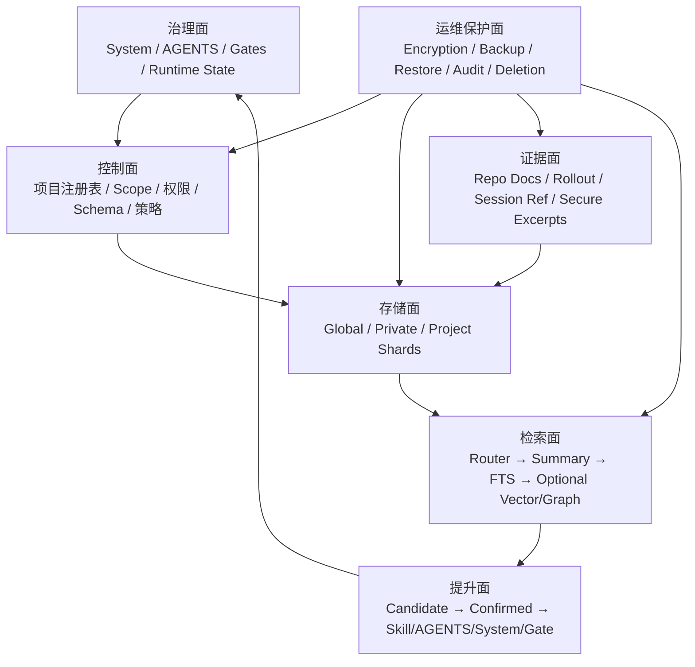

# DeepSeek Harness Personal 记忆系统架构评审与升级建议

> ⚠️ 本文已被《记忆系统手册 v4》（docs/记忆系统手册.md，唯一权威）吸收取代——2026-08-20 Cyrus 拍板（D2 §9 / D3 治理制度）。仅留档，勿据此开发。索引见 docs/INDEX.md。

> 文档状态：Codex 架构评审稿，供 DeepSeek 修订《记忆系统手册》
> 编写日期：2026-08-15
> 评审对象：`D:\Deepseek Harness Personal\docs\记忆系统手册.md`
> 评审依据：原手册全文、DeepSeek Harness 当前已核验的 System/Runtime/AGENTS 机制，以及本机 Codex 可观察到的长期记忆分层与检索工作方式
> 本文不授权实现、迁移、覆盖稳定数据、修改 System Policy、写入 `$DSH_HOME`、安装依赖、联网、commit、push 或发布。
> 2026-08-18 归档说明：本文是 v2 前的历史评审证据，`project_uuid`、Ollama、P5=图等旧建议不得覆盖当前实现。最新总入口为 [记忆系统手册 v4](./记忆系统手册.md)，P5 以 [P5 记忆智能层统一架构](./P5-记忆智能层统一架构.md) 为准。

---

## 1. 最终判断

### 1.1 一句话结论

**原架构的治理方向正确，已经具备成为长期记忆系统的基础；但按当前第 9 章直接进入开发，尚不能安全、稳定地支撑大量类似食溯的复杂项目并行。**

建议保留其“分级记忆、来源标注、人工确认、失效归档、System/AGENTS/Gate 分工、本地优先”的核心思想，但必须先完成以下结构性升级：

1. 从“一个通用图数据库”升级为“全局目录 + Global/Private/Project 分片 + 证据层”的分区架构；
2. 用稳定 `project_uuid` 和项目注册表替代路径、分支或自由文本 `projectKey`；
3. 从“每轮自动提取、每轮自动召回”改为“按需检索 + 显式写入 + 自动候选隔离”；
4. 把 task-specific recall 从 Runtime Snapshot 中移出，避免把查询结果误当成动态机器状态；
5. 先做摘要、关键词索引、FTS5 和证据指针，再用评测证明向量/图谱确实提升效果；
6. 修正 SQLite Schema、FTS 同步、向量版本、跨项目唯一键和审计日志隐私问题；
7. 用 SQLite Online Backup API 或 `VACUUM INTO` 等一致性快照替代“运行中直接 copy 数据库文件”；
8. 增加静态加密、Windows ACL、恢复密钥、备份加密、跨项目访问控制和数据删除权；
9. 建立标准迁移包、schema migration、路径重绑定、embedding 重建和可回滚切换流程；
10. 用可测的召回质量、越界率、过时率、备份 RPO/RTO 和恢复演练，而不是条目数量证明系统可用。

### 1.2 能否满足 Cyrus 的需求

| 需求 | 原稿现状 | 评审结论 |
|---|---|---|
| 跨会话保存稳定经验 | 有 L0–L4、SQLite、provenance 设计 | 基本可行，但需要更严格的写入确认与来源存活策略 |
| 多个复杂项目并行 | 有 `scope/projectKey/branch` | 不足；缺稳定项目身份、分片、访问控制、跨项目晋升门 |
| 避免项目串味 | 有 project 粗筛和不可信标记 | 不足；共享库、自由文本 projectKey、全局 PageRank 仍可能污染 |
| 保留当前事实准确性 | 有事实可信度链 | 方向正确；需把记忆定位为索引和线索，而非项目事实副本 |
| 记忆迁移 | 仅提到 schema migration 和文件复制 | 不足；缺可移植导出格式、项目路径重绑定、密钥与向量迁移 |
| 备份恢复 | 每日/升级前 copy + 哈希 | 不安全；WAL 运行中直接复制可能不一致，也没有恢复演练合同 |
| 安全与隐私 | 本地优先、不存凭据/原始会话 | 方向正确；缺静态加密、ACL、注入防护、删除权和备份威胁模型 |
| 规模扩大后的检索 | FTS5 + 向量 + 图排序 | 有潜力；当前向量 BLOB 无索引，图排序可能造成旧记忆自增强 |
| 维护成本 | vendor 图内核 + 多条自动流水线 | 偏高；一期过度复杂，应该先建立可测基线再逐步增加能力 |
| 可审计 | recall/escalation log、provenance | 基础良好；日志本身还需脱敏、规范化、签名和保留期 |

### 1.3 分阶段能力判断

- **当前蓝图原样**：适合原型验证，不适合直接承载稳定版个人长期记忆。
- **完成本文 P0–P2 后**：可以可靠支撑多个项目的结构化经验、显式保存与按需检索。
- **完成 P3–P4 并通过评测后**：可以逐步加入自动候选提取和本地语义召回。
- **完成 P5–P6 后**：才有资格声称可以长期支撑大量类似食溯的复杂项目并行、迁移和灾难恢复。

这里的“支撑”不是指数据库能装下多少行，而是同时满足：不串项目、不过时冒充当前事实、可恢复、可删除、可迁移、可解释、不会泄露隐私，并且召回质量可测。

---

## 2. 评审边界与证据说明

### 2.1 本次实际检查内容

本次完整读取了原手册 560 行，并只读检查了本机 Codex 可观察到的记忆目录结构：

```text
C:\Users\Administrator\.codex\memories\
├─ memory_summary.md
├─ MEMORY.md
├─ raw_memories.md
├─ rollout_summaries\
├─ skills\
└─ extensions\ad_hoc\notes\
```

当前可观察规模（仅作为结构样本，不是性能证明）：

| 表面 | 当前规模 |
|---|---:|
| `MEMORY.md` | 1333 行，22 个 Task Group，71 个 Task |
| `raw_memories.md` | 2765 行，52 个 Thread |
| `rollout_summaries` | 52 份摘要文件 |
| `extensions/ad_hoc/notes` | 7 份显式更新申请 |
| `skills` | 1 个已提升的程序化记忆 Skill |
| 记忆目录 Git | 本地 Git 基线，无 remote |

这些数字只说明 Codex 当前采用了分层和可追踪文件表面，不能证明其闭源内部存储或检索算法，也不能直接外推到几百个项目。

### 2.2 不在本次评审范围内的内容

- 未重新联网审计 `graph-memory`、`mnemon`、`memory-evolve` 等外部项目的最新源码、许可和安全状态；
- 无法评价 Codex 闭源服务端的内部模型、数据库或调度实现；
- 未运行 DeepSeek 记忆插件原型，因为目前尚未实施；
- 未对真实稳定版数据目录做写入、迁移、备份或恢复；
- 未决定最终 embedding 模型、向量扩展和加密库；
- 未替 Cyrus 决定哪些个人信息允许长期保存。

因此，本文借鉴的是 Codex **可观察的治理与检索合同**，不是声称复制 Codex 内部实现。

---

## 3. Codex 可观察记忆体系值得借鉴的部分

### 3.1 不是“一个数据库”，而是不同职责的多层表面

Codex 当前可观察结构体现了以下分工：

| 层 | 可观察载体 | 主要职责 |
|---|---|---|
| 紧凑总览 | `memory_summary.md` | 提供小型、优先级高的当前记忆地图，不承载全部细节 |
| 可检索注册表 | `MEMORY.md` | 按 Task Group、scope、keywords、偏好、可复用知识和失败经验组织索引 |
| 原始提炼层 | `raw_memories.md` | 按 Thread/Task 保留更宽的提炼输入，不作为每次默认上下文 |
| 证据摘要层 | `rollout_summaries/*.md` | 保存任务结果、证据、rollout/session 指针和详细经验 |
| 程序化记忆 | `skills/<name>/SKILL.md` | 把稳定、可重复的流程提升成带步骤、脚本和验证的能力 |
| 显式更新队列 | `extensions/ad_hoc/notes/*.md` | 用户明确要求记住时写小型更新申请，而不是让会话直接修改所有规范表面 |

它最重要的设计不是 Markdown，而是 **渐进披露（progressive disclosure）**：

```text
先看紧凑摘要
  → 再按关键词查 MEMORY 注册表
  → 只打开 1–2 个最相关的 rollout / skill / 更新证据
  → 当前仓库事实仍需现场验证
```

这避免把所有历史一次性塞进上下文，也降低无关项目串味。

### 3.2 记忆是“索引和线索”，不是当前事实的替代品

Codex 可观察的 `MEMORY.md` 条目通常包含：

- 适用 scope；
- 当前 cwd 或项目路径；
- 关键词；
- rollout summary 指针；
- 用户偏好；
- 可复用知识；
- 失败与改进；
- 对“需重新验证”的提醒。

这种方式允许记忆帮助定位证据，但不会把旧测试数、旧 milestone 或旧实现状态自动当成当前真相。

这与原手册的“事实可信度链”一致，应该保留并进一步机器化。

### 3.3 显式更新优于无边界自动捕获

Codex 当前可观察的长期记忆更新约束是：只有用户明确要求更新长期记忆时，才写一份小型、可审计的 ad-hoc note，再由记忆系统处理，而不是让当前会话任意改写全部长期记忆。

例如现有更新申请会写明：

- 用户何时明确批准；
- 哪些偏好应该加入；
- 哪些敏感或易变内容不能加入；
- 当前项目事实仍以仓库文件为准。

DeepSeek 可以借鉴这种“**候选更新队列**”，而不是直接让 turn-end LLM 成为 canonical memory writer。

### 3.4 过程记忆应提升为 Skill，而不是永远留作语义节点

Codex 把部分高度稳定、可重复执行的经验放进 Skill：

```text
When to use
Inputs and context
Procedure
Efficiency plan
Pitfalls and fixes
Verification checklist
```

这比只保存一条 `skill` 图节点更可执行，因为 Skill 可以带：

- 明确触发条件；
- 输入合同；
- 步骤；
- 辅助脚本；
- 模板；
- 验证清单；
- 失败恢复。

因此 DeepSeek 的升级闭环应增加一个正式目标：

```text
L3 经验
  → 经过多次验证
  → 程序化 Skill
  → 配套测试/脚本
```

而不是只考虑升级到 AGENTS、System 或 Gate。

### 3.5 来源引用是召回可信度的一部分

Codex 的可观察检索流程要求：

- 记忆回答带具体来源文件和行号；
- 如果用了 rollout summary，带 rollout/thread id；
- 当前事实可能漂移时重新验证；
- 没有现场验证时明确说明记忆可能过时。

DeepSeek 当前设计有 `sourceEvidence` 和 `DERIVED_FROM`，方向正确，但还需要把“引用是否仍可访问、是否已验证、是否含安全摘录”纳入正式模型。

### 3.6 Codex 可观察设计也不能直接照搬

需要同时看到它的局限：

- 单一 `MEMORY.md` 随项目增长会越来越大；
- Markdown 索引依赖生成和维护质量；
- Windows 绝对路径迁移性差；
- 本地 Git 只有版本历史，没有 remote，不等于异机备份；
- raw memory 和 rollout summary 仍可能含敏感信息，需要额外加密/访问控制；
- 当前样本规模不能证明百项目性能。

因此 DeepSeek 应借鉴其 **分层、检索预算、更新审批、来源引用和程序化提升**，但存储层可以采用更适合长期规模化的数据库和分片方案。

---

## 4. 原手册做得好的地方

以下内容建议保留：

### 4.1 System、AGENTS、Runtime、Memory、Gate 分工正确

原手册没有把记忆库当成最高权威，而是明确：

- L0 红线在 System；
- L1 稳定工作方法在 AGENTS；
- L2 当前事实以源码/Schema/快照为准；
- L3 经验需要评审后升级；
- Gate 才是危险动作硬拦截。

这是正确的基础。

### 4.2 行为指令链和事实可信度链分开

这是原稿最重要的正确决定之一。一个旧记忆即使“很重要”，也不能覆盖当前源码；一个当前运行状态也不能反向授权本来需要用户批准的动作。

### 4.3 本地优先、凭据不入库、原始会话不复制

这些原则有效减少了：

- 外部泄漏；
- 数据重复；
- 上游 Session 与自建数据库的双写冲突；
- 记忆库成为凭据仓库的风险。

### 4.4 单写者、短事务、网络调用在事务外

这是 SQLite 正确的基本纪律。embedding 和 LLM 调用不能放在数据库事务中，否则会产生长锁和恢复复杂度。

### 4.5 候选、确认、升级、失效归档闭环

`active / superseded / archived`、`CONFLICTS_WITH`、`SUPERSEDES` 和 escalation log 为长期维护提供了基础。

### 4.6 FTS5 降级路径

没有 embedding 时仍可以做关键词召回，符合“显式失败优于静默不可用”。

### 4.7 召回带来源和不可信标记

记忆不能伪装成 System 或当前事实。原稿明确将其作为历史参考，这个边界应保留。

---

## 5. 原架构当前的阻断性问题

### 5.1 记忆等级与提示词等级混在了一套 L0–L4 命名中

原手册把：

- System Policy；
- AGENTS；
- 项目事实；
- 经验；
- 会话历史；

全部叫“记忆等级”。这在讨论时方便，但实现时会造成误解：System/AGENTS 是治理和指令表面，不应该被记忆数据库拥有或自动覆盖。

建议改名为两套体系：

```text
治理面：G0 System / G1 AGENTS / G2 Gate / G3 Runtime State
记忆面：M0 Candidate / M1 Confirmed / M2 Procedural / M3 Evidence / M4 Archive
```

记忆系统可以提出“将某条候选提升为 AGENTS/System/Gate”的建议，但不能直接修改治理面。

### 5.2 每轮自动提取范围过大

原手册计划在 turn-end 自动提取，并自动写 `project_log / daily_log`，其中还包含“情绪反馈”。参见原手册 `9.3.1` 和 `9.4`。

风险：

- 普通对话中的临时想法被长期固化；
- 个人情绪、健康、身份等敏感信息被无意识保存；
- 自动抽取错误进入长期库；
- 每轮写入造成大量低价值噪音；
- 项目越多，维护和去重成本越快增长；
- 用户无法清楚知道系统保存了什么。

建议：

- `user_profile`、情绪、健康、个人身份默认 **禁止自动写入**；
- 显式“请记住”走 confirmed lane；
- 自动提取只能进入隔离的 candidate staging；
- candidate 有 TTL，未确认自动过期而不是永久保留；
- 自动日志只记录最小运行元数据，不保存完整自然语言内容；
- 自动提取功能按项目和数据等级单独 opt-in。

### 5.3 每个用户轮都自动召回会造成噪音和历史膨胀

原手册 `9.5` 计划“每次新用户轮开始”构造查询，并将结果作为“一条 user-role 持久消息”注入。

这会产生：

- 简单、无需历史的任务也被旧记忆干扰；
- 每轮不同查询产生新的持久消息；
- 旧召回结果长期留在历史中；
- 记忆之间相互提示，形成自我强化；
- token 持续上涨；
- 压缩前后的可见记忆不稳定；
- 项目边界判断错误时产生跨项目泄漏。

Codex 可观察流程更接近：先判断任务是否需要记忆，再做有预算的渐进检索。

推荐改为：

```text
任务是否需要历史？
  ├─ 否：完全跳过记忆检索
  └─ 是：确定 scope → 查紧凑摘要/精确关键词 → 查 FTS → 必要时向量/图 → 有界注入
```

### 5.4 `systemPrompt.context` 不适合承载 task-specific recall

原手册 `9.9.2` 提议用 `systemPrompt.context` 注入召回结果。

问题在于 Runtime Context 的语义是“当前状态快照”：新快照取代旧快照。历史记忆召回则是“本轮查询得到的参考材料”，不是机器当前状态。

如果每轮 query 不同：

- context 每轮都会变化；
- 每轮都可能追加持久 snapshot；
- “新结果取代旧结果”不等于旧结果在本轮失效；
- 状态快照和知识检索的生命周期被混淆。

建议：

1. 一期先只提供显式 `memory.query` 工具；
2. 自动召回成熟后，通过专门的 typed retrieval-context seam 注入；
3. 最好是 request-scoped/可压缩/可替换的检索上下文，而不是 Runtime Snapshot；
4. 如果上游没有合适 seam，应先补测试和小型插件验证，不要强行复用 context；
5. 召回文本始终是低权威、不可信参考，不能进入 System section。

### 5.5 项目标识不足以防止串味

当前字段只有 `scope(global|project|branch) · projectKey · branch`。

问题：

- `projectKey` 的生成规则未定义；
- 路径重命名、磁盘迁移、worktree、clone 可能制造新 key；
- 分支名会删除、重命名、复用；
- 同一个项目可能有多个 root alias；
- 两个相似项目可能使用相同自由文本名称；
- stable/dev/test 可能把同一项目识别成不同项目或反过来。

必须增加稳定项目注册表和不可变 `project_uuid`。路径和分支只能作为可变定位信息，不能作为身份主键。

### 5.6 一个共享 SQLite 会扩大故障和泄漏半径

原稿倾向一个 `memory.sqlite3` 存 global、project、daily、task、skill、event 等全部内容。

对少量数据可行，但项目增多后会出现：

- 任何查询过滤缺陷都可能跨项目泄漏；
- 一个损坏库影响所有项目；
- 一次 schema migration 影响全部项目；
- 一个项目无法独立导出、归档或删除；
- 多会话争用同一写入队列；
- 备份和恢复只能全量处理；
- 高敏感项目和普通项目无法采用不同密钥/保留期。

推荐 Global/Private/Project 分片，详见第 7 章。

### 5.7 当前 SQLite Schema 只是草图，不能直接实施

具体问题：

#### 5.7.1 `checksum UNIQUE` 范围错误

全局唯一 checksum 会把两个不同项目中内容相同的记忆当成同一条，破坏 scope 和 provenance。

应该使用类似：

```sql
UNIQUE(scope_kind, scope_id, kind, normalized_content_hash)
```

或者允许一条 canonical claim 关联多个 scope，但必须通过明确 cross-project promotion，而不是 checksum 自动合并。

#### 5.7.2 声明字段和 Schema 不一致

公共字段列出了：

- branch；
- sessionId；
- turnSeq；
- sourceEvidence；
- supersededBy；
- decay；
- extractionModelVersion；

但表结构没有完整承载这些字段或约束。

#### 5.7.3 FTS5 没有同步机制

`CREATE VIRTUAL TABLE nodes_fts USING fts5(content)` 没有：

- 与 nodes 的 rowid 关系；
- external-content 绑定；
- insert/update/delete trigger；
- 重建和一致性检查。

结果可能是 nodes 已更新、FTS 仍返回旧内容。

#### 5.7.4 向量表不能支持可靠迁移

当前只有 `node_id / dim / vec`，缺少：

- embedding provider；
- model id；
- model revision；
- 向量格式；
- content hash；
- 生成时间；
- 归一化方式；
- 状态和重建批次。

#### 5.7.5 BLOB 不等于向量索引

将向量存成 SQLite BLOB 并不会自动得到近邻索引。若应用逐条读取并计算余弦，复杂度接近 O(N)。项目多、条目多时会明显变慢。

一期应在项目过滤后的小候选集上使用 brute-force，或暂缓向量；需要大规模 ANN 时，再评估 Windows 上可稳定部署、可备份、可迁移的向量扩展。

#### 5.7.6 审计日志反而可能泄露隐私

`recall_log.query` 直接保存完整查询；`recalled_ids` 用一个文本字段存列表。查询可能包含健康、身份、凭据片段或商业信息。

建议：

- 默认只存 query hash、分类、长度和脱敏摘要；
- 召回条目单独用 `recall_items` 规范化；
- 原始 query 仅在显式诊断模式、加密且短期保存；
- 日志有独立保留期。

### 5.8 直接 copy WAL 数据库不是可靠备份

原手册写“每日/升级前 copy + 哈希”和“WAL checkpoint 定期执行”。这不足以保证运行中备份一致性。

风险：

- 主数据库和 `-wal` 文件不同步；
- copy 过程中仍有写入；
- checkpoint 不等于备份；
- 哈希只能证明复制后文件没变，不能证明逻辑一致；
- 同一磁盘上的副本不是灾难备份；
- 从未做恢复演练的备份不可视为有效。

推荐使用 SQLite Online Backup API、`VACUUM INTO`（满足其限制时）或短暂停写后的受控一致性快照，并执行 `PRAGMA integrity_check`。

### 5.9 “本地”不等于“安全”

当前原稿没有完整定义：

- 数据库是否加密；
- Windows ACL；
- 备份加密；
- 恢复密钥；
- embeddings 是否按敏感数据处理；
- 日志的保留期；
- 用户查看、导出、纠正和删除记忆的能力；
- 诊断插件落盘完整 effective prompt 时如何防泄漏。

一个未加密的本地 SQLite，一旦机器账户、备份盘或其他进程被访问，记忆正文和向量都可能泄漏。

### 5.10 仅保存来源引用和哈希会产生“悬空证据”

原稿不复制会话正文，只保存 session id/path/hash。这符合数据最小化，但需要处理：

- 上游 Session 被删除或迁移；
- rollout path 改变；
- 项目文档被重写；
- 旧哈希无法还原当时证据；
- 另一台机器没有同一路径。

需要在 provenance 中记录 `availability`、`last_verified_at` 和 portable locator；对关键高价值记忆可在独立加密证据库中保存最小必要摘录，而不是保存整段会话。

### 5.11 PageRank/社区检测可能造成旧记忆自我强化

高频召回的记忆会获得更多连接和中心性，随后更容易再次被召回。这会形成反馈回路：

```text
被召回 → 获得更多使用关系 → 排名更高 → 更常被召回
```

如果记忆已经过时，PageRank 可能放大错误。

图结构应作为补充信号，不应压过：

- scope 精确匹配；
- confirmed 状态；
- 当前版本适用性；
- 来源质量；
- last_verified_at；
- superseded/CONFLICTS 状态；
- 当前用户明确意图。

### 5.12 effective prompt 诊断不能默认落盘全文

原手册建议把最终 System + instruction chain 落盘诊断。完整 prompt 可能包含：

- 内部安全策略；
- 项目规则；
- 路径和环境信息；
- 召回的个人记忆；
- 潜在敏感上下文。

默认应该只记录：section 名称、顺序、来源、长度、内容哈希、是否 complete、是否被 shadow、是否截断。只有显式诊断时才允许生成脱敏全文，并且应加密、限时、自动清理。

### 5.13 “免于压缩”表述需要修正

System Prompt 本身不是会话历史中的普通消息，无需“免压缩”；AGENTS loader 已有压缩后重新投影语义。正确目标是：

- 关键规则能由权威源重新生成；
- 压缩后重新注入；
- 验证重注入内容和作用域；
- 不依赖某条历史消息永久不被压缩。

### 5.14 一期复杂度过高

原稿 P1 就计划 clone/vendor 图内核、Ollama embedding、图谱、FTS、自动提取、召回注入和治理胶水。

风险是问题发生时无法判断来自：

- 抽取；
- scope；
- 去重；
- FTS；
- embedding；
- 图排序；
- prompt 注入；
- compaction；
- 数据迁移；
- 外部 vendor 漂移。

应先建立简单、可解释的 baseline，再增加复杂算法。

---

## 6. 推荐的记忆体系 v2 总体架构

### 6.1 六个平面



### 6.2 平面职责

| 平面 | 职责 | 不负责 |
|---|---|---|
| 治理面 | 权限、行为规则、安全红线、机器状态 | 不保存大量历史 |
| 控制面 | 项目身份、scope、访问策略、schema、数据等级 | 不做自然语言召回 |
| 存储面 | 保存结构化 claim、关系、索引和审计 | 不决定什么进入 System |
| 证据面 | 保留来源定位、哈希、可用性和最小安全摘录 | 不自动成为当前事实 |
| 检索面 | 有界召回、排序、去重、预算和引用 | 不修改 canonical memory |
| 提升面 | 人工确认、程序化 Skill、规则/Gate 建议 | 不自动改 System/AGENTS |
| 运维保护面 | 加密、备份、恢复、迁移、删除、审计 | 不授予用户未批准的权限 |

---

## 7. 多项目存储拓扑

### 7.1 推荐采用“目录库 + 分片库”

```text
memory-root\
├─ catalog.sqlite3                 # 项目注册、别名、策略、分片目录；不存长正文
├─ global\
│  ├─ shared.sqlite3               # 人工确认的跨项目通用记忆
│  └─ private.sqlite3              # 个人敏感偏好，独立加密/策略
├─ projects\
│  └─ <project_uuid>\
│     ├─ memory.sqlite3            # 该项目 claim / evidence / relations / logs
│     ├─ manifest.json             # 项目身份、schema、版本、hash、策略
│     └─ exports\                  # 临时导出；成功后移出 live root
├─ evidence\                       # 可选的加密最小证据摘录
├─ staging\                        # 自动候选，TTL，可清空
└─ state\                          # writer lease、backup status、migration journal
```

备份目录必须在 live root 之外，最好位于不同物理设备或加密外部介质。

### 7.2 为什么不建议“一项目一切”或“一个库装全部”

完全单库的缺点是泄漏半径、迁移半径和恢复半径太大；完全每项目独立又会让 Global 偏好和跨项目方法难以统一。

混合分片的好处：

- Global 只保存经人工确认的真正跨项目内容；
- 每个 Project 可以独立备份、迁移、归档、删除和恢复；
- 高敏感项目可以使用不同密钥和保留期；
- 一个项目损坏不影响所有项目；
- 查询默认只打开当前项目分片和 Global；
- 并行项目可以拥有独立 writer queue；
- 项目结束后可以冷归档，不拖累在线检索。

### 7.3 项目注册表

建议至少包含：

```text
project_uuid          不可变 UUIDv7/UUIDv4
canonical_name        用户可读名称
aliases               历史名称
root_aliases          当前及历史路径
repository_fingerprint 可选：remote identity / initial commit / repo marker
portfolio_id          项目群，例如 NutriSight / Store / Music
trust_zone            trusted / untrusted / external
sensitivity_class     public / internal / sensitive / restricted
lifecycle             active / paused / archived / deleted
memory_policy_id      自动提取、保留期、召回范围
created_at / updated_at
```

### 7.4 路径、分支和 worktree 的正确语义

- 路径是 locator，不是 identity；
- 分支是项目视图，不是默认独立项目；
- worktree 属于同一 `project_uuid`，可以有 workspace overlay；
- 只有用户明确创建分叉项目时，才建立新 `project_uuid`；
- 项目移动磁盘时只更新 root alias，不重写所有记忆；
- stable/dev/test 是 deployment flavor，不是项目身份。

### 7.5 Scope 建议

建议从当前 `global|project|branch` 扩展为：

```text
global_user       经确认、跨所有项目的用户偏好
portfolio         只在一个项目群内共享的方法
project           单一项目稳定记忆
workspace         特定 worktree/实验分支的临时记忆
session           当前会话暂存，不进入长期库
candidate         自动提取隔离区
```

跨项目召回默认顺序：

```text
当前 workspace/project
  → 所属 portfolio（若明确允许）
  → confirmed global_user
```

不得默认对所有项目做全库向量搜索。

### 7.6 跨项目模式库

多个类似食溯的项目会产生可复用方法，但不能直接把某项目事实提升为 global。

建议增加 `pattern/playbook` 类型，晋升条件至少包括：

- 在两个以上独立项目中验证；
- 有明确适用边界和反例；
- 不包含项目特有路径、业务数据和用户隐私；
- Cyrus 确认允许跨项目；
- 有来源链和最近验证日期；
- 可执行时优先提升为 Skill。

---

## 8. 改进后的数据模型

### 8.1 不再把所有东西都叫 node

建议区分：

- `memory_claim`：一条可判断真伪、适用范围明确的短记忆；
- `evidence_source`：来源；
- `claim_evidence`：claim 与来源的关系；
- `claim_relation`：claim 之间的关系；
- `procedure_ref`：指向 Skill/AGENTS/Gate 的提升结果；
- `recall_run`：一次召回；
- `promotion_event`：一次状态或治理提升；
- `backup_snapshot`：备份和恢复证据。

### 8.2 memory_claim 建议字段

```text
id
scope_kind
scope_id
kind
canonical_text
status                 candidate|confirmed|active|disputed|superseded|archived
authority_class        user_confirmed|repo_verified|machine_observed|llm_extracted
confidence
importance
sensitivity_class
retention_policy
valid_from
valid_until
applicable_version
last_verified_at
superseded_by
normalized_content_hash
extractor_id
extractor_version
created_at
updated_at
revision
```

必须把以下概念分开：

- `confidence`：这条记忆有多可信；
- `importance`：忘记它的代价；
- `freshness`：多久没有验证；
- `authority_class`：来自用户确认、源码、机器还是 LLM；
- `sensitivity`：泄露后影响；
- `retention`：保存多久。

不能用一个 0–100 importance 代替全部判断。

### 8.3 evidence_source 建议字段

```text
id
kind                   repo_file|rollout|session|command|artifact|user_confirmation
portable_locator
local_locator
source_hash
captured_at
last_verified_at
availability           available|moved|deleted|unknown
sensitivity_class
secure_excerpt_ref      可选，指向加密最小摘录
```

### 8.4 关系类型建议

保留原有：

- `DERIVED_FROM`
- `SUPERSEDES`
- `CONFLICTS_WITH`
- `USED_SKILL`
- `SOLVED_BY`
- `REQUIRES`

增加：

- `VALIDATES`
- `INVALIDATES`
- `APPLIES_TO_VERSION`
- `PROMOTED_TO`
- `DUPLICATE_OF`
- `PORTFOLIO_PATTERN_OF`

### 8.5 FTS5 正确实现要求

选择之一：

1. external-content FTS5 + 完整 insert/update/delete triggers；
2. contentless FTS5 + 应用层同事务维护；

并提供：

- rebuild 命令；
- integrity check；
- nodes/claims 与 FTS count 对账；
- 测试 supersede/archive 后默认搜索不返回旧记录。

### 8.6 embedding 表要求

```text
claim_id
provider_id
model_id
model_revision
dimensions
encoding
normalization
content_hash
vector_blob
generated_at
batch_id
status
```

向量永远是可重建索引，不是权威数据。备份可以不含向量，只要 manifest 记录模型并允许全量重建。

### 8.7 召回日志规范化

```text
recall_runs(id, session_id, project_uuid, query_hash, query_class,
            injected_bytes, latency_ms, created_at, expires_at)
recall_items(recall_id, claim_id, rank, score, reasons, injected)
```

默认不保存完整 query。需要调试时启用临时、加密、自动过期的 verbose 模式。

### 8.8 删除与隐私请求

状态机必须支持：

- 查看当前记住的内容；
- 修正；
- 导出；
- 删除单条；
- 删除项目；
- 删除所有个人记忆；
- 证明备份中的删除何时生效。

删除敏感正文后，审计 tombstone 只能保留不可逆 id/hash、删除时间和原因，不能继续保留原始敏感内容。

---

## 9. 写入架构升级

### 9.1 三条写入通道

#### A. 显式记忆通道

触发示例：

- “记住这条”；
- “以后所有项目都这样做”；
- “把这个坑记到本项目”；

流程：

```text
用户明确请求
  → 分类 scope/sensitivity/retention
  → 回显准备保存的精简 claim
  → 必要时确认
  → confirmed write
  → provenance + revision
```

#### B. 自动候选通道

适合从任务结果中提取潜在经验，但只能进入 staging：

```text
turn/task end
  → 本地规则先过滤敏感内容
  → 有界 LLM 提取候选
  → schema 校验
  → candidate staging + TTL
  → 批量评审/用户确认
  → confirmed 或自动过期
```

LLM 不能直接写 canonical claim。

#### C. 机器事实通道

版本、路径、测试、构建、schema 等机器事实不应写成长期自然语言记忆。它们进入：

- Runtime Snapshot；
- current status docs；
- artifact manifest；
- compat；
- provenance 指针。

记忆库只保存“在哪里重新确认”和“这个事实曾用于什么决定”。

### 9.2 写入前安全管线

每条 candidate 必须经过：

1. scope 解析；
2. secret scan；
3. PII/sensitivity 分类；
4. data minimization；
5. canonicalization；
6. exact dedup；
7. 冲突检测；
8. authority 标注；
9. retention 赋值；
10. schema validation；
11. 短事务写入；
12. 事务后异步 embedding。

### 9.3 幂等键

自动候选应有稳定幂等键，例如：

```text
project_uuid + session_id + turn_seq + extractor_version + candidate_index
```

HMR、resume 或崩溃重试不能重复生成相同候选。

### 9.4 自动写入默认策略

| 类型 | 默认策略 |
|---|---|
| 用户稳定偏好 | 显式确认后保存 |
| 项目架构决策 | 有当前证据和确认后保存 |
| 经验/坑点 | candidate，评审后保存 |
| task 日志 | 默认只存指针和结果摘要，可按项目 opt-in |
| daily log | 默认关闭 |
| 情绪、健康、身份、私人关系 | 默认禁止自动保存，显式 opt-in |
| 凭据、密钥、令牌 | 永不保存 |
| 当前测试数/插件数/进度 | 不进长期记忆，保存事实源指针 |

### 9.5 升级目的地增加 Skill

```text
candidate
  → confirmed memory claim
  → 多次复用且步骤稳定
  → Skill proposal
  → SKILL.md + scripts/templates/tests
```

Skill 是程序化记忆；AGENTS 是路由和规则；两者不要混为一谈。

---

## 10. 召回架构升级

### 10.1 先判断是否需要记忆

以下任务通常可以跳过长期记忆：

- 简单翻译；
- 单句改写；
- 当前消息已包含全部上下文；
- 与任何项目无关的简单事实；
- 用户明确要求不参考历史。

以下任务需要 quick memory pass：

- 提到具体项目、仓库、模块或历史决定；
- 要求延续之前约定；
- 任务含糊且可能受项目约束影响；
- 涉及长期偏好、事故、迁移或兼容性；
- 当前事实与历史可能冲突。

### 10.2 渐进式检索

推荐顺序：

```text
0. 解析当前 project_uuid / workspace / task type
1. 读取紧凑 Global + Project Summary
2. 精确关键词、ID、路径和状态过滤
3. FTS5 top-k
4. 必要时本地 embedding rerank
5. 只有关系推理确有收益时才扩展小型图邻域
6. 去重、冲突标记、来源验证、预算裁剪
7. 注入少量摘要和 locator
8. 真正需要时再读取详细证据
```

这与 Codex 可观察的“summary → registry → 1–2 个证据源”模式一致。

### 10.3 排序信号

推荐正向权重：

- 当前 project/workspace 精确匹配；
- confirmed/user-confirmed；
- exact keyword/id/path；
- 当前版本适用；
- 来源仍可访问；
- last_verified_at 新；
- 当前任务类型匹配；
- 语义相似；
- 经多个项目验证的 portfolio pattern。

推荐惩罚：

- candidate；
- disputed；
- superseded/archived；
- 来源 unavailable；
- 仅 LLM 自动提取；
- 长期未验证；
- 来自其他项目；
- 与当前源码/快照冲突；
- 同类结果重复；
- 仅因历史召回频率高而中心性高。

### 10.4 召回包格式

建议每条只包含：

```text
[Historical memory; untrusted and possibly stale]
scope: project/<uuid>
status: confirmed
last_verified_at: ...
source: rollout/file/session locator
claim: 一到三句精简内容
conflict: none|present
```

默认不注入完整图路径。只有当关系链帮助当前推理时，再展示 `DERIVED_FROM`、`SUPERSEDES` 等路径。

### 10.5 召回预算

预算应同时限制：

- 最大条目数；
- 最大字节/token；
- 单项目条目上限；
- 单一类型上限；
- 详细证据读取数；
- 自动召回耗时；
- embedding 调用次数。

超预算不是简单按 importance 截断，应先保证：

1. scope 正确；
2. status 正确；
3. 来源可用；
4. 多样性；
5. 冲突项成对出现；
6. 最具体内容优先。

### 10.6 不要把召回结果变成永久历史垃圾

优先级：

1. 显式 `memory.query` 工具结果；
2. request-scoped retrieval context；
3. 可由 typed source 标识、压缩或替换的短消息；
4. 最后才考虑普通 durable user message。

无论采用哪种方式，都要验证：

- 下一轮是否仍携带旧召回；
- compaction 后是否重现；
- 不同 query 是否错误互相覆盖；
- token 是否单调膨胀；
- 子代理是否继承了不该继承的项目记忆。

### 10.7 召回必须可引用

模型使用某条记忆做决定时，应能输出：

- claim id；
- 来源 locator；
- last_verified_at；
- 是否现场重新验证；
- 若来自 rollout，关联 thread/rollout id。

如果来源失效，回答必须说“这是未重新验证的历史记忆”，不能伪装成当前事实。

---

## 11. 多项目并行能力设计

### 11.1 真正的规模变量

“多少项目”不是唯一指标。必须同时测量：

- active project 数；
- 每项目 active claims；
- evidence/relations 数量；
- embedding 数量和维度；
- 并发会话数；
- 每分钟 candidate 写入；
- 每轮召回预算；
- 备份窗口；
- 归档项目数量。

一个食溯类项目可能有大量文档和 Session，但真正应该进入 active memory 的短 claim 应该是有界的。不能把全部会话和任务日志都长期放在热召回库。

### 11.2 建议的热/温/冷分层

| 层 | 内容 | 默认召回 |
|---|---|---|
| Hot | confirmed、当前版本适用、近期验证、重要项目约束 | 是 |
| Warm | 低频经验、已完成阶段、可按关键词找到 | 按需 |
| Cold | archived/superseded、旧会话、旧版本证据 | 否，只用于审计 |

归档不是删除；冷数据可独立压缩、加密和备份，不参与日常向量/图计算。

### 11.3 并发写入

推荐每个 flavor 有一个 Memory Service，负责：

- 持有 catalog；
- 路由到项目分片；
- 每个分片串行写入；
- 多读单写；
- writer lease / named mutex；
- 有界队列和 backpressure；
- 崩溃后幂等恢复。

不要让每个 Session/Renderer 各自直接打开并写同一个数据库。

### 11.4 跨项目检索默认关闭

默认只能访问：

- 当前项目；
- 当前项目所属 portfolio 中明确共享的 pattern；
- confirmed global_user。

只有用户明确提出“比较多个项目”“复用其他项目经验”时，才扩大 scope，并在结果中显示来源项目。

### 11.5 建议的规模验收场景

以下数字是建议测试目标，不是当前能力声明：

| 场景 | 建议测试规模 |
|---|---:|
| 活跃复杂项目 | 20 个 |
| 已归档项目 | 100 个 |
| active/confirmed claims | 200,000 条 |
| provenance/relations | 1,000,000 条 |
| 并发读取会话 | 10 个 |
| 每分片写入者 | 1 个 |
| 项目越界召回 | 0 条 |
| FTS 本地召回 p95 | 建议 ≤ 300 ms，不含模型调用 |
| Hybrid 召回 p95 | 建议 ≤ 1 s，不含模型生成 |

这些目标必须在目标 Windows 机器和真实磁盘上压测；如果实际需求更小，可以降低，但跨项目泄漏必须始终为 0。

### 11.6 防止相似项目互相污染

类似食溯的项目通常会共享术语、表名、流程和错误文本，纯向量相似度尤其容易串味。

必须遵守：

1. scope filter 在向量搜索之前执行；
2. `project_uuid` 是强过滤条件，不是排序加分；
3. portfolio/global 召回需要明确 allowlist；
4. 相同 claim 在不同项目中分别保存 provenance；
5. 只有人工 promotion 才能生成跨项目 pattern；
6. 测试集中加入“相同术语、不同项目结论”的对抗样例。

---

## 12. 迁移设计

### 12.1 必须支持的迁移类型

1. Schema 升级；
2. Personal 插件版本升级；
3. 项目移动目录或磁盘；
4. 项目改名；
5. stable/dev/test 间受控迁移；
6. Windows 机器迁移；
7. embedding 模型/维度更换；
8. 单库向分片库迁移；
9. 项目归档与重新激活；
10. 从 Markdown 经验索引导入数据库。

### 12.2 路径迁移

由于项目使用不可变 `project_uuid`，移动路径只需：

```text
验证新根目录身份
  → 新增 root_alias
  → 标记旧路径 retired
  → 不修改 claim scope 和历史 provenance
```

provenance 应同时保留 portable locator，例如：

```text
project://<project_uuid>/docs/NEXT.md#decision-x
```

本机绝对路径只是 resolver 的一个 alias。

### 12.3 标准导出包

建议定义与 SQLite 实现解耦的可移植格式：

```text
memory-export-<project_uuid>-<timestamp>\
├─ manifest.json
├─ project.json
├─ claims.jsonl
├─ evidence.jsonl
├─ relations.jsonl
├─ promotions.jsonl
├─ tombstones.jsonl
├─ schema\
│  └─ version.json
├─ hashes.sha256
└─ embeddings\              # 可选；默认可不导出并在目标机重建
```

manifest 至少记录：

- export format version；
- database schema version；
- plugin version；
- project UUID；
- sensitivity class；
- source machine id 的非敏感匿名标识；
- createdAt；
- counts；
- embedding model/dim；
- encryption information；
- 每个文件哈希；
- 是否包含 secure excerpts；
- 是否包含 archived/deleted 内容。

凭据、DPAPI 明文密钥和 endpoint token 永不进入导出包。

### 12.4 导入流程

```text
读取 manifest
  → 验证签名/哈希/版本
  → 在临时目录建立新库
  → 执行逐版本 migration
  → 导入 claims/evidence/relations
  → 校验数量、唯一键、FTS、关系完整性
  → 重新绑定 project root
  → 必要时全量重嵌
  → 运行召回回归集
  → 人工抽样
  → 原子切换 active pointer
  → 保留旧库为只读 rollback
```

禁止直接在唯一 live DB 上做不可回滚的原地迁移。

### 12.5 Schema migration

- migration 文件 append-only；
- 每个 migration 有 from/to version 和 checksum；
- 单个 migration 尽量在事务中完成；
- 大型重写使用 shadow table/new DB；
- migration journal 记录开始、完成和 rollback 信息；
- 迁移前在线一致性备份；
- 迁移后 `integrity_check`、FTS 对账、外键对账和召回回归；
- 不支持的旧版本应显式拒绝，而不是猜测导入。

### 12.6 embedding 迁移

embedding 是派生索引：

- 模型或维度改变时建立新 generation；
- 新旧 generation 不混比；
- 后台分批重建；
- 新 generation 达到完整覆盖并通过回归后再切换；
- 旧向量延迟删除，保留回滚窗口；
- 无 embedding 时 FTS 仍可工作。

### 12.7 stable/dev/test 迁移边界

- Dev 不得直接打开 Stable live DB；
- 测试使用合成 fixture 或经过脱敏的只读导出；
- Stable → Dev 导出必须显式批准并检查敏感等级；
- Dev → Stable 只能导入经过评审的 schema/migration，不直接覆盖用户记忆；
- 所有迁移先在临时目录验证；
- 迁移过程不能与运行中的 Stable writer 并发改同一文件。

---

## 13. 备份与恢复设计

### 13.1 备份目标

建议先由 Cyrus 确认：

- RPO：最多允许丢失多久的记忆；
- RTO：发生损坏后多久恢复可用；
- 是否需要异机/离线备份；
- 哪些敏感项目允许进入外部介质或云端；
- 加密恢复密钥如何保管。

建议起始目标：

- 正常 RPO ≤ 24 小时；
- 任何升级/迁移前 RPO = 0（先做一致性快照）；
- 单项目恢复 RTO ≤ 2 小时；
- 每季度至少一次真实恢复演练。

这些是建议值，需 Cyrus 决定。

### 13.2 正确的 SQLite 在线备份

优先级：

1. SQLite Online Backup API；
2. 在符合要求时使用 `VACUUM INTO`；
3. 暂停 writer、checkpoint、关闭连接后复制完整文件集；

不推荐在 writer 运行时只复制 `memory.sqlite3` 主文件。

备份完成后必须：

- 在隔离连接中打开备份；
- `PRAGMA integrity_check`；
- 校验 schema version；
- 对账 claims/evidence/relations/FTS 数量；
- 生成 manifest 和 SHA-256；
- 记录 snapshot id、时间、来源 revision。

### 13.3 备份分层

| 类型 | 触发 | 保留建议 |
|---|---|---|
| 临时事务前快照 | migration、批量导入、升级前 | 保留到验收和 rollback 窗口结束 |
| 每日自动快照 | 正常运行 | 7–14 份 |
| 每周快照 | 每周 | 4–8 份 |
| 每月快照 | 每月 | 6–12 份 |
| 项目归档包 | 项目归档时 | 按项目生命周期 |
| 离线/异机副本 | 明确授权后 | 至少 1 份最新可恢复副本 |

保留数只是建议，应按数据敏感性和磁盘预算确认。

### 13.4 3-2-1 原则的本地个人版

至少考虑：

- 3 份逻辑副本；
- 2 种介质或故障域；
- 1 份离线或异机加密副本。

同一 F 盘不同目录不构成独立故障域。

任何云端或远端备份都是外部动作，必须单独授权，并在客户端完成加密后再上传。

### 13.5 加密与恢复密钥

只用 Windows DPAPI 加密数据密钥，日常使用方便，但迁移到新机器时可能无法解密。

推荐 envelope encryption：

- 每个 DB/项目一个随机 data key；
- data key 的日常副本由 DPAPI/Windows Credential Manager 保护；
- 另一个恢复副本由 Cyrus 保管的 recovery key/passphrase 加密；
- 备份只携带被加密的数据密钥；
- 恢复密钥不与备份放在同一位置；
- 定期验证恢复密钥真的可用。

### 13.6 恢复流程

```text
停止目标 writer
  → 保留损坏现场和日志
  → 选择已验证 snapshot
  → 恢复到临时目录
  → 解密并检查 manifest/hash
  → integrity_check + schema/FTS/关系对账
  → 运行召回回归和人工抽样
  → 原子切换 active pointer
  → 启动只读验证
  → 恢复写入
  → 记录 incident 和恢复证据
```

禁止直接覆盖唯一损坏库后再尝试调查。

### 13.7 Git 的正确角色

适合进 Git：

- schema；
- migration 源码；
- AGENTS、规则、Skill；
- 非敏感 fixture；
- 备份/恢复脚本；
- 文档。

不适合直接进普通 Git：

- live SQLite；
- WAL/SHM；
- embedding BLOB；
- 私人记忆正文；
- session 原文；
- 未脱敏日志。

本地 Git 能提供版本历史，但没有异机副本时不构成完整备份。

---

## 14. 安全架构

### 14.1 威胁模型

必须至少考虑：

1. 其他本地进程读取未加密数据库；
2. 备份盘丢失；
3. 项目 A 的 Session 召回项目 B 的敏感内容；
4. 仓库文档或历史记忆包含 prompt injection；
5. 自动提取保存密钥、个人健康、身份或情绪内容；
6. embedding endpoint 配错到远程地址；
7. 恶意 symlink/reparse point 让插件跨目录读取；
8. 日志或 effective prompt dump 泄露内部规则和记忆；
9. vendor 依赖含漏洞或未预期联网；
10. 数据库被篡改而普通 SHA-256 被攻击者重新计算；
11. 过时记忆被当成当前事实导致错误写入；
12. 删除请求只删 live DB，但备份永久保留。

### 14.2 数据分类

| 等级 | 示例 | 策略 |
|---|---|---|
| Public | 公开项目文档指针 | 可进入普通项目索引 |
| Internal | 内部架构、非敏感经验 | 本地加密，按项目隔离 |
| Sensitive | 个人偏好、商业策略、私人记录 | 独立 private/project shard，严格召回 |
| Restricted | 凭据、令牌、原始医疗/遗传/高度敏感数据 | 不进入记忆正文；只存安全引用或完全禁止 |

embeddings 继承原文敏感等级，不能因为“不易读”就视为无敏感性。

### 14.3 静态保护

- 数据库和备份加密；
- Windows ACL 只允许当前用户和必要服务账户；
- live、backup、export、diagnostic 分目录并分别授权；
- 临时文件同样加密或在完成后安全清理；
- 不把 key 写入 config、环境日志或记忆；
- 数据目录不允许被 Web Renderer 直接访问。

### 14.4 Host/Renderer 边界

- Renderer 无数据库文件路径和任意 SQL 能力；
- 所有调用通过 Host 的有界 API；
- 参数有类型、长度、scope 和 limit 白名单；
- SQL 参数化；
- 每次写入重新验证当前项目和授权；
- archive/delete/export 需要明确确认；
- tool 返回有最大长度并脱敏。

### 14.5 Prompt injection 防护

历史记忆、仓库文档和 rollout 都是不可信内容。

要求：

- 永远不把召回记忆写入 System Policy；
- 用结构化字段和明确 delimiter 包裹；
- 转义可能闭合包装的标记；
- 标记来源、scope、日期、status；
- 召回内容不能调用工具或改变权限；
- 从 untrusted repo 提取的内容默认只对该项目可见；
- 检测“忽略之前规则”等注入式文本并降低权重/隔离。

### 14.6 本地 Ollama 安全

- endpoint 默认只允许精确 loopback；
- 禁止凭据、路径、非 HTTP(S) 和宽松 loopback 变体；
- 不跟随重定向到非允许地址；
- 明确记录模型、revision、维度；
- 请求正文经过 secret/PII policy；
- 无本地 embedding 时降级 FTS，而不是自动调用远程服务；
- 远程 embedding 必须单独授权、报价和数据分类审查。

### 14.7 完整性与防篡改

普通 SHA-256 适合检测意外损坏，但攻击者修改文件后可以重算哈希。

对高价值 manifest 建议：

- HMAC 或数字签名；
- 签名密钥放系统凭据库；
- backup manifest 链接上一个 snapshot id；
- migration 和 promotion 记录 append-only；
- 定期审计异常 revision、批量删除和跨项目召回。

### 14.8 用户数据权利

必须提供：

- `memory.explain`：为什么保存、来源、何时使用；
- `memory.export`：按 global/project 导出；
- `memory.correct`：修正并保留 supersede 链；
- `memory.delete`：明确 live/backup 的删除语义；
- `memory.list_sensitive`：查看敏感条目；
- `memory.pause`：暂停自动候选和召回；
- `memory.reset_project`：项目级重置，需双重确认。

### 14.9 诊断数据安全

effective prompt 诊断默认只输出 manifest：

```text
section name / order / source / length / hash / shadowed / complete / truncated
```

全文诊断必须：

- 用户显式开启；
- 只在本机加密目录；
- 先脱敏；
- 有自动过期时间；
- 不进入普通日志、Git 或发布包。

---

## 15. 故障恢复与降级

| 故障 | 正确行为 |
|---|---|
| SQLite 损坏 | 停止写入、保留证据、只读检查、从已验证备份恢复 |
| writer 崩溃 | WAL 恢复 + 幂等重试；不产生重复 candidate |
| embedding 不可用 | FTS 工作，标记 semantic unavailable |
| embedding 维度变化 | 不混比，建立新 generation 并重嵌 |
| LLM 提取失败 | 本轮无候选，显式记录；不伪造记忆 |
| 来源文件消失 | provenance 标 unavailable，召回降权并提示 |
| 项目身份不明 | 不做长期写入，不做跨项目召回 |
| scope 冲突 | 停止自动晋升，进入人工评审队列 |
| 备份过期 | 状态面告警；迁移/升级 Gate 拒绝继续 |
| migration 失败 | 回滚 active pointer，保留失败临时库和日志 |
| recall 超预算 | 缩小 scope/条目，不静默截断冲突对 |
| 队列积压 | backpressure，降低自动候选优先级，不阻塞用户主任务 |
| 加密密钥不可用 | fail closed，不创建明文替代库 |

---

## 16. 可观测性和质量评测

### 16.1 运行指标

- 各项目 active/candidate/archived 数量；
- candidate 确认率和过期率；
- exact dedup/semantic duplicate 数量；
- conflict/disputed 数量；
- 来源 unavailable 比例；
- embedding 覆盖率和 generation；
- FTS/Hybrid p50/p95；
- 单轮注入条目和 token/bytes；
- writer queue 深度；
- DB/FTS/向量体积；
- 最近备份、integrity check、恢复演练时间；
- schema/plugin 版本；
- 敏感条目和保留期到期数量。

### 16.2 召回质量指标

- scope precision：召回是否来自正确项目；
- source validity：来源是否仍可用；
- stale recall rate：召回过时记忆比例；
- contradiction surfacing：冲突是否成对呈现；
- helpful hit rate：召回是否帮助完成任务；
- false memory rate：不存在/错误记忆比例；
- duplicate rate：注入重复内容比例；
- citation completeness：使用记忆时是否能给出来源；
- cross-project leak：必须为 0；
- user correction closure：用户纠正后旧记忆是否退出默认召回。

### 16.3 基准测试集

应从真实历史中建立脱敏 benchmark：

- 同一术语在两个项目中含义相反；
- 项目移动路径；
- 旧版本事实被新版本 supersede；
- 用户偏好与项目规则冲突；
- 来源已删除；
- 同一经验在多个项目重复；
- 无需记忆的简单任务；
- prompt injection 型历史文本；
- 敏感内容不应召回；
- compaction/新 Session 后重新召回。

### 16.4 引入向量和图的准入门槛

先建立 FTS baseline，再比较：

| 方案 | 比较项 |
|---|---|
| FTS only | 正确率、延迟、可解释性 |
| FTS + vector rerank | 是否显著提高 helpful hit，是否增加串味 |
| FTS + vector + graph | 图是否在关系任务上有可测提升，是否放大旧记忆 |

没有可测提升就不引入额外复杂度。Graph/PageRank 不应因“架构看起来先进”而默认上线。

---

## 17. 推荐的分阶段路线图

### P0：合同、安全和项目身份

先完成：

- 记忆分类和数据等级；
- `project_uuid` 注册表；
- Global/Portfolio/Project/Workspace scope；
- 写入授权矩阵；
- 用户查看/导出/纠正/删除合同；
- 加密与密钥恢复方案；
- 备份 RPO/RTO；
- recall 注入 seam 选择；
- threat model。

验收：文档和 fixture，不接触 stable live data。

### P1：最小可用存储，不做图和自动召回

- catalog + 单一临时 project shard；
- corrected schema；
- FTS5；
- provenance；
- explicit `memory.record/query/list/status`；
- secret/PII gate；
- online backup + restore fixture；
- JSONL 标准导出/导入。

验收：全合成数据、恢复演练、路径迁移。

### P2：Codex 式渐进披露

- Global/Project compact summary；
- searchable registry；
- evidence pointer；
- 有界 quick memory pass；
- citations；
- recall 预算和审计；
- 不需要历史的任务跳过检索。

验收：真实任务脱敏回归集，cross-project leak = 0。

### P3：候选提取和治理闭环

- automatic candidate staging；
- TTL；
- 用户确认队列；
- conflict/supersede；
- promotion proposal；
- Skill promotion；
- 敏感类别默认禁止自动保存。

验收：LLM 错误不进入 canonical memory。

### P4：可选向量召回

- 本地 Ollama endpoint 安全；
- embedding generation；
- 模型/维度迁移；
- FTS + vector benchmark；
- 敏感向量加密；
- 无 embedding 降级。

验收：相比 FTS 有明确提升且不增加串味。

### P5：可选图关系能力

- 只导入必要关系；
- 有界图展开；
- 禁止 centrality 覆盖 scope/status/freshness；
- PageRank 反馈回路测试；
- vendor 安全、许可和维护审计。

验收：只在关系型任务上带来可测增益。

### P6：多项目、迁移和稳定版

- Global/Private/Project 分片；
- 20 active/100 archived 规模压测；
- 多会话并发；
- stable/dev/test 隔离；
- 加密离线备份；
- 整机迁移演练；
- 单项目删除/归档/恢复；
- 真人长期试用。

验收：第 18 章矩阵全部通过后才进入 Stable。

---

## 18. 上线验收矩阵

| 类别 | 必须通过 |
|---|---|
| 项目身份 | 移动、改名、worktree、clone 后仍正确识别或安全阻止 |
| Scope | 默认只召回当前 Project + allowlisted Portfolio/Global |
| 串味 | 对抗样例下 cross-project leak = 0 |
| 写入 | LLM 自动结果只能进 candidate；敏感类型默认禁止 |
| 用户控制 | list/explain/export/correct/delete/pause 可用 |
| 来源 | 每条 confirmed claim 有 provenance 和可用性状态 |
| 当前事实 | 旧记忆不能覆盖当前源码/Schema/Snapshot |
| FTS | insert/update/archive/supersede 后索引一致 |
| 向量 | 模型/维度/generation 不混比；可完全重建 |
| 召回 | 无需历史的任务不检索；相关任务有界召回和引用 |
| 注入 | 召回不进入 System，不执行历史文本中的指令 |
| 压缩 | 压缩/新会话后可从权威源重新检索，不依赖旧消息残留 |
| 数据库 | 单写者、短事务、崩溃幂等、integrity check |
| 备份 | 在线一致性快照、manifest/hash、独立打开验证 |
| 恢复 | 定期真实恢复演练，RPO/RTO 有证据 |
| 加密 | live DB、向量、备份、临时导出按等级保护 |
| 密钥 | 新机器可用 recovery key 恢复；密钥不与备份同存 |
| 迁移 | shadow import、完整校验、原子切换、可回滚 |
| Flavor | Dev/Test 不直接读写 Stable live DB |
| 日志 | query/prompt/记忆正文默认不明文进入诊断日志 |
| 删除 | live、索引、向量和备份保留期语义清楚 |
| 性能 | 目标 Windows 机器上通过规定规模 p95 |
| Vendor | 许可、锁定 commit、联网行为、依赖安全已审计 |

---

## 19. 对原手册逐项修改建议

### 19.1 保留

- 第 1–3 章的 System/Runtime/AGENTS 机制事实；
- 双权威链；
- 本地优先；
- 凭据不入库；
- 单写者和短事务；
- provenance、conflict、supersede、archive；
- 人工升级评审；
- FTS 降级；
- Gate 只能缩小权限。

### 19.2 重写

| 原章节 | 修改方向 |
|---|---|
| 4.1 L0–L4 | 分离治理面 G 层和记忆面 M 层 |
| 4.2 存储选型 | 改为 catalog + Global/Private/Project shards + evidence |
| 4.3 写入闭环 | 增加 explicit/candidate/machine 三通道和 TTL |
| 4.4 召回 | 改为按需渐进检索，不是每轮自动 |
| 4.5 安全 | 增加加密、ACL、删除权、备份和 threat model |
| 9.2 组件图 | 加入控制面、证据面和运维保护面 |
| 9.3 数据模型 | 采用 claim/evidence/recall/promotion 分表 |
| 9.4 写入路径 | LLM 只能写 candidate；敏感类型默认关闭 |
| 9.5 召回路径 | 移出 Runtime Snapshot，改专用 retrieval context/tool |
| 9.7 生命周期 | 增加 Hot/Warm/Cold、TTL、删除和来源存活 |
| 9.9 接入点 | 一期仅显式工具；自动 seam 后置验证 |
| 9.10 部署 | 分片、加密、key、备份 root、flavor 隔离 |
| 9.11 路线图 | 先合同/备份/FTS，再 vector/graph |

### 19.3 删除或延期

- 默认自动保存 daily log；
- 自动捕获情绪反馈；
- 每个用户轮自动召回；
- 一期直接 vendor 图内核；
- 一期 PageRank/社区检测；
- 运行中简单 copy WAL DB；
- 默认落盘完整 effective prompt；
- 在架构文档写死“第 16 个插件”等易变数字；
- 用分支名作为长期身份；
- 直接在 recall log 保存完整 query。

### 19.4 原稿中的小型文档问题

- 第 2.3 节末尾和第 3.12 节末尾的 `---` 与正文粘连，应换行；
- 第 9.4 节最后写“第 9.5 节详述升级闭环”，实际升级闭环在 9.6；
- `memory.upgrade_propose` 的 target 中 `agends` 应为 `agents`；
- “第 16 个插件”属于易变事实，不应进入稳定架构合同；
- “SQLite 向量扩展或独立库”和后文 BLOB Schema 未统一，需要明确一期实现；
- “copy + 哈希 + 原子替换”不能作为 WAL 在线备份合同。

---

## 20. 交给 DeepSeek 的行动清单

在开始任何代码前，DeepSeek 应先提交一版修订后的《记忆系统手册》，回答以下问题：

1. `project_uuid` 如何创建、识别、移动和防冒认？
2. Global、Portfolio、Project、Workspace、Candidate 的默认访问规则是什么？
3. 哪些内容允许自动进入 staging，哪些永不自动保存？
4. task-specific recall 使用什么 seam，如何避免 durable history 膨胀？
5. 为什么需要 graph/vector；相对 FTS baseline 的验收指标是什么？
6. live DB 如何加密，key 如何恢复到新机器？
7. WAL 在线备份用什么 API，恢复演练如何自动验证？
8. 项目独立导出、迁移、归档、删除如何完成？
9. 来源删除后，claim 如何降权和展示？
10. 用户如何查看、纠正、删除和暂停记忆？
11. 多 Session/多 flavor 如何保证单写者和 Stable 隔离？
12. 如何证明项目越界召回为 0？
13. effective prompt/recall 日志如何防止二次泄漏？
14. external vendor 的许可、联网、更新和安全审计如何做？
15. 备份 RPO/RTO 和保留期由 Cyrus 如何确认？

以上问题没有形成可测试合同前，不建议进入原计划 P1 的 vendor/embedding/图谱开发。

---

## 21. 最终推荐架构摘要

```text
治理面（不由记忆库自动修改）
├─ Personal System Policy
├─ Global / Project / Nested AGENTS
├─ Runtime Snapshot
└─ Machine Gates

记忆控制面
├─ Project Registry（稳定 project_uuid）
├─ Scope / Sensitivity / Retention Policies
├─ Schema / Migration Journal
└─ Writer / Backup / Health State

记忆存储面
├─ Global Shared Shard
├─ Private Encrypted Shard
├─ Project Shards
├─ Candidate Staging（TTL）
└─ Evidence / Provenance

检索面
├─ Compact Summary
├─ Searchable Registry
├─ Exact / FTS5
├─ Optional Vector Rerank
├─ Optional Bounded Graph
└─ Source-backed Retrieval Context

提升面
├─ Candidate → Confirmed
├─ Confirmed → Procedural Skill
├─ Confirmed → AGENTS Proposal
├─ Critical → System Proposal
├─ Mechanical → Gate/Test
└─ Obsolete → Superseded/Archive/Delete

运维与安全面
├─ Encryption + ACL + Key Recovery
├─ Online Consistent Backup
├─ Portable Export / Shadow Import
├─ Restore Drills
├─ Audit / Metrics / Evals
└─ User View / Correct / Export / Delete / Pause
```

最终建议不是放弃 DeepSeek 的原方案，而是调整实现顺序和责任边界：

> 先把记忆做成“可信、隔离、可恢复的索引系统”，再把它升级成“自动、语义化、图谱化的智能系统”。

对于 Cyrus 将来同时维护多个食溯级复杂项目，这个顺序比先追求图谱和自动化更重要。只要采用稳定项目身份、分片隔离、渐进式召回、显式确认、加密备份和可回滚迁移，SQLite + FTS5 完全可以作为很长一段时间的可靠核心；向量和图应是经过评测后增加的可选加速层，而不是整个记忆系统成立的前提。

---

## 22. 本文边界

本评审完成的是架构评论和升级设计，不表示以下事项已发生：

- 未修改原《记忆系统手册》；
- 未创建记忆数据库；
- 未导入 Codex 记忆；
- 未读取或输出任何凭据；
- 未修改 System、AGENTS、Runtime Snapshot 或 Gate；
- 未安装 graph/vector/embedding 依赖；
- 未连接或调用 Ollama；
- 未触碰 Stable/Dev 用户数据；
- 未执行备份、迁移、恢复、commit、push 或外发。

下一步应由 DeepSeek 基于本文重写蓝图，并把 P0 的项目身份、数据分类、写入授权、召回 seam、加密密钥、备份恢复和用户删除权先变成可审核合同，再请求 Cyrus 决定是否进入实现。
